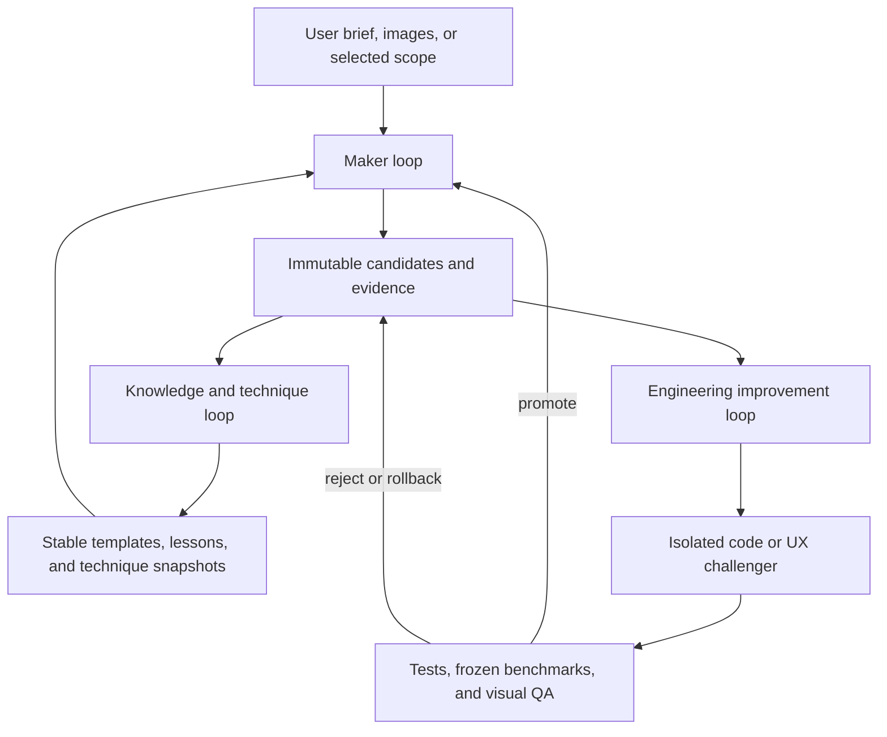

# Learning harness and controlled improvement system

Date: 2026-07-09

Status: design draft for review

Related: [product and architecture specification](spec.md)

## Purpose

The harness turns model creation into a replayable experiment. It lets an agent inspect the rendered result and structured assembly state, refine its construction approach, preserve useful evidence, and improve prompts, retrieval, templates, repair strategies, validators, harness behavior, and application code without allowing the system to grade or deploy its own work unchecked.

The harness is not a claim that a model rewrites its weights after every run. Most early improvement comes from better context, validated templates, deterministic repair, search, retrieval, user preference data, and better software. Fine-tuning is a later optional consumer of a curated corpus.

## Three nested loops



### Authority boundaries

| Loop | May change automatically | May not change automatically |
|---|---|---|
| Maker | Candidate models inside the run budget | User document, validators, evaluator policy, application code |
| Knowledge | Draft lesson, template, prompt, retrieval, or ranking challengers | Stable knowledge, protected holdout, promotion policy |
| Engineering | Code and UI on a branch inside a disposable exact-base worktree or equivalent sandbox | Running production code, its own evaluator, protected benchmarks, deployment |

An experiment may change the system under test or the evaluation contract, never both. This prevents apparent improvement through weakened checks, easier benchmarks, hidden camera angles, or a critic tailored to its own outputs.

Named authorities enforce those boundaries:

- The maker agent owns only candidates inside a job capability.
- The curator may create quarantined knowledge proposals and request evaluation.
- The independent evaluator owns masked holdout cases, champion-pinned validators, renderer, metrics and signed reports.
- The human maintainer approves stable default-pointer changes, code merges, evaluator-contract changes, canary enrollment and release.

Stable promotion uses compare-and-swap against the expected champion version. A stale experiment cannot replace a newer champion. Only non-safety product or technique challengers may become opt-in, visibly labeled and bounded user canaries, and only after maintainer approval. Validator, scope, consent, signing, ledger, credential and acceptance-authorization sensor canaries are confined to synthetic fixtures in isolated test or evaluator namespaces and can never receive user authority or data.

## Improvement cycle

Every improvement follows the same high-level protocol:

1. **Observe:** inspect canonical renders, diagnostic overlays, structured state, logs, metrics, and user edit diffs.
2. **Diagnose:** cluster a repeated failure and form a falsifiable hypothesis.
3. **Choose the smallest change class:** candidate repair, template, technique configuration, provider adapter, validator, harness, or UI.
4. **Create a challenger:** preserve the current champion and change one coherent factor.
5. **Evaluate:** run paired cases with frozen budgets, catalog, validator, critic, and benchmark definitions.
6. **Review evidence:** compare hard metrics, canonical render packets, user effort, latency, cost, and counterexamples.
7. **Promote, quarantine, reject, or roll back.**
8. **Record a scoped lesson:** what changed, when it applies, supporting runs, counterexamples, and confidence.

No success claim is based solely on the agent preferring its own screenshot.

## Fleet compatibility with `civ-engine` and the game repositories

The engineering loop deliberately borrows the fleet philosophy proven in `civ-engine`, `aoe2`, `farm`, `city`, and `townscaper`:

`run → evidence → finding → verify → select → fix → rerun → prove → ledger`

It borrows the small shared vocabulary and lifecycle, not game simulation semantics. `BrickDocument`, `BuildProgram`, validator issues, broker events, consent, sealing, and promotion remain LEGO-native.

### Native authority and fleet projection

| Layer | Authority | Purpose |
| --- | --- | --- |
| Native sealed run | Companion broker and canonical brick contracts | Complete replay, truth snapshots, consent, scope, candidate lineage, artifact hashes, acceptance, and references to separately sealed evaluator evidence |
| Fleet projection | Rebuildable adapter output | Cross-repo finding vocabulary, lightweight run summary, pass ledger, recurrence grouping, and operations dashboards |

The independent evaluator owns only evaluation-namespace evidence, aggregate masked reports and `PassVerdict` artifacts. The broker verifies and references those hashes from its exclusive native event stream; evaluator output is never a second native-run authority.

The fleet projection is never a second source of truth. A LEGO-owned wrapper references the native run ID, sealed event root, candidate or challenger, and content-addressed artifacts. If the projection disagrees with the native record, it is discarded and rebuilt.

The adapter targets the current public `civ-engine` concepts without making the browser, brick domain, broker, or production evaluator depend on the game engine:

- `ImprovementRunManifest` for a lightweight run summary.
- `ImprovementFinding` for a durable engineering or harness finding.
- Strict finding and manifest shape validation at every projection write boundary.
- `improvementFindingSignature` semantics for `<product>/<stable-class>` recurrence grouping.
- `stateDigest` semantics only for cheap sanitized checkpoint comparison.

The historical `gameId` projection field is set to `lego`; it does not make this product a game. Gate 2 defaults to a LEGO-owned dev adapter against a pinned `civ-engine` package, contract-tested in build and CI. Each native run records the package, finding-schema and adapter versions; it does not rerun compatibility tests as part of generation. Extract a domain-neutral package only after another non-game product proves the same stable mapping and the dev-only dependency becomes a demonstrated maintenance cost. Do not add the full game engine to shipped browser, brick-domain, broker or evaluator packages merely to obtain these types.

The native document structural hash, artifact hashes, broker signatures, and event roots remain the security and identity contracts. A fleet finding signature is a bug-class key, not a cryptographic signature. A fleet state digest is a comparison accelerator, not a document hash or seal.

### LEGO-owned projection envelope

The public civ manifest represents artifacts by path and its open `data` fields do not by themselves establish a native LEGO binding. Every projection therefore uses this separately validated wrapper before its nested civ payloads are passed to civ validators:

```ts
type PassStopReason =
  | "no-fix-candidate"
  | "proposal-only"
  | "run-failed"
  | "lock-unavailable"
  | "budget-unavailable"
  | "persistence-failed"
  | "proposal-failed"
  | "apply-failed"
  | "gate-failed"
  | "rerun-failed"
  | "verifier-unavailable"
  | "cleanup-failed"
  | "rollback-failed"
  | "fixed-proven"
  | "fix-unproven";

interface LegoLoopOpsPassBase {
  contractVersion: string;
  passId: string;
  baseCommit: string;
  baseTreeHash: string;
  findingSelected: boolean;
  selectedClass?: string;
  challengerTreeMaterialized: boolean;
  stopReason: PassStopReason;
  terminalEvent: { sequence: number; sha256: string };
}

type LegoLoopOpsPassProjection =
  | (LegoLoopOpsPassBase & {
      mode: "diagnosis" | "proposal";
      outcome?: never;
      challengerTreeMaterialized: false;
      challengerTreeHash?: never;
      verdictSha256?: never;
    })
  | (LegoLoopOpsPassBase & {
      mode: "full";
      outcome: "fixed-proven";
      findingSelected: true;
      selectedClass: string;
      challengerTreeMaterialized: true;
      challengerTreeHash: string;
      verdictSha256: string;
    })
  | (LegoLoopOpsPassBase & {
      mode: "full";
      outcome: "fix-unproven" | "blocked";
      challengerTreeHash?: string;
      verdictSha256?: string;
    });

interface ProjectionArtifact {
  artifactId: string;
  kind: string;
  mediaType: string;
  sha256: string;
  casKey: string;
}

interface LegoFleetProjectionEnvelope {
  schemaVersion: "1";
  adapter: {
    name: "lego-civ-improvement-adapter";
    version: string;
    civEnginePackageVersion: string;
    improvementFindingSchemaVersion: number;
    loopOpsContractVersion?: string;
  };
  native: {
    namespace: "production" | "test";
    runId: string;
    manifestSha256: string;
    eventRoot: string;
    artifacts: ProjectionArtifact[];
  };
  evaluation?: {
    namespace: "evaluation";
    reportRoot: string;
    artifacts: ProjectionArtifact[];
  };
  subject: {
    kind: "generationRun" | "engineeringPass";
    candidateId?: string;
    challengerId?: string;
    passId?: string;
  };
  mapping: {
    version: string;
    findings: Array<{
      nativeFindingId: string;
      nativeEvent: { sequence: number; sha256: string };
      fleetFindingId: string;
      fleetFindingSha256: string;
      nativeClass: string;
      fleetCategory: string;
      nativeEvidenceKinds: string[];
      fleetEvidenceKinds: string[];
      evidence: Array<{
        nativeEvidenceIndex: number;
        nativeEvidenceSha256: string;
        fleetEvidenceIndex: number;
        artifactIds: string[];
      }>;
    }>;
  };
  payload: {
    run: ImprovementRunManifest;
    findings: ImprovementFinding[];
    pass?: LegoLoopOpsPassProjection;
  };
  payloadSha256: string;
}
```

Wrapper validation verifies canonical payload and artifact hashes, required identifiers, namespace, versioned category and evidence mappings, the broker seal on referenced native events, any evaluator seal on separately referenced evaluation artifacts, and subject consistency before invoking `assertImprovementRunManifest` and strict `assertImprovementFinding`. Artifact IDs and `casKey` values are unique across the native and optional evaluation sets and resolve to the declared hashes. Exactly one mapping matches each nested fleet finding by ID and canonical hash; it binds that finding to a native finding and sealed event occurrence. Each evidence row reproduces the canonical native evidence hash at its native index, the fleet evidence at its fleet index, and one or more exact artifact IDs, so two screenshots or metrics of the same kind cannot be confused. Those civ validators establish schema shape and JSON compatibility; for a finding whose `verificationStatus` is `verified`, strict finding validation also requires an allowed verification method and addressed evidence. An `unverified` finding intentionally validates without those proof fields. The validators do not prove that a path exists, an evidence claim is true, or a native seal or hash binding is authentic. The wrapper validator owns those additional checks.

`LegoLoopOpsPassProjection` is LEGO's typed projection of the runner stop/outcome vocabulary owned by `loop-ops`; it is not a `civ-engine` export. Wrapper validation requires `loopOpsContractVersion`, pass and subject consistency whenever it is present, and reproduces mode, selection and challenger progress, selected class, challenger tree, stop reason, outcome and terminal-event hash from the sealed native terminal record. `fixed-proven` additionally requires the exact signed `PassVerdict` hash and matching positive verdict. A compatibility `stopReason: fixed-proven` is derived from that native record and verdict, never asserted independently by the runner or adapter. A projection may be retained as a content-addressed derived artifact; a native event that records its byte hash attests only which bytes were captured, not that the projection is semantically correct or authoritative.

### Findings and evidence mapping

A routine invalid generated candidate is a native validator result, not automatically a fleet-wide engineering finding. Project it as an `ImprovementFinding` only when it exposes a durable product, technique, template, provider, observation, replay, validator, harness, or UX failure worth tracking across runs.

Every projected finding:

- Starts `unverified`.
- Carries a stable own-property `data.class`, such as `scope/outside-part-mutated`, `renderer/context-recovery-lost-overlay`, or `technique/tow-arm-cabin-clearance`. Part IDs, timestamps, run IDs, and coordinates belong to occurrence evidence, not the class.
- Preserves all finding sources with provenance rather than choosing a source whose priority can hide a fresh oracle failure.
- Uses a verification method appropriate to the claim.
- Uses the strict contract's addressed evidence reference before becoming `verified`. A runtime or run-derived finding references the native run bundle or session and cannot rely on screenshots, metrics or prose alone. A source, documentation, architecture, schema or security finding may instead reference a real broker- or evaluator-sealed engineering evidence bundle containing content hashes and reproducible static, type, schema or threat-model checks; never fabricate a product run to verify a static claim.
- Names an honest next action and promotion target. Harness weaknesses use `improveHarness`; confirmed recurrence can propose `addRegression`; neither weakens truth to make a run pass.

Exact LEGO anchors remain in native data: document and base revision hashes, normalized build-program hash, candidate and patch IDs, scope digest, validation-report hash, render-packet and camera hashes, truth and template snapshots, sealed event ID, and effective replay boundary.

### LEGO-owned adapters

| Adapter | Responsibility |
| --- | --- |
| Maker adapter | Plans and proposes restricted programs or repairs through scoped compiler capabilities. |
| Browser playtest adapter | Drives only capability-authorized controls from the exact hashed `ActorObservation` through bounded schema-checked actions in a real browser. Visibility and enabled state are necessary but not authority. |
| Observation adapter | Produces a redacted `ActorObservation` for the actor and separate trusted `VerifierEvidence`; it never leaks debug or holdout truth across that boundary. |
| Replay adapter | Redrives maker programs through released compiler commands and browser transcripts through the actual bounded browser-action adapter in a fresh instance, recording non-vacuous settled checkpoints. |
| Oracle adapter | Converts deterministic compiler, scope, connection, collision, replay, resource, accessibility, and coverage failures into typed findings. |
| Visual critic adapter | Produces soft resemblance, composition, and usability claims; it cannot verify structural truth. |
| Transcript submitter | Submits attempt-start and terminal records plus content-addressed artifacts under broker-issued IDs; it cannot allocate authoritative IDs, append authoritative events, sign or seal. |
| Fleet projection adapter | Reads authorized sealed native events and emits validated rebuildable fleet projections and pass ledgers; it cannot sign, seal or become authority. |

The broker-owned native run store is outside the unprivileged adapter plane. It allocates authoritative run, attempt and event-sequence identities, appends the native event stream, and seals finalized roots and artifacts. A persistence failure before an attempt-start event is committed prevents the provider or actor call; the harness cannot create an unrecorded production attempt.

`ActorObservation` is the only model-facing browser observation. Its content hash binds one settled frame's screenshot hash, visible-text hash, offered control IDs, states, bounds and action categories, viewport and device-pixel ratio, camera and render configuration, application build, document revision and structural hash, run ID and observation sequence. Before an external model receives it, the broker policy applies the run's provider-transmission consent, minimizes visible text, and masks references, document content or UI data outside that consent. A browser action cites the observation hash, control ID and broker-granted action capability. The adapter atomically rejects a stale observation, a control no longer offered or enabled, or an action outside the capability, then records a settled post-action checkpoint.

`MakerObservation` is the only model-facing assembly input. Its content hash binds the broker-issued job and attempt IDs, consent and scope-policy hashes, base revision and structural hash, normalized brief hash, mutable entities, separately declared read-only boundary context, exposed connector IDs, scope-filtered component plan, document summary, validator summary, parent diff and canonical render packet, authorized reference-asset descriptors and content hashes, permitted lesson and template snapshots, and remaining budgets. Every field is minimized and filtered to the job's read and write capabilities before an external provider sees it. The broker transmits referenced bytes or an approved derived feature only when the recorded provider-transmission consent permits that exact asset and purpose. Locked-region details, unrelated document content and unapproved references are omitted. The compiler still enforces the full hidden scope and truth after generation.

Visible and enabled never implies permission. A production browser actor has no capability to accept an AI patch, originate or widen consent, transmit a user reference, delete or export data, change provider, credential, evaluator, retention or release policy, promote knowledge, or trigger merge or deployment. Acceptance-path automation uses only synthetic documents, a separate test broker namespace and keys, and an explicit fixture-user capability whose effects cannot cross into production.

The browser-playtest agent sees the rendered surface, offered controls, and user-visible text from `ActorObservation`. The maker agent receives only `MakerObservation`. `VerifierEvidence` may add the full canonical graph, debug hooks, validator and resource details, but it stays inside trusted capture and verification processes and is not leaked into either acting prompt. Case-level holdout evidence never leaves the evaluator; general verifier evidence may reference only the evaluator's signed aggregate masked report.

For every browser, maker or provider attempt, the harness first asks the broker to commit an attempt-start row and later submits a terminal row for the broker to commit. The start row contains broker-issued run, attempt and sequence IDs, pre-action document and settled-frame hashes, the observation or render-packet hash, bounded prompt input and declared deadline. `AttemptTerminalStatus` is the closed set `success | timeout | malformedOutput | refusal | cancelled | crash | persistenceFailed | staleObservation | capabilityRejected | controlUnavailable`. The terminal row stores the proposed normalized decision separately from the executed action. A stale or rejected decision remains inspectable, but `executedAction` is absent, a typed reason identifies the failed precondition, and equal pre/post document hashes plus the absence of a command transaction prove that no mutation occurred. Never discover a run by modification time, and never let historical ledger entries point at mutable `latest.*` bytes.

## Inner maker loop

### Inputs

Each run begins locally with a normalized `BuildBrief` containing:

- Mode: full model, insertion, completion, replacement, repair, or variant.
- Text prompt and reference assets.
- Reference-camera assumptions and uncertainty.
- Base document revision and structural hash.
- Frozen and mutable part sets.
- Target volume and required attachment ports.
- Allowed parts, colors, substitutions, inventory, and piece budget.
- Dimensions, style, semantic requirements, and optimization preferences.
- Technique snapshot and retrieved knowledge IDs.
- Time, candidate, repair, model-call, token, and monetary budgets.

The external maker does not receive that local record directly. It receives the `MakerObservation` projection defined above, in which the current component plan, compact document summary, validator report, parent diff, canonical render packet, active lessons, templates, references and remaining budget are consent-authorized, scope-filtered and minimized. The broker records the exact projection hash used for the attempt.

### Hierarchical planning

The system does not begin by asking a model for hundreds of flat coordinates. It first produces:

1. Semantic components and their approximate volumes.
2. Required interfaces between components.
3. A rough attachment graph.
4. Candidate templates or construction techniques per component.
5. A coarse build and refinement order.

Examples are chassis, cabin, wheel assemblies, roof, or trim for a vehicle; base, trunk, branches, and foliage for a tree; or walls, corners, floors, openings, and roof for a building.

### State machines

The following four tables are normative. A diagram is intentionally omitted so candidate processing, provider attempts, run control and document acceptance cannot be mistaken for one lifecycle.

#### Run

| State | Allowed next states | Meaning |
| --- | --- | --- |
| `created` | `queued`, `cancelling`, `failed`, `persistenceFailed` | The trusted job exists; preflight and its first durable event are pending. |
| `queued` | `running`, `draining`, `cancelling`, `failed`, `persistenceFailed` | Preflight passed and execution is waiting for capacity. Queue-time budget expiry enters `draining`. |
| `running` | `draining`, `cancelling`, `failed`, `persistenceFailed` | Strategies, attempts and candidates may be created within the recorded budgets. A normal stop or exhausted budget enters `draining`, not a terminal state. |
| `draining` | `succeeded`, `exhausted`, `failed`, `cancelling`, `persistenceFailed` | No new work may start. Active work is quiesced, eligible retained candidates are sealed and presented, and the termination reason is finalized. |
| `cancelling` | `cancelled`, `persistenceFailed` | New work is forbidden; owned work is being stopped and cleaned up idempotently. |
| `persistenceFailed` | `queued`, `running`, `draining`, `cancelling`, `failed` | Presentation and acceptance are blocked. An explicit recovery resumes from the recorded last durable checkpoint or terminates the run. |
| `succeeded` | none | At least one presentable outcome completed and the run intentionally stopped. |
| `exhausted` | none | Draining completed after a declared budget or stopping rule; eligible retained evidence has already been sealed and shown. |
| `failed` | none | A non-recoverable run-level error ended the run. |
| `cancelled` | none | Cancellation and cleanup completed. |

#### Provider attempt

| State | Allowed next states | Meaning |
| --- | --- | --- |
| `created` | `running`, `failed`, `cancelled` | A particular provider, strategy and idempotency key have been allocated. |
| `running` | `succeeded`, `failed`, `timedOut`, `cancelled` | One external or local generation call is active. |
| `succeeded` | none | Its bounded response was durably captured or policy-recorded at the declared replay boundary. |
| `failed` | none | The attempt failed; the run may create a distinct attempt if strategy and budget remain. |
| `timedOut` | none | Its deadline expired; late output is diagnostic only. |
| `cancelled` | none | The attempt stopped or was abandoned under its declared cancellation semantics. |

If an attempt result cannot be persisted, the enclosing run enters `persistenceFailed`; the result remains quarantined and cannot create a presentable candidate.

#### Candidate

| State | Allowed next states | Meaning |
| --- | --- | --- |
| `received` | `compiled`, `compileRejected`, `archived`, `cancelled`, `processingFailed`, `persistenceFailed` | An untrusted program or deterministic strategy result has been bounded and identified. |
| `compiled` | `hardValid`, `hardInvalid`, `archived`, `cancelled`, `processingFailed`, `persistenceFailed` | The trusted compiler produced an unsigned `AssemblyPatch`. |
| `hardInvalid` | `diagnosticRendered`, `archived`, `cancelled`, `processingFailed`, `persistenceFailed` | Blocking issues prevent application; only non-rankable diagnosis or a child repair may follow. |
| `diagnosticRendered` | `diagnosticReviewed`, `archived`, `cancelled`, `processingFailed`, `persistenceFailed` | Failure evidence is renderable but the candidate remains inapplicable. |
| `diagnosticReviewed` | `archived`, `cancelled`, `processingFailed`, `persistenceFailed` | Typed failure evidence may seed a new child, but this candidate can never be ranked or presented. |
| `hardValid` | `rendered`, `archived`, `cancelled`, `processingFailed`, `persistenceFailed` | Deterministic hard gates and scope checks passed. |
| `rendered` | `critiqued`, `archived`, `cancelled`, `processingFailed`, `persistenceFailed` | The canonical render packet was sealed. |
| `critiqued` | `ranked`, `archived`, `cancelled`, `processingFailed`, `persistenceFailed` | Typed visual and semantic evidence was recorded for a hard-valid candidate. |
| `ranked` | `presented`, `archived`, `cancelled`, `processingFailed`, `persistenceFailed` | The hard-valid candidate was compared under the run's predeclared policy. |
| `persistenceFailed` | `received`, `compiled`, `hardInvalid`, `diagnosticRendered`, `diagnosticReviewed`, `hardValid`, `rendered`, `critiqued`, `ranked`, `archived`, `cancelled`, `processingFailed` | Explicit idempotent recovery may return only to the recorded last durable checkpoint or a terminal quarantine state. |
| `presented` | none | Candidate processing completed; document acceptance uses the separate lifecycle below. |
| `compileRejected` | none | The untrusted program failed compilation and may only inform a new child candidate. |
| `archived` | none | Processing stopped without presentation. |
| `cancelled` | none | Processing stopped under the enclosing run's cancellation generation. |
| `processingFailed` | none | Compilation infrastructure, rendering, critique or another candidate-local stage failed; the run may continue with other candidates. |

Every repair or replan creates an immutable child in `received`; it never rewrites a parent. Structural hashes detect duplicate states, lineage detects cycling, and metric history detects oscillation between equivalent failures.

#### Acceptance

| State | Allowed next states | Meaning |
| --- | --- | --- |
| `available` | `blocked`, `accepting`, `stale`, `rejected`, `cancelled` | A hard-valid broker-sealed `PresentedPatchEnvelope` is selectable. |
| `blocked` | `available`, `stale`, `rejected`, `cancelled` | The broker, one-use authorization, seal, capability or verifier material is unavailable; no document write is permitted. |
| `accepting` | `committed`, `stale`, `cancelled`, `failed` | The online broker first records an irrevocable one-use authorization; the browser then verifies it and attempts its atomic IndexedDB command-plus-outbox transaction. |
| `committed` | `mirrorPending` | The document transaction is authoritative and accepted; it is never rolled back because ledger mirroring is delayed. |
| `mirrorPending` | `mirrored`, `mirrorBlocked` | The durable outbox is retrying idempotent broker verification and append. A disconnect after authorization remains pending. |
| `mirrorBlocked` | `mirrorPending`, `locallyArchived` | Reauthentication, seal reconciliation or storage repair requires user action. Retry never rewrites the accepted document. |
| `mirrored` | none | The broker authenticated the browser, found the one-use authorization in its ledger, replayed the patch, reproduced its hashes and appended acceptance. |
| `stale` | none | Compare-and-swap failed; version 1 requires regeneration rather than rebase. |
| `rejected` | none | The user intentionally declined the candidate; this is explicit negative feedback. |
| `cancelled` | none | The acceptance attempt stopped without a negative label. A later attempt uses a new acceptance ID. |
| `failed` | none | The local transaction failed and changed neither the document nor its outbox. A retry creates a new acceptance attempt. |
| `locallyArchived` | none | The document remains accepted locally, but the unreconciled event is excluded from authoritative learning evidence. |

Every candidate persistence failure also moves its enclosing run to `persistenceFailed`; recovery coordinates both lifecycles. A candidate-local `processingFailed` need not fail the run when another strategy remains. A run may become terminal only after every owned provider attempt and candidate is terminal, durably quarantined, or explicitly resumable from a verified checkpoint. In particular, run cancellation cannot reach `cancelled` until owned work is quiesced or quarantined.

Cancellation and cleanup are idempotent at every asynchronous boundary. Late events after terminal states or from an older cancellation generation are diagnostic only. Restart resumes only from a verified finalized event and replays idempotently from the next sequence.

### Candidate population

Use a small beam or population instead of one answer. Keep Pareto-diverse candidates such as:

- Most faithful to the prompt or reference.
- Lowest part count or estimated cost.
- Strongest support or simplest build.
- Most stylized or visually distinctive.

Selection first removes all hard-invalid candidates. It then preserves diversity before ranking by soft objectives. A visually strong invalid result can remain a diagnostic draft but cannot enter the document.

### Generation strategies

Candidate strategies are composable and replaceable:

- Retrieve and adapt an accepted case.
- Instantiate and connect parameterized templates.
- Constrained graph search.
- Provider-generated build program.
- Provider-generated graph normalized into a patch.
- Mesh or voxel target followed by deterministic brick fitting.
- Mutation of a valid parent at typed subassembly ports.
- Local repair around explicit validator issues.

A run manifest records exactly which strategies were tried, their order, and why the harness stopped or restarted them.

## Deterministic compilation and validation

The AI-facing `BuildProgram` is compiled before any geometry or UI mutation. Unsupported operations, unknown parts, malformed transforms, and out-of-scope edits fail compilation.

Hard validation is performed by application-owned code:

1. Part and color availability.
2. Finite, canonical, permitted transforms.
3. Compatible port pairing and exact connector alignment.
4. Collision under the versioned collision model.
5. Required component connectivity.
6. Frozen-part and allowed-scope preservation.
7. Target envelope and part budget.

Advisory validation initially includes:

- Support and center-of-mass heuristics.
- Estimated stability and strength.
- Insertion accessibility.
- Human-friendly build order.
- Rare or expensive part use.

Advisory checks become blocking only after calibration against real builds and an explicit policy change.

### Typed issue contract

Validator output is machine-actionable:

```ts
interface ValidationIssue {
  code: string;
  severity: "blocking" | "advisory";
  message: string;
  partIds: string[];
  portIds: string[];
  evidenceArtifactIds: string[];
  allowedRepairKinds: string[];
  validatorVersion: string;
}
```

Rule-based repairs run before model-guided repairs. The harness can replace a part with a known substitution, move along a compatible port, split a collision-free subassembly, reconnect a component, or reduce a template parameter without consuming another language-model call.

## Render, inspect, and critique

### Standard render packet

Every candidate is inspected through the same versioned cameras and diagnostics:

- Isometric presentation view.
- Front, back, left, right, top, and underside orthographic views.
- Reference-camera match when an input image defines one.
- Silhouette, depth, normal, and part-ID passes.
- Connection and exposed-port overlay.
- Collision and invalid-part overlay.
- Disconnected-component overlay.
- Exploded, layer, or step view when relevant.
- Support or cantilever heatmap when available.
- Closeups for localized validation failures.

Renders are deterministic for the same document, render configuration, browser and renderer versions. Cross-platform visual tests use perceptual tolerances; structural hashes, not pixels, are the identity of a model.

### Structured visual critique

The visual critic returns evidence rather than a free-form verdict:

```ts
interface VisualCritique {
  observations: Array<{
    viewId: string;
    imageRegion?: [number, number, number, number];
    partIds: string[];
    issueCode: string;
    severity: "major" | "minor";
    evidence: string;
  }>;
  causeHypotheses: string[];
  proposedOperations: BuildOperation[];
  expectedMetricChanges: Record<string, number>;
  confidence: number;
  decision: "repair" | "replan" | "keep";
}
```

The critic may judge recognizability, silhouette, proportion, color, style, missing visible features, and visible awkwardness. It cannot certify hidden collisions, connection legality, clutch, stability, exact inventory, or build-step accessibility.

`proposedOperations` is an untrusted suggestion list. The harness discards any authority-bearing fields, stamps the original job capability, and sends the normalized operations through the same restricted compiler, scope diff and validators as generator output.

The harness should periodically use a different critic family, random audit views, and blind candidate labels to detect reward hacking and correlated generator/critic errors.

## Ranking and stopping

Ranking is lexicographic:

1. Compilation and hard structural validity.
2. Declared intent requirements.
3. Advisory buildability.
4. Visual and semantic quality.
5. Part count, availability, cost, latency, and provider cost.

Stop when any of these conditions holds:

- A valid candidate reaches the requested target.
- No meaningful metric improves over a configured number of iterations.
- Candidate structural hashes repeat.
- The loop oscillates between known states.
- The user cancels.
- Any explicit budget is exhausted.

Budget exhaustion returns the best evidence-backed result. Unresolved failures remain visible and prevent a validity or buildability label.

## Sealed run store and replay

The authoritative record is a hash-chained append-only event stream plus sealed content-addressed artifacts. The minimal released companion trust broker is its exclusive writer: it authenticates user, curator, maintainer and evaluator capabilities before appending their events, and seals finalized roots through an OS-keystore key unavailable to the unprivileged harness or challenger code. SQLite is a rebuildable query index, not a second source of truth.

Every event records schema version, monotonic sequence, previous-event hash, actor, transition, idempotency key and referenced artifact hashes. A truncated final record is discarded during recovery; earlier verified events remain authoritative. Files are written to temporary names, flushed and atomically renamed. A working manifest is finalized once, then sealed with all artifact hashes. Later acceptance, edit, feedback, consent or deletion records are linked events rather than manifest mutation.

```text
var/runs/<run-id>/
  manifest.json
  events.jsonl
  brief.json
  inputs/
  candidates/<candidate-id>/
    program.json
    patch.json
    document.json
    validation.json
    critique.json
    metrics.json
    renders/
    export.ldr
```

### Run manifest

The manifest records:

- Parent run and complete candidate lineage.
- App, harness and optional `3d-maker` commit SHAs plus source-tree/diff and built-bundle hashes for uncommitted challengers. Retrievable content-addressed source patches and built bundles may be retained only after secret and license scans; hashes alone are not reconstructable evidence.
- Lockfiles, Node, Python, browser and relevant runtime versions and non-secret configuration hashes.
- Schema, catalog, connector, collision and template hashes.
- Fleet-adapter implementation and compatibility-contract versions when a projection is emitted.
- Prompt, technique, lesson and benchmark hashes.
- Provider, base model, adapters, decoding parameters and seeds.
- Raw provider response hashes and stored responses when policy allows.
- Critic and metric versions.
- Renderer, Three.js, browser, camera and overlay versions.
- Reference-asset hashes and consent classification.
- A sealed replay-closure certificate containing root artifacts, their validated transitive dependency hashes, retrievability results, verifier version, the derived `sealedReplayLevel`, and the earliest retained replay boundary.
- Time, iteration, token, call, monetary and storage budgets.
- Timing, cost, error, cancellation and termination records.

At finalization, the broker walks the complete artifact-reference graph and verifies that every required byte is content-addressed, retrievable and permitted by consent. It derives the maximum `sealedReplayLevel`; callers may request retention policy but cannot declare themselves `full`. `full` requires exact retained inputs, provider and critic boundary responses, programs, truth snapshots, configuration, and any scanned source patch and built bundle needed to restore an uncommitted challenger. `downstream-only` requires a complete closure from its recorded earliest response or program. Anything less is `metadata-only`, which supports audit but not execution.

Hosted model APIs are not assumed reproducible. A full replay substitutes captured provider and critic responses at their boundaries, restores required source and built artifacts, then re-runs compilation, validation, rendering and scoring.

Immutability does not override consent-driven deletion. Deletion appends an authenticated tombstone, removes derived indexes, thumbnails and knowledge links, decrements reference counts and garbage-collects unreferenced blobs. Shared blobs remain only while another authorized reference exists. The sealed manifest and `sealedReplayLevel` remain unchanged; the query index and API derive and expose a separately named `effectiveReplayLevel` from the tombstone lineage without retaining deleted sensitive content. User-derived artifacts never enter Git knowledge or benchmarks without separate consent.

### Derived fleet pass records

Engineering passes may emit a validated `LegoFleetProjectionEnvelope` containing a civ-compatible run and selected finding plus a `loop-ops`-compatible `pass-manifest.json` and append-only `passes.jsonl` under `output/`. These are rebuildable projections over broker-sealed native events, not authority. Each row references immutable artifact hashes and an explicit native run ID; it never points at replaceable `latest.*` files or infers identity from directory modification time.

The pass projection records the base commit and tree hash, challenger patch and tree hashes, selected stable finding class, mode, proof-budget reserve, gates, outcome, cleanup or rollback result, and the native sealed event root. A truncated last JSONL row is discarded during projection recovery and regenerated from authoritative events.

## Knowledge model

Keep truth, technique, and preference separate.

### Truth

Truth includes catalog geometry, connection legality, collision rules, and provenance. It is updated by reviewed source changes and fixtures, never inferred from user preference or a visual critic.

### Template

A template is a parameterized, compiler-interpreted, validated declarative subassembly with:

- Semantic tags and lifecycle status.
- Parameter schema and valid ranges.
- Brick graph or graph-generating recipe.
- Typed attachment ports and local transforms.
- Required clearance envelope.
- Preconditions and postconditions.
- Allowed substitutions.
- Supported catalog and color snapshots.
- Positive examples and counterexamples.
- Unit tests, benchmark cases, provenance and license metadata.

“Executable” means a schema-constrained, non-Turing-complete declarative AST interpreted by trusted code. Templates, predicates and operation patterns cannot contain imports, scripts, callbacks, arbitrary expressions or dynamic evaluation. Expansion depth, recursion, memory, operation, part-count and time limits apply even in quarantine.

Every template is an immutable `TemplateSnapshot` with ID, version, parent ID, content hash, lifecycle status, exact catalog and truth snapshots, typed ports, evidence runs, counterexamples and benchmark reports. Retrieval pins the exact version and hash; mutable aliases are resolved only before a run manifest is sealed.

Initial examples are limited to stud/tube constructions supported by the first catalog: running-bond walls, reinforced corners, openings, stepped slopes, roof ridges, simple fixed chassis frames and decorative modules. Wheel bogies and articulated character joints wait for the required axle, pin, hinge or clip truth.

### Technique

A technique describes how to approach a class of problems:

```ts
interface TechniqueSnapshot {
  id: string;
  version: number;
  parentId?: string;
  status: "draft" | "trial" | "canary" | "stable" | "rejected" | "deprecated";
  applicability: Predicate[];
  planner: ConfigRef;
  retrieval: ConfigRef;
  generators: ConfigRef[];
  repairOrder: string[];
  ranking: ConfigRef;
  stopPolicy: ConfigRef;
  evidenceRunIds: string[];
  benchmarkReportIds: string[];
}
```

Technique snapshots are immutable. A changed prompt, retrieval count, provider, repair order, candidate budget, mutation operator, scoring weight, or stop condition creates a new challenger.

### Lesson

A lesson is a scoped hypothesis, not trusted memory:

```ts
interface Lesson {
  id: string;
  version: number;
  status: "draft" | "trial" | "stable" | "rejected" | "deprecated";
  appliesWhen: Predicate[];
  claim: string;
  recommendedActions: OperationPattern[];
  evidenceRunIds: string[];
  counterexampleRunIds: string[];
  confidence: number;
  benchmarkCaseIds: string[];
}
```

Lessons are mined from repeated successful repairs and accepted edit diffs. Promotion requires unrelated supporting cases and counterexample checks.

### Case and preference

An accepted case links its brief and references to the accepted candidate and the user's final corrected document. Preference data records style, palette, economy, symmetry, complexity, and candidate rankings separately from universal technique knowledge.

Only accepted or manually corrected documents become positive cases. Rejected output is retained as labeled negative evidence. Acceptance alone does not imply perfection; user edit distance remains part of the case.

## Knowledge promotion

```text
observed
  -> draft
  -> quarantined trial
  -> benchmarked
     -> rejected when it regresses or meets a counterexample
     -> canary when it passes
  -> stable after review and canary evidence
  -> deprecated when later evidence invalidates it
```

A stable item is never overwritten. Promotion changes a versioned default pointer. Rollback restores the previous pointer and preserves all evidence.

## Benchmarks

Maintain three disjoint suites with different access boundaries:

- `dev`: visible cases used while creating a change.
- `regression`: known failures and representative successes.
- `holdout`: masked cases stored outside the agent-readable workspace and owned by the independent evaluator.

The evaluator verifies broker or evaluator seals from the expected namespace and rejects signatures originating from harness or challenger identities, then receives sealed champion and scanned challenger artifacts. It runs challenger code in a sandbox with no arbitrary filesystem access and no direct network egress, re-runs champion-pinned validators, renderer, cameras and metrics, and returns a hash-linked report containing only aggregate masked results. Cases that require a provider use evaluator-owned ephemeral credentials through an allowlisted proxy; all challenger outputs are size-bounded and schema-checked before release. The engineering agent cannot inspect holdout inputs, expected outputs or case-level output channels.

Human review uses two separately pre-registered evaluator-owned tasks. Aesthetic review shows randomized render-packet pairs without prompts. Prompt-fidelity review shows the exact sanitized user brief and required constraints alongside the randomized pair, but never the expected output, case ID, champion identity or challenger identity. Only authorized reviewers see those surfaces; the engineering agent sees neither prompts nor case-level votes. The evaluator records authenticated signed votes and releases only the pre-registered aggregate.

Each champion epoch has a finite pre-registered holdout-query budget, challenger count, batching rule and result-release cooldown. Every submission and report is audited. An engineering loop cannot request case subsets or repeatedly query one challenger with small variations; exhausted budget returns `inconclusive` rather than another score. The evaluator replaces holdout cases periodically, when a query budget closes, and immediately after suspected leakage. A leaked case moves to regression only after its holdout replacement is sealed.

Validator, renderer, metric or evaluator changes use a separate dual-run contract-update process against labeled fixtures. The proposed evaluator never grades the same change that defines it.

Initial case families are:

- Text-to-model with basic parts.
- Image guidance using synthetic renders with known source documents.
- Complete or extend a partial model through required exposed ports.
- Repair intentionally invalid assemblies.
- Import, edit and export known LDraw fixtures.
- Cancellation, stale patch, malformed provider output, and provider outage.

### Evaluator and harness canaries

The sensors must be tested, not merely trusted. A canary starts from a quiet immutable champion fixture inside a disposable exact-base worktree or isolated evaluator sandbox, applies one declared reversible defect, runs the unchanged observation and oracle path, and requires the expected stable finding class. The sandbox is then discarded and the original fixture and tree hashes are rechecked; restoration never uses reset, clean, checkout or branch switching in the user's workspace. A baseline already emitting that class is `canary-invalid`; a fixture whose pinned truth no longer matches is `canary-stale`; failure to detect the seeded defect is `canary-blind`, never success.

Initial deterministic canaries cover connector incompatibility, collision, disconnected components, out-of-scope mutation, stale revision, replay divergence, malformed provider data, render-hook failure, WebGL context recovery, and acceptance authorization. Scope, consent, signing, ledger, credential, validator and acceptance canaries use synthetic fixtures and isolated test or evaluator namespaces only; they never run against user documents or production authority. Visual-critic canaries use repeated preregistered trials and sensitivity thresholds because a single stochastic judgment cannot prove coverage.

Coverage gaps are first-class `improveHarness` findings. The browser curriculum tracks whether bounded runs actually exercise placement, removal, legal rotation, snapping, collision rejection, undo and redo, AI-patch preview and rejection, scoped generation, all canonical views, LDraw reopen, cancellation, and context recovery. Ordering and caps are deterministic so an omitted finding is not misreported as resolved.

A generated regression remains quarantined until it has provenance and consent clearance, fails on the champion, passes on the proposed fix, receives signed approval from the human maintainer or an independently designated benchmark owner, and records its exact test, fixture, scenario, or assertion ID. The challenger may draft this evidence but cannot author and approve the same regression, enroll it automatically, or alter validator or metric semantics outside the separate contract-update workflow.

### Metrics

Hard metrics:

- Compilation pass rate.
- Catalog and transform validity.
- Illegal-connection and collision counts.
- Required connectivity.
- Frozen-scope and envelope compliance.
- Replay and structural-hash consistency.

Soft metrics:

- Required semantic feature satisfaction.
- Multi-view silhouette and image similarity.
- Blind human pairwise preference.
- User acceptance and rejection rate.
- Edit burden measured by changed parts, commands, and time to accept.
- Diversity among valid candidates.
- Advisory support and stability margin.
- Part count, rarity, estimated cost, latency, token usage, provider calls and monetary cost.

### Champion/challenger promotion

Run paired comparisons using the same cases, seeds where meaningful, catalogs, validators, critics, cameras and budgets.

Before execution, the curator submits and the broker or independent evaluator seals a protected `PromotionPolicy`; challenger code can read its public constraints but cannot alter or sign it. The policy contains:

- Champion and challenger snapshot IDs and expected champion version.
- Primary metric, direction and minimum effect.
- Per-metric non-inferiority margins and a veto on every new hard-validity failure.
- Required case and seed counts, stopping rule and multiple-comparison handling.
- Holdout epoch, query-budget charge, maximum challenger submissions, batching rule and result-release cooldown.
- Cost, latency, storage and failure-rate ceilings.
- Required blind-review count and tie handling.
- Canary duration, opt-in exposure and rollback triggers when a canary is allowed.

The evaluator returns `promote`, `reject` or `inconclusive`; missing samples, ties or conflicting metrics never default to promotion. Promotion requires the signed evaluator report, a reproducible experiment manifest, human-maintainer approval, compare-and-swap against the expected champion, and a verified immediate rollback path.

When there are enough samples, a preference change must have a paired confidence interval that excludes no improvement and meet the pre-registered effect size. Small early suites require explicit human review rather than pretending statistical certainty.

The experiment cannot access or modify the holdout, validator, visual critic, scoring policy, or promotion threshold that judges it. Changes to those surfaces are evaluated in separate experiments against the previous contract.

## User-feedback learning

Feedback is a versioned event tied to run ID, candidate ID, base and resulting document revisions, explicit label, consent scope and consent-policy version. Labels distinguish:

- `selected`: closest candidate, not positive knowledge.
- `accepted`: applied to the document, still provisional.
- `finalized`: explicitly marked suitable for reuse under the recorded consent.
- `corrected`: finalized after a bounded, explicitly linked edit window.
- `rejected`: negative evidence with optional reason tags and “closest, but…” notes.
- `physicallyVerified`: exact document and catalog hash was built and reported.

Manual edits count as correction evidence only until the user finalizes the candidate or starts an unrelated edit session. Feedback can be retracted or corrected; a retraction appends a new event, removes the case from retrieval and training indexes, and triggers consent-aware deletion where requested.

Additional explicit signals include candidate ranking, final rating and intended use, physical failure, instruction step, affected parts, and volunteered photographs.

Dwell time, viewport attention, and repeated undo are weak signals and are never treated as explicit approval.

User references and designs are local by default. Sending them to an external provider, retaining them for model training, or sharing them across users requires separate inspectable consent. Export and deletion propagate through the run and knowledge indexes.

Only the exact tested document and catalog hash receives `physicallyVerified`; any structural edit invalidates it. Physical reports calibrate stability and build-order checks; they do not silently change truth rules or imply that unrelated generated models are buildable.

## Controlled app and harness improvement

### Change classes

| Change | Agent authority | Promotion requirement |
|---|---|---|
| Candidate document | Automatic inside run scope and budget | User accepts patch |
| Draft lesson or template | Automatic to quarantine | Benchmarks, then review or canary |
| Prompt, retrieval, ranking, or stop config | Automatic challenger experiment | Paired benchmark and rollback |
| Validator, generator, or harness code | Patch a branch inside a disposable exact-base worktree or equivalent sandbox | Tests, frozen benchmarks, adversarial review |
| App or UI code | Patch a branch inside a disposable exact-base worktree or equivalent sandbox | Browser reproduction, screenshots, accessibility, full CI |
| Companion trust broker, signing, ledger, or credential policy | Test-namespace challenger only; never production authority | Explicit maintainer approval, security review, migration test and release signing |
| Dependencies, secrets, deployment, policy, or holdout | Never automatic | Explicit user approval |

### Engineering state machine

```text
failure clustered
  -> issue reproduced
  -> test or benchmark added
  -> patch made in isolation
  -> unit, type, lint and build gates
  -> focused generation benchmark
  -> full regression and holdout benchmark
  -> browser interaction and canonical screenshot QA
  -> independent review
     -> reject and archive
     -> approve to canary
  -> release or rollback
```

### Normative fleet-style engineering pass

An engineering pass is one bounded transaction over one selected finding:

1. **Open and preflight:** read owner directives and declare `diagnosis`, `proposal`, or `full` mode, then ask the broker to allocate the native pass ID and durably append a minimal `PassOpened` event under the request's `admissionIdempotencyKey` before any fallible pass work. Only then acquire the single-flight lock, pin the clean base commit and tree, and validate authority, patch policy, consent, remaining storage, provider, reviewer, render and evaluator budgets. Full mode receives separate non-borrowable attempt and proof-budget capabilities before spending either; the attempt arm cannot consume the proof reserve. If durable admission itself fails, no native pass exists: return a typed non-authoritative admission error, emit no `PassTerminalRecord` or fleet projection, and retry only through the same admission key.
2. **Run:** use the broker-issued native pass ID to drive the recorded browser or maker actions. The broker alone appends and seals the native pass transcript, canonical-state and render references, findings, gates and terminal event in the native namespace, even when the run fails. The evaluator separately seals evaluator-owned run evidence, aggregate masked reports and `PassVerdict` artifacts in the evaluation namespace; the broker verifies and references their hashes but never treats them as a second native event stream. Afterward the unprivileged adapter may emit a validated rebuildable projection; if its byte hash is recorded, that does not grant semantic authority.
3. **Verify:** require non-vacuous evidence. Deterministic replay must check at least one required checkpoint, skip no required hard validator, reproduce the expected structural hashes, and retain the addressed bundle. A replay failure blocks proof and promotion.
4. **Select one finding:** consider only verified, reproducible, open findings. Rank by severity, authority blast radius, recurrence, expected fixability and cost, and existing regression coverage; record why the winner was selected.
5. **Propose:** create a bounded patch capability naming allowed paths, files and byte limits, dependency and migration permissions, and forbidden trust-broker, evaluator, secret, consent, holdout, and release-policy surfaces. Scan the proposal for secrets and license changes.
6. **Apply in isolation:** use a disposable worktree or equivalent exact-base sandbox. Never switch, clean, reset, or otherwise mutate the user's active checkout. The challenger has test identities and no production authority.
7. **Gate:** run the focused failing test first, then applicable unit, property, type, lint, build, browser, accessibility, rendering, replay, resource, and security gates. A gate failure is evidence, not permission to weaken the gate.
8. **Rerun and prove:** reserve enough budget for a meaningful rerun before the initial attempt. Redrive the exact retained case where deterministic; use paired preregistered replicates for nondeterministic providers. Combine the rerun ledger with a fresh independent oracle sweep so source priority cannot hide a persistent failure.
9. **Assess proof provisionally:** `fixed-proven` is only a candidate outcome when the stable failure class is absent, no new hard failure exists, current canaries pass for every affected observation and oracle path, and preregistered non-inferiority holds across regression, visual, accessibility, latency, cost, and resource metrics. `canary-blind`, `canary-stale`, `canary-invalid`, `run-failed`, missing verifier evidence, or an empty or underfunded rerun blocks positive proof. No terminal outcome is asserted yet.
10. **Finalize atomically:** quiesce the challenger, complete the declared discard, contained retention or rollback policy, verify cleanup and original-workspace integrity, then apply the exhaustive outcome mapping below. An evaluator-owned or released verifier signs any available proof verdict over the finalized evidence and terminal-core hash. The broker atomically appends exactly one `PassTerminalRecord` that references that verdict when present. Only after this native event is durable may the adapter emit its rebuildable projection or any promotion proceed. Never auto-push, merge, deploy, or modify the production broker or evaluator.

`PassVerdict` and `PassTerminalRecord` have separate authority. Only an evaluator-owned or released-verifier identity that actually performed the declared checks may author `PassVerdict`; `fixed-proven` always requires its matching positive signature. Every verdict binds mode, native run and manifest hashes, finalized cleanup and rollback results, and the canonical terminal-core hash. It binds the selected stable class after selection, the exact challenger tree after materialization, and all applicable replay, rerun, oracle, canary, gate and metric evidence. A verifier that ran may also sign a negative verdict, but verifier unavailability cannot deadlock terminal accounting.

The broker authors `PassTerminalRecord` inside its sealed native terminal event only as an accounting and integrity statement. It binds pass ID, mode, stage reached, whether a challenger tree was materialized, stop reason, full-pass outcome when applicable, attempt and proof budget usage, cleanup and rollback results, surviving resources, optional verifier-verdict hash, artifact root, and `terminalIdempotencyKey`. It may record evidence-backed `blocked` or `fix-unproven` when no verifier could run, but that record never implies the broker evaluated the fix. The native terminal event and event-root seal prove the recorded bytes and actor identity, not the semantic truth of an absent proof verdict.

Mode, runner stop reason and full-pass outcome are separate fields. Diagnosis and explicit proposal modes have no full-pass outcome; they may stop at the non-full reasons admitted by the closed schema, including `no-fix-candidate`, `proposal-only`, `proposal-failed`, `run-failed`, or `persistence-failed`, and hand evidence back to the driving session. A full pass cannot stop at `proposal-only`.

| Full-mode finalization condition | Outcome | Stop reason |
| --- | --- | --- |
| Lock, authority or proof reserve unavailable before mutation | `blocked` | `lock-unavailable`, `verifier-unavailable`, or `budget-unavailable` |
| Initial drive fails, no verified fix candidate exists, proposal fails, or apply fails before a challenger tree is materialized | `blocked` | `run-failed`, `no-fix-candidate`, `proposal-failed`, or `apply-failed` |
| A challenger tree exists but a focused gate, rerun, oracle, affected canary, metric comparison or proof check fails | `fix-unproven` | `gate-failed`, `rerun-failed`, or `fix-unproven` |
| A challenger tree exists but verifier authority becomes unavailable before proof completes | `fix-unproven` | `verifier-unavailable` |
| Positive proof is complete and the declared discard, contained-retention or rollback policy succeeds | `fixed-proven` | `fixed-proven`, derived from the positive verdict |
| Cleanup or required rollback fails at any stage | `blocked` | `cleanup-failed` or `rollback-failed` |
| Native final append fails | no terminal outcome yet | native state `persistenceFailed`; after recovery resume idempotently or finalize from the last durable checkpoint |

The finalizer evaluates this table only after cleanup or rollback results exist. The following versioned discriminated schemas are canonical; generated JSON Schema and runtime validators reject unknown values and every mode, progress, stage, outcome or stop-reason combination not represented here. A `persistence-failed` record whose stage is `finalize` means recovery deliberately terminated from the last durable progress state; the originating failed operation and stage remain in the sealed persistence evidence.

```ts
type CleanupStatus =
  | "not-required"
  | "completed"
  | "retained-contained"
  | "failed";
type RollbackStatus = "not-required" | "completed" | "failed";

type BeforeSelection = {
  findingSelected: false;
  selectedClass?: never;
  challengerTreeMaterialized: false;
  challengerTreeHash?: never;
};
type SelectedWithoutTree = {
  findingSelected: true;
  selectedClass: string;
  challengerTreeMaterialized: false;
  challengerTreeHash?: never;
};
type ChallengerTree = {
  findingSelected: true;
  selectedClass: string;
  challengerTreeMaterialized: true;
  challengerTreeHash: string;
};

type CleanFinalization = {
  cleanupStatus: "not-required" | "completed" | "retained-contained";
  rollbackStatus: "not-required" | "completed";
};
type CleanupFailed = {
  cleanupStatus: "failed";
  rollbackStatus: "not-required" | "completed";
  stage: "finalize";
  stopReason: "cleanup-failed";
};
type RollbackFailed = {
  cleanupStatus: CleanupStatus;
  rollbackStatus: "failed";
  stage: "finalize";
  stopReason: "rollback-failed";
};
type FailedFinalization = CleanupFailed | RollbackFailed;

type BeforeSelectionStop =
  | {
      stage: "preflight";
      stopReason: "lock-unavailable" | "budget-unavailable";
    }
  | {
      stage: "preflight" | "drive" | "select" | "finalize";
      stopReason: "verifier-unavailable";
    }
  | { stage: "drive"; stopReason: "run-failed" }
  | { stage: "select"; stopReason: "no-fix-candidate" }
  | {
      stage: "preflight" | "drive" | "select" | "finalize";
      stopReason: "persistence-failed";
    };
type ProposalStop =
  | { stage: "propose"; stopReason: "proposal-only" | "proposal-failed" }
  | { stage: "propose" | "finalize"; stopReason: "persistence-failed" };
type SelectedWithoutTreeStop =
  | { stage: "propose"; stopReason: "proposal-failed" }
  | { stage: "apply"; stopReason: "apply-failed" }
  | {
      stage: "propose" | "apply" | "finalize";
      stopReason: "verifier-unavailable";
    }
  | {
      stage: "propose" | "apply" | "finalize";
      stopReason: "persistence-failed";
    };
type ChallengerFailureStop =
  | { stage: "gate"; stopReason: "gate-failed" }
  | { stage: "rerun"; stopReason: "rerun-failed" }
  | {
      stage: "rerun" | "finalize";
      stopReason: "verifier-unavailable";
    }
  | { stage: "finalize"; stopReason: "fix-unproven" }
  | {
      stage: "gate" | "rerun" | "finalize";
      stopReason: "persistence-failed";
    };

interface PassOpened {
  schemaVersion: "1";
  recordType: "passOpened";
  passId: string;
  nativeRunId: string;
  namespace: "production" | "test";
  mode: "diagnosis" | "proposal" | "full";
  canonicalRequestSha256: string;
  ownerDirectivesSha256: string;
  opener: {
    actorId: string;
    capabilityId: string;
    capabilitySha256: string;
  };
  admissionIdempotencyKey: string;
}

interface PassTerminalCommon {
  schemaVersion: "1";
  recordType: "passTerminal";
  passId: string;
  nativeRunId: string;
  attemptBudgetDigest: string;
  proofBudgetDigest: string;
  survivingResourceIds: string[];
  artifactRoot: string;
  terminalIdempotencyKey: string;
  terminalCoreSha256: string;
}

type DiagnosisTerminal = PassTerminalCommon &
  BeforeSelection &
  CleanFinalization &
  { mode: "diagnosis"; outcome?: never } &
  (
    | { stage: "drive"; stopReason: "run-failed" }
    | { stage: "select"; stopReason: "no-fix-candidate" }
    | {
        stage: "drive" | "select" | "finalize";
        stopReason: "persistence-failed";
      }
  );
type ProposalTerminal = PassTerminalCommon &
  CleanFinalization &
  { mode: "proposal"; outcome?: never } &
  (
    | (BeforeSelection &
        (
          | { stage: "drive"; stopReason: "run-failed" }
          | { stage: "select"; stopReason: "no-fix-candidate" }
          | {
              stage: "drive" | "select" | "finalize";
              stopReason: "persistence-failed";
            }
        ))
    | (SelectedWithoutTree & ProposalStop)
  );
type NonFullFinalizationFailed = PassTerminalCommon &
  { outcome?: never } &
  (
    | ({ mode: "diagnosis" } & BeforeSelection)
    | ({ mode: "proposal" } & (BeforeSelection | SelectedWithoutTree))
  ) &
  FailedFinalization;

type FullBlockedWithoutTree = PassTerminalCommon &
  CleanFinalization &
  { mode: "full"; outcome: "blocked"; verifierVerdictSha256?: string } &
  (
    | (BeforeSelection & BeforeSelectionStop)
    | (SelectedWithoutTree & SelectedWithoutTreeStop)
  );
type FullFixUnproven = PassTerminalCommon &
  ChallengerTree &
  CleanFinalization & {
    mode: "full";
    outcome: "fix-unproven";
    verifierVerdictSha256?: string;
  } &
  ChallengerFailureStop;
type FullFinalizationBlocked = PassTerminalCommon &
  (BeforeSelection | SelectedWithoutTree | ChallengerTree) & {
    mode: "full";
    outcome: "blocked";
    verifierVerdictSha256?: string;
  } &
  FailedFinalization;
type FullFixedProven = PassTerminalCommon &
  ChallengerTree & {
    mode: "full";
    stage: "finalize";
    outcome: "fixed-proven";
    stopReason: "fixed-proven";
    verifierVerdictSha256: string;
    cleanupStatus: "completed" | "retained-contained";
    rollbackStatus: "not-required" | "completed";
  };

type PassTerminalRecord =
  | DiagnosisTerminal
  | ProposalTerminal
  | NonFullFinalizationFailed
  | FullBlockedWithoutTree
  | FullFixUnproven
  | FullFinalizationBlocked
  | FullFixedProven;

interface AffectedPathCoverage {
  affectedPathId: string;
  oracleId: string;
  canaryId: string;
  canaryReportSha256: string;
  status: "pass" | "fail" | "blind" | "stale" | "invalid";
}
interface PassingAffectedPathCoverage {
  affectedPathId: string;
  oracleId: string;
  canaryId: string;
  canaryReportSha256: string;
  status: "pass";
}
interface PositiveProofEvidence {
  replayVerificationSha256: string;
  exactRerunReportSha256: string;
  freshOracleReportSha256: string;
  gateReportSha256: string;
  metricReportSha256: string;
  affectedPathCoverage: PassingAffectedPathCoverage[];
}
interface PartialProofEvidence {
  replayVerificationSha256?: string;
  exactRerunReportSha256?: string;
  freshOracleReportSha256?: string;
  gateReportSha256?: string;
  metricReportSha256?: string;
  affectedPathCoverage: AffectedPathCoverage[];
  incompleteReasons: string[];
}
interface PassVerdictCommon {
  schemaVersion: "1";
  recordType: "passVerdict";
  verdictId: string;
  passId: string;
  nativeRunId: string;
  nativeManifestSha256: string;
  mode: "full";
  terminalCoreSha256: string;
  impactAndPromotionPolicySha256: string;
  supportingEvidenceSha256: string[];
  signer: { kind: "evaluator" | "releasedVerifier"; keyId: string };
  seal: { algorithm: "Ed25519"; keyEpoch: number; signature: string };
}

type PassVerdict = PassVerdictCommon &
  (
    | (ChallengerTree & {
        stage: "finalize";
        outcome: "fixed-proven";
        stopReason: "fixed-proven";
        cleanupStatus: "completed" | "retained-contained";
        rollbackStatus: "not-required" | "completed";
        positiveProof: PositiveProofEvidence;
        partialProof?: never;
      })
    | (ChallengerTree &
        CleanFinalization & {
          outcome: "fix-unproven";
          positiveProof?: never;
          partialProof: PartialProofEvidence;
        } &
        ChallengerFailureStop)
    | (CleanFinalization & {
        outcome: "blocked";
        positiveProof?: never;
        partialProof?: PartialProofEvidence;
      } &
        (
          | (BeforeSelection & BeforeSelectionStop)
          | (SelectedWithoutTree & SelectedWithoutTreeStop)
        ))
    | ((BeforeSelection | SelectedWithoutTree | ChallengerTree) & {
        outcome: "blocked";
        positiveProof?: never;
        partialProof?: PartialProofEvidence;
      } &
        FailedFinalization)
  );
```

A signed verdict and terminal record share the same terminal-core hash, so a later cleanup failure cannot be attached to an earlier positive verdict. The validators require `selectedClass` exactly after finding selection and `challengerTreeHash` exactly after challenger materialization; this preserves proposal handoff and recurrence attribution without inventing a tree. Cleanup and rollback constraints are bidirectional: a failed cleanup selects `cleanup-failed`, a failed rollback selects `rollback-failed`, and rollback failure deterministically wins when both fail. Clean outcomes forbid either failed status. Any attached verdict must match the terminal core, progress state, outcome and stop reason byte-for-byte.

`PassOpened` establishes an immutable one-to-one binding between `passId` and `nativeRunId`. The broker scopes `admissionIdempotencyKey` to namespace and authenticated opener identity. A retry with the same key and identical canonical request digest returns the exact existing event and identifiers; the same key with a different digest, mode, directives hash or authority capability fails `idempotencyConflict` and creates nothing. Keys are never recycled. Every later pass event, terminal record, verdict and projection must reproduce both identifiers and resolve to that admission event. Terminal append uses its own `terminalIdempotencyKey`, bound to the admitted identifiers and terminal-core hash.

The verifier resolves `nativeManifestSha256` against the broker-sealed manifest. The sealed impact-and-promotion policy enumerates every affected observation and oracle path plus its required canary. A positive verdict must contain exactly one coverage row for every required path, no unapproved extras, and all statuses `pass`; it also requires content-addressed replay verification, exact rerun, fresh oracle, gate and metric reports. An empty coverage list is valid only when the sealed policy declares no affected paths. Negative verdicts preserve partial hashes and explicit incomplete reasons instead of fabricating positive evidence.

Any authoritative persistence failure while recording proposal, apply, gate, rerun, oracle, canary, verdict or finalization evidence enters `persistenceFailed` with no outcome, projection or promotion. Recovery resumes idempotently from the last durable checkpoint. If recovery instead terminates the pass, it first performs cleanup and then records outcome `blocked` with stop reason `persistence-failed` before challenger materialization, or outcome `fix-unproven` with the same stop reason after materialization; the selected class is retained whenever selection already happened, and cleanup or rollback failure still overrides to `blocked`. An append-committed but acknowledgement-lost retry reuses `terminalIdempotencyKey` and returns the existing event. No adapter emits a projection for an uncommitted terminal record.

Open findings may be retrieved as bounded, typed, sealed summaries so the next pass verifies rather than rediscovers them. Resolve every summary through the current native index and consent tombstones; exclude rejected, `wontFix`, deleted, consent-revoked, or no-longer-readable evidence. Check the current `effectiveReplayLevel` plus catalog, connector, collision, validator and schema compatibility. Mark truth-incompatible findings `stale` and require re-verification instead of silently applying them. The new run records the exact retrieved finding IDs and summary-snapshot hash. Never inject raw finding prose, provider output, or user data as trusted instructions.

The overall loop correlates pixels with structured verifier evidence without giving one actor both authority surfaces. A screenshot can reveal composition, legibility, layout, camera, color and interaction problems. Trusted capture code records selection, commands, model summary, current run and candidate, validation issues, lineage, active overlays and errors in `VerifierEvidence`, so independent review can detect a visually plausible but logically broken state. The acting browser model still receives only `ActorObservation`; the maker receives only its scoped assembly input.

Code changes remain human-gated until the user explicitly adopts a narrower automatic-promotion policy backed by strong regression coverage. No loop autonomously pushes, deploys, changes secrets, or modifies release policy.

## Co-evolution protocol with `3d-maker`

The projects may initially exchange a small generic experiment envelope containing:

- Artifact type and domain.
- Generator, recipe or genome snapshot.
- Seed, code commit and provider versions.
- Candidate lineage.
- Preview artifacts.
- Typed evaluator results.
- User selection and edit outcome.
- Budgets and termination reason.

Each repository adapts its own truth into that envelope. `3d-maker` retains genome-to-mesh semantics; `lego` retains part-graph semantics.

After both independently implement and use the same experiment behavior, potential shared packages are:

- Run manifest and lineage schemas.
- Champion/challenger experiment runner.
- Generic evaluator and artifact-store interfaces.
- Candidate comparison and gallery primitives.
- Visual-evaluation orchestration.

Do not share generators, domain models, validators, catalogs, persistence databases, or renderer scene graphs.

## Operational budgets and failure handling

Every run declares hard ceilings for wall-clock time, iterations, candidates, repair attempts, provider calls, tokens, cost, render count and stored bytes. After `PassOpened`, full-mode preflight grants separate non-borrowable attempt and proof-budget capabilities; if the minimum meaningful rerun, rendering, oracle, canary and evaluator work cannot be reserved, the fix arm does not start and the admitted pass records outcome `blocked` with stop reason `budget-unavailable`, or the operator explicitly starts a new proposal-mode handoff. `fix-unproven` applies only after a fix was actually attempted and its proof failed or became incomplete. Cost accounting includes generation, proposal, review, rendering, evaluator, storage, and provider usage even when a subscription hides marginal API price.

The harness handles:

- Provider timeout, rate limit, refusal, malformed output and outage.
- Cancellation at every asynchronous boundary.
- WebGL context loss and deterministic renderer reconstruction.
- Catalog or schema mismatch.
- Stale document revision.
- Partial artifact writes through atomic finalization.
- Disk quota and artifact retention.
- Repeated-state loops and metric oscillation.

A failed run remains inspectable and is replayable only from the boundary permitted by its current `effectiveReplayLevel`; a metadata-only or consent-degraded record is audit evidence, not executable replay. One bad candidate or provider cannot crash the editor or corrupt the current document.

## First harness milestone

The first harness milestone is intentionally model-agnostic:

1. Compile and validate deterministic template-generated candidates.
2. Capture canonical render packets and structured state.
3. Store immutable run bundles and candidate lineage.
4. Replay a run from captured provider output.
5. Compare four candidates under frozen metrics and budgets.
6. Accept one candidate as a transactional patch and record subsequent manual edits.
7. Create a quarantined technique challenger, run paired benchmarks, reject or promote it, and roll back the default pointer.
8. Emit a rebuildable fleet-compatible run projection and an initially unverified finding with a stable `data.class`; verify it only with an addressed native bundle.
9. Pass the fleet acceptance drill: two unchanged deterministic drives agree, a seeded defect travels through verified finding → selected fix → rerun → class-level proof → promoted regression, and a crashed or malformed run still records a valid failure manifest.

Forward-test the procedure with a synthetic scoped roof-extension job whose `MakerObservation` exposes only permitted roof context and boundary connectors. Seed a harness or compiler defect that lets the untrusted program propose modifying a frozen chassis part. The trusted scope validator must block application and leave the document unchanged; the native bundle and wrapper must bind the exact program, event, validation report and `scope/outside-part-mutated` occurrence. A full engineering pass may then repair the defect only in a disposable worktree. It reaches `fixed-proven` only if the exact rerun, fresh scope oracle, affected canary, non-regression gates, cleanup, positive `PassVerdict` and broker terminal append all succeed; the regression remains quarantined until independent benchmark-owner approval. Any missing link yields `fix-unproven` or `blocked`, never silent acceptance.

Only after this loop works should a research model become a provider. This ensures that progress in models improves the product rather than defining or destabilizing it.

## Non-negotiable safeguards

- Runtime AI outputs restricted data, not executable code.
- Every retained candidate, repair, critique, decision and promotion is immutable and attributable; consent-driven artifact deletion leaves a tombstone and replay downgrade rather than rewriting history.
- Hard validity dominates visual resemblance.
- Visual critics advise; deterministic geometry decides.
- Truth, technique and personal preference remain separate.
- Stable knowledge is benchmarked, versioned and reversible.
- The serving app never rewrites itself during a user session.
- The system always shows what is known, inferred, advisory, unresolved or physically verified.
- `lego` remains independent until real duplicated implementation justifies extraction.
