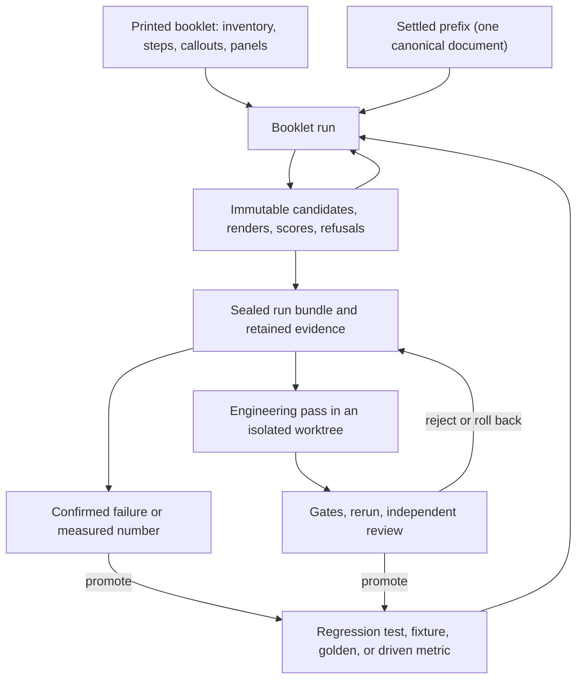

# Booklet-run evidence, evaluation, and promotion

Date: 2026-07-09

Revised 2026-08-07: rewritten around the booklet loop. The inner maker loop this document was built on — a user supplies a text brief, the system generates candidates, a visual critic judges them as designs, and the best is presented for acceptance — was cut with the AI copilot. See [`spec.md`](spec.md#cut-the-ai-copilot) for what went and what survives it.

Related: [product and architecture specification](spec.md) · [building system: assessment and plan](building-system.md) · [part model](part-model.md) · [current implementation threat model](threat-model.md)

## What this document owns

`spec.md` owns the product, domain, trust and authority contracts, and wins wherever the two overlap. This document owns what happens around a run: what evidence it must retain, what lifecycle its candidates travel, how a claim about it is evaluated, and what has to be true before a finding leaves one run and becomes a repository input.

Each section says whether it is describing something that exists or something that is specified and unbuilt, because a contract nothing exercises goes stale silently. Nothing here is a status report: `building-system.md` holds the measured position of the booklet loop, and `docs/devlog/` holds the history.

## The run this serves

A **booklet run** reads a printed instruction booklet, compiles each printed step into a build program against the settled prefix, places the pieces, and settles the step by comparing a render of its candidate against a printed panel at that panel's own camera and face.

A **printed step** is the unit of work, and it replaces the text brief entirely. It carries its callouts and quantities, its panel raster, and the printed annotations on that panel — highlight regions, displacement arrows, and the rotation icon that gives the face. There is no prompt; the run's inputs are the booklet, the catalog, and the settled prefix.

The **check is closed**. A candidate is judged by a same-or-different comparison against art the booklet itself drew, never by an open judgement of whether the model is good. The closed form measured 84 of 84 on this booklet where the open pick-one-of-N form managed 39.9 percent self-consistency, which is why the form is a contract here and not a preference.


```mermaid
flowchart TD
  K["Printed booklet: inventory, steps, callouts, panels"] --> S["Booklet run"]
  P["Settled prefix (one canonical document)"] --> S
  S --> C["Immutable candidates, renders, scores, refusals"]
  C --> S
  C --> E["Sealed run bundle and retained evidence"]
  E --> F["Confirmed failure or measured number"]
  F -->|"promote"| G["Regression test, fixture, golden, or driven metric"]
  G --> S
  E --> D["Engineering pass in an isolated worktree"]
  D --> H["Gates, rerun, independent review"]
  H -->|"promote"| G
  H -->|"reject or roll back"| E
```

### Authority boundaries

| Loop | May change automatically | May not change automatically |
| --- | --- | --- |
| Booklet run | Candidate placements inside the run budget, and the settled prefix it owns | User documents, validators, thresholds, evaluation policy, application code |
| Knowledge | Draft template, lesson, or search-policy challengers, in quarantine | Stable knowledge, catalog truth, protected holdout, promotion policy |
| Engineering | Code and UI on a branch inside a disposable exact-base worktree or equivalent sandbox | Running production code, its own evaluator, protected benchmarks, deployment |

An experiment may change the system under test or the evaluation contract, never both. That single rule is what stops apparent improvement arriving through a weakened check, an easier benchmark, a hidden camera angle, or a bar tuned on the run it is grading — all four of which this repository has actually produced.

Named authorities enforce it: the run driver owns only candidates inside a job capability; a curator may create quarantined proposals and request evaluation; an independent evaluator owns masked holdout cases, pinned validators, renderer, metrics and signed reports; the human maintainer approves stable default-pointer changes, code merges, evaluation-contract changes and release.

Stable promotion uses compare-and-swap against the expected champion version, so a stale experiment cannot replace a newer champion. Validator, scope, consent, signing, ledger and credential sensors are exercised only on synthetic fixtures in isolated test or evaluator namespaces and never receive user authority or data.

### Improvement cycle

1. **Observe:** open the printed panel and the render, look at both, and read the structured state and validator output beside them.
2. **Diagnose:** cluster a repeated failure and form a falsifiable hypothesis; name the number that would move.
3. **Choose the smallest change class:** search policy, template, catalog admission, validator, harness, or UI.
4. **Create a challenger:** preserve the current champion and change one coherent factor.
5. **Evaluate:** run paired cases with frozen budgets, catalog, validators, cameras and benchmark definitions.
6. **Review evidence:** compare hard metrics, renders, refusal counts, latency, cost, and counterexamples — as pictures, not only as scores.
7. **Promote, quarantine, reject, or roll back.**
8. **Record what was learned:** what changed, when it applies, the supporting runs, the counterexamples, and the confidence.

No claim is accepted because the agent preferred its own screenshot, and no number is quoted unless its picture has also been seen.

## Evidence

### What a booklet run retains

This exists. A run writes an immutable bundle under the ignored `output/` and `var/runs/` roots containing, per printed step: the step's outcome and evidence class, the candidate count considered, the winning transform and its score, the runner-up and the margin, the panel raster and the candidate render actually compared against it, and the typed refusal when the step did not settle.

The run also retains the whole-run summary — pieces placed, steps complete, deferrals, and the depth of the deepest reversal — plus the inputs that produced it: the prepared booklet, the run contract, the prepared options, the identification closure, and an environment digest.

Evidence is retained bounded. Every artifact is content-addressed, every retained byte is counted against a declared ceiling before it is written, and a run that would exceed its budget refuses rather than truncating.

### Immutable candidates and lineage

This exists, and it is what backtracking is built on. Every repair, replan or rejected placement creates an immutable child; it never rewrites a parent, and a rejected alternative is retained as counterevidence rather than dropped.

The requirement follows from the booklet rather than from bookkeeping. A locally symmetric placement contradicts nothing at the step that makes it, so a symmetric mistake surfaces several steps later — and the search can only walk back to the shallowest step with an untried alternative if that alternative still exists. A wrong branch has to survive as evidence, not as a gap.

Structural hashes detect duplicate states, lineage detects cycling, and metric history detects oscillation between equivalent failures. The measurable this produces is how many steps were undone and how far back the deepest reversal reached — a number that can be recorded and driven, where "prove this placement is unique" gives none.

### Typed refusals

A refusal is evidence and is treated as a product surface. Each names what happened, which input caused it, and what would satisfy it, and publishes the number it refused on.

Hard validator output is machine-actionable and is a live protocol type:

```ts
interface ValidationIssue {
  code: string;
  severity: "blocking" | "advisory";
  message: string;
  partIds: string[];
  portIds: string[];
  evidenceArtifactIds: string[];
  allowedRepairKinds: string[];
  validatorVersion: string;
}
```

Deterministic repairs run before model-guided ones. Replacing a part with a known substitution, moving along a compatible port, splitting a collision-free subassembly, reconnecting a component or reducing a template parameter costs no model call and is tried first.

Every bar a refusal is measured against is derived from the panel's own geometry. A panel has a reachable ceiling — a fully contained ghost on one measured panel caps at 0.5881 — so one fixed threshold asks a different question on every page, and a global constant in a scoring gate is a defect rather than a simplification.

## Sealed runs and replay

Run replay is a weaker contract than deterministic compilation, because a run may call a model and a model may be nondeterministic. Compilation, validation, render configuration and operation application stay deterministic at every replay level.

### Replay levels

This exists and the booklet loop uses it today. A run's closure manifest declares a `replayLevel` and the earliest boundary from which execution can resume:

- `full` — exact retained inputs, captured model boundary responses, programs, truth snapshots, configuration, and any scanned source patch and built bundle needed to restore an uncommitted challenger.
- `downstream-only` — a complete closure from the earliest retained boundary, which for a booklet run is the browser output.
- `metadata-only` — audit evidence, not executable replay; a run whose inputs were rejected earns this and nothing more.

The level is derived, never requested. A caller may ask for a retention policy; the verifier walks the transitive artifact-reference graph, checks that every required byte is content-addressed, retrievable and permitted by consent, and derives the maximum level the closure actually supports. The role set required at each level is closed and checked exactly, against a fixed maximum role count: a closure declaring a role the level does not require, or missing one it does, is refused by name.

That exactness has to be sized against a completed run, not a failing one. A bound written while every run refused early was one role too small from the day it was written, and only a run that finally reached the browser could produce the twenty-first role that exposed it.

Local booklet-run closures carry `authority: "local-diagnostic"` and `authenticated: false`, and their declared level is confined to `downstream-only` or `metadata-only`. `full` requires the sealed production path, which is specified above and unbuilt. They are inspectable evidence and grant no production authority, no seal, and no physical claim.

A sealed `sealedReplayLevel` records what the closure supported at finalization and never changes afterwards. Consent-driven deletion appends an authenticated tombstone, removes derived indexes and thumbnails, decrements blob references and garbage-collects unreferenced blobs; the sealed certificate is left alone while the API derives a separate `effectiveReplayLevel` from the tombstone lineage. **Reproduce a failure against the current effective level, not the historical sealed one** — a sealed `full` does not restore deleted bytes.

Replaying a run substitutes captured model responses at their boundaries, restores the required source and built artifacts, then re-runs compilation, validation, rendering and scoring. Hosted model APIs are not assumed reproducible.

The mirror a replay verifies against vouches for a file at a repository-relative path, not for a URL: a served module resolves exactly when the mirror declares the same relative path, and the drift check proves the checkout still holds the captured bytes. Recorder and verifier apply the same rule, or the two disagree about what was replayed.

### Native run ledger and its state machines

The authoritative record is a hash-chained append-only event stream plus sealed content-addressed artifacts, written exclusively by the released companion trust broker. SQLite is a rebuildable query index, not a second source of truth. Every event records schema version, monotonic sequence, previous-event hash, actor, transition, idempotency key and referenced artifact hashes; a truncated final record is discarded during recovery and earlier verified events remain authoritative.

A test-namespace ledger implementing these three tables exists in `apps/companion`; the production broker that would seal them does not. The tables are normative and the code enforces them. A diagram is deliberately omitted so candidate processing, model attempts and run control cannot be mistaken for one lifecycle.

#### Run

| State | Allowed next states | Meaning |
| --- | --- | --- |
| `created` | `queued`, `cancelling`, `failed`, `persistenceFailed` | The trusted job exists; preflight and its first durable event are pending. |
| `queued` | `running`, `draining`, `cancelling`, `failed`, `persistenceFailed` | Preflight passed and execution is waiting for capacity. Queue-time budget expiry enters `draining`. |
| `running` | `draining`, `cancelling`, `failed`, `persistenceFailed` | Attempts and candidates may be created within the recorded budgets. A normal stop or exhausted budget enters `draining`, not a terminal state. |
| `draining` | `succeeded`, `exhausted`, `failed`, `cancelling`, `persistenceFailed` | No new work may start. Active work is quiesced, eligible retained candidates are sealed, and the termination reason is finalized. |
| `cancelling` | `cancelled`, `persistenceFailed` | New work is forbidden; owned work is being stopped and cleaned up idempotently. |
| `persistenceFailed` | `queued`, `running`, `draining`, `cancelling`, `failed` | An explicit recovery resumes from the recorded last durable checkpoint or terminates the run. |
| `succeeded` | none | At least one presentable outcome completed and the run intentionally stopped. |
| `exhausted` | none | Draining completed after a declared budget or stopping rule; eligible retained evidence has already been sealed. |
| `failed` | none | A non-recoverable run-level error ended the run. |
| `cancelled` | none | Cancellation and cleanup completed. |

#### Model attempt

| State | Allowed next states | Meaning |
| --- | --- | --- |
| `created` | `running`, `failed`, `cancelled` | A particular provider, purpose and idempotency key have been allocated. |
| `running` | `succeeded`, `failed`, `timedOut`, `cancelled` | One external or local call is active. |
| `succeeded` | none | Its bounded response was durably captured or policy-recorded at the declared replay boundary. |
| `failed` | none | The attempt failed; the run may create a distinct attempt if budget remains. |
| `timedOut` | none | Its deadline expired; late output is diagnostic only. |
| `cancelled` | none | The attempt stopped or was abandoned under its declared cancellation semantics. |

If an attempt result cannot be persisted, the enclosing run enters `persistenceFailed` and the result stays quarantined.

#### Candidate

| State | Allowed next states | Meaning |
| --- | --- | --- |
| `received` | `compiled`, `compileRejected`, `archived`, `cancelled`, `processingFailed`, `persistenceFailed` | An untrusted program or deterministic enumeration result has been bounded and identified. |
| `compiled` | `hardValid`, `hardInvalid`, `archived`, `cancelled`, `processingFailed`, `persistenceFailed` | The trusted compiler produced an unsigned `AssemblyPatch`. |
| `hardInvalid` | `diagnosticRendered`, `archived`, `cancelled`, `processingFailed`, `persistenceFailed` | Blocking issues prevent application; only non-rankable diagnosis or a child repair may follow. |
| `diagnosticRendered` | `diagnosticReviewed`, `archived`, `cancelled`, `processingFailed`, `persistenceFailed` | Failure evidence is renderable but the candidate remains inapplicable. |
| `diagnosticReviewed` | `archived`, `cancelled`, `processingFailed`, `persistenceFailed` | Typed failure evidence may seed a new child, but this candidate can never be ranked. |
| `hardValid` | `rendered`, `archived`, `cancelled`, `processingFailed`, `persistenceFailed` | Deterministic hard gates and scope checks passed. |
| `rendered` | `critiqued`, `archived`, `cancelled`, `processingFailed`, `persistenceFailed` | The canonical render packet was sealed. |
| `critiqued` | `ranked`, `archived`, `cancelled`, `processingFailed`, `persistenceFailed` | Typed panel-comparison evidence was recorded for a hard-valid candidate. |
| `ranked` | `presented`, `archived`, `cancelled`, `processingFailed`, `persistenceFailed` | The hard-valid candidate was compared under the run's predeclared policy. |
| `persistenceFailed` | any non-terminal state above, plus `archived`, `cancelled`, `processingFailed` | Explicit idempotent recovery may return only to the recorded last durable checkpoint or a terminal quarantine state. |
| `presented` | none | Candidate processing completed. |
| `compileRejected` | none | The untrusted program failed compilation and may only inform a new child candidate. |
| `archived` | none | Processing stopped without presentation. |
| `cancelled` | none | Processing stopped under the enclosing run's cancellation generation. |
| `processingFailed` | none | Compilation infrastructure, rendering, comparison or another candidate-local stage failed; the run may continue with other candidates. |

`critiqued` is the state in which a candidate's panel comparison has been recorded. It is a lifecycle name inherited from the copilot and it now means the closed same-or-different check against a printed panel, not an open judgement of a design.

Every candidate persistence failure also moves its enclosing run to `persistenceFailed`; recovery coordinates both lifecycles. A candidate-local `processingFailed` need not fail the run when another candidate remains. A run may become terminal only after every owned attempt and candidate is terminal, durably quarantined, or explicitly resumable from a verified checkpoint. Cancellation and cleanup are idempotent at every asynchronous boundary; late events after a terminal state or from an older cancellation generation are diagnostic only, and restart resumes only from a verified finalized event.

Reaching a user document is a separate contract owned by `spec.md`. No automatic path into a user document is open today.

### The test-namespace bootstrap contract

The development test namespace has a deliberately weaker contract, because production signing and replay-closure certification do not exist yet. A test bundle manifest binds its retained roles to their content-addressed bytes and non-diagnostic source events, embeds the deterministic downstream capture checkpoints, and is anchored atomically by a `draining → exhausted` event over the exact preceding event count and root.

Recording requires explicit artifact-retention consent and local-only transmission, retains no user reference artifacts, permits no knowledge, benchmark or training reuse, and counts every distinct payload against a hard stored-byte ceiling before its put. The manifest and its handle stay visibly `integrity: unsealed` and `authenticated: false`; they carry no seal, replay level, physical claim, promotion evidence or production authority. An untrusted unsealed capture may create only neutral `received → archived` ledger records — only a released trusted replay verifier may later record compilation or hard-valid states.

## Model calls as evidence

The repository calls vision models at runtime for two jobs, and the distinction is measured rather than stylistic.

A **proposer** reads printed art — which floating piece belongs where, on which face, which way up, and which catalog part a callout thumbnail shows. It is open-ended and cheap to be wrong about, because a wrong candidate is discarded by the next panel.

A **checker** asks whether a render matches a printed panel, and must be posed as a closed same-or-different question over two pictures.

Both are bound by the same rule, and it binds harder now that the loop calls models at runtime than it ever did under the copilot: **model output is untrusted data**. It proposes; a deterministic check disposes. It cannot declare itself valid, author trusted scope or provenance, execute code, waive a hard validator, admit a part, or mutate the user document. It cannot restate a scope or a consent it was given, and a caller submits an untrusted value with only opaque broker-issued job and attempt identifiers — the trusted revision, scope, provenance, consent, truth and budget context are resolved from the job record and handed to the released compiler.

Every call records provider, model, parameters, seed where supported, and a raw response hash. The model a product calls is pinned in this repository at the call site's own module; the pin is enforced at the call, and a response that does not prove the pinned identity is refused rather than accepted with a note. Aliases are refused explicitly, because a mutable alias cannot reproduce evidence.

Consent is scoped and specific. Cropped regions of the user's own instruction booklets — callout thumbnails and step panels — may be sent to a model for part identification and step classification. Crops only: never a whole booklet, never other repository content, never credentials, and nothing retained beyond local evidence under the ignored output roots. That consent does not extend to any other user reference, design, or artifact, and external transmission, training, benchmark inclusion, sharing and Git retention stay separate decisions.

Before any transmission the broker evaluates a versioned `ProviderCapabilities` record from a maintainer-reviewed policy registry. Runtime discovery may narrow that trusted record but never broaden it or relax its data-handling policy, and an incompatible or insufficiently consented job fails preflight without sending user data. This is a live protocol schema with contract tests and no live producer; the broker that would enforce it is unbuilt.

### Blind pair judging is its own trust source

This exists. A verdict that two pictures show the same part is produced by raters who see neither features, distances, candidate answers, scores, nor the truth artifact — a strictly smaller question than "which of these candidates is this drawing?", and one that two independent raters on different models answered identically 84 of 84 times, including all eight "different" calls.

It gets its own confidence label rather than being written out as ordinary vision output, because conflating the two destroys the only thing that makes either number readable later: which mechanism established the identity. A "different" verdict is a refusal, not merely an absent judgement — an absent judgement says nobody looked, and this one says somebody looked and the claim is wrong, so the stronger evidence has to produce the stronger outcome.

A verdict is evidence and never authority. It cannot say a callout is placeable. It binds to an exact crop digest and an exact claim, the coverage compiler still disposes, the closure still has to recompile byte for byte, and a verdict whose crop or claim has moved simply stops binding.

### Model-facing observations

Specified, with live schemas and no live producer. When an external actor is given the browser or the assembly to act on, it receives a content-hashed observation and nothing else — an `ActorObservation` binding one settled frame's screenshot hash, visible-text hash, offered control identifiers, states and bounds, viewport, camera and render configuration, application build, document revision and structural hash; or a scoped assembly observation binding job and attempt identifiers, consent and scope-policy hashes, base revision and structural hash, exposed connectors, document and validator summaries, parent diff, render packet, permitted snapshots and remaining budgets.

Every field is minimized and filtered to the job's capabilities before an external provider sees it. A trusted verifier may hold the full canonical graph, debug hooks and validator detail; that evidence stays inside capture and verification and is never leaked into an acting prompt. Visible and enabled never implies permission: an action cites the observation hash, a control identifier and a granted capability, and a stale observation or an out-of-capability action is rejected atomically with a typed reason and equal pre/post document hashes proving no mutation occurred.

For every model attempt the harness first commits an attempt-start row — run, attempt and sequence identifiers, pre-action document and frame hashes, the observation or render-packet hash, bounded input and declared deadline — and later submits a terminal row. A persistence failure before the start row is committed prevents the call, so there is no unrecorded attempt. Terminal status is a closed set: `success | timeout | malformedOutput | refusal | cancelled | crash | persistenceFailed | staleObservation | capabilityRejected | controlUnavailable`.

## Evaluation

### Build the measurable intermediate first

Before work whose only honest verdict is far away, build the number that can be checked now and drive it. A booklet checks itself — step numbers run 1..N with no gaps, callout quantities reconcile against the back-matter inventory, piece totals reconcile against the official ledger — and a rebuild is scored per step by `compareBuilds` against a reference, not by hash equality.

Record the number in `output/` and move it deliberately. A change with no number attached is not progress, and the step-64 parser bug surfaced only because sequence coverage was being measured.

Two corollaries this repository paid for. A gate must be checkable against a source it did not derive itself: a fixture holding both an input and its own fold, compared to that fold, measures nothing and stayed green with the fix reverted. And a claimed accuracy must be quoted against its majority-class baseline, or 43 of 43 hides that answering the same way every time already scores 0.8837.

### Blind-judged ground truth

Where the truth is a visual judgement, it is established by raters who cannot see the system's answer, committed as a fixture, and gated. The panel-face ground truth is the worked example: two independent raters read the rendered panels without being shown the icon or each other's answers, the derivation is scored against their agreement, and the fixture records both raters' per-panel verdicts, the feature each named, and its own baseline.

A threshold is calibrated in the metric it gates and in no other. A bar maximised over one quantity and applied to another is not conservative, it is unrelated: three of the four observations behind one superseded bar were margins of a different metric whose rank correlation with the gated one flips sign panel to panel, and in the gated metric no wrong-pick observation had ever been recorded at all. When the available data cannot separate right from wrong, the honest outcome is to find a quantity that does, not to choose a better number in the one that cannot.

A bound the run has never measured is refused rather than extrapolated, and a bound whose supporting observation was oracle-conditioned does not count as a measurement.

### Benchmarks and the independent evaluator

Specified; the evaluator does not exist. Maintain three disjoint suites with different access boundaries: `dev`, visible cases used while making a change; `regression`, known failures and representative successes; and `holdout`, masked cases stored outside the agent-readable workspace and owned by the independent evaluator.

The evaluator verifies broker or evaluator seals from the expected namespace and rejects signatures originating from harness or challenger identities. It runs challenger code in a sandbox with no arbitrary filesystem access and no direct network egress, re-runs champion-pinned validators, renderer, cameras and metrics, and returns a hash-linked report containing only aggregate masked results. Cases needing a model use evaluator-owned ephemeral credentials through an allowlisted proxy, and all challenger output is size-bounded and schema-checked before release. The engineering agent cannot inspect holdout inputs, expected outputs, or case-level channels.

Each champion epoch has a finite pre-registered holdout query budget, challenger count, batching rule and release cooldown. An exhausted budget returns `inconclusive` rather than another score. The evaluator replaces holdout cases periodically and immediately after suspected leakage; a leaked case moves to regression only after its replacement is sealed. Validator, renderer, metric or evaluator changes go through a separate dual-run contract update against labelled fixtures — the proposed evaluator never grades the change that defines it.

Case families for this product: read a booklet and reconcile it against itself; fit a panel camera and derive its face; enumerate and prune placements from a settled prefix; settle a step by each evidence class — highlight, exploded ghost, and deferral to the next panel; backtrack out of a seeded wrong placement; import, edit and export known LDraw fixtures; and the failure paths — cancellation, malformed model output, model outage, WebGL context loss.

### Sensors must be tested, not trusted

Specified; partly exercised today by the synthetic-booklet drives. A canary starts from a quiet immutable champion fixture inside a disposable exact-base worktree or isolated sandbox, applies one declared reversible defect, runs the unchanged observation and oracle path, and requires the expected stable finding class. The sandbox is then discarded and the original fixture and tree hashes rechecked; restoration never uses reset, clean, checkout or branch switching in the user's workspace.

A baseline already emitting that class is `canary-invalid`; a fixture whose pinned truth no longer matches is `canary-stale`; failure to detect the seeded defect is `canary-blind`, never success.

The face-blind control is the live instance of this and it is the shape to copy. The loop is driven twice over a synthetic booklet with underside panels — once told which face each panel was drawn from, once not — and the face-blind run must do measurably worse. What it revealed is why the control exists: a face-blind run does not refuse, it produces a confidently wrong build, because the correct placement projects nowhere near the highlight and is pruned before it is ever scored. Only the inequality is gated; the specific counts are reported and may drift.

Canaries covering scope, consent, signing, ledger, credential and validator sensors use synthetic fixtures in isolated namespaces only and never touch user documents or production authority. Vision canaries use repeated pre-registered trials and sensitivity thresholds, because a single stochastic judgement cannot prove coverage. Coverage gaps are first-class findings.

### Metrics

Hard, and dominant over everything below them: compilation pass rate; catalog and transform validity; illegal-connection and collision counts; required connectivity and support against the build plate; frozen-scope and envelope compliance; replay and structural-hash consistency.

Booklet, and the ones `building-system.md` drives: printed steps read and reconciled; covered prefix length; pieces placed; steps settled and by which evidence class; refusals by name and the number each refused on; deferral reach; reversal depth; and the completion audit's agreement with the official ledger.

Soft: panel agreement against the panel's own reachable ceiling; multi-view silhouette similarity; blind human pairwise agreement; part count, rarity, latency, token usage, model calls and monetary cost.

Validity is lexicographic and a high visual score never compensates for a hard failure. Pixels cannot prove graph correctness, and graph correctness cannot prove the model is the one the booklet draws; both are inspected. When a score and an image disagree, the image is the evidence and the score is a lossy summary of it.

## Promotion

```text
observed
  -> draft
  -> quarantined trial
  -> benchmarked
     -> rejected when it regresses or meets a counterexample
     -> canary when it passes
  -> stable after review and canary evidence
  -> deprecated when later evidence invalidates it
```

A stable item is never overwritten. Promotion changes a versioned default pointer; rollback restores the previous pointer and preserves all evidence.

### Champion and challenger

Run paired comparisons using the same cases, seeds where meaningful, catalogs, validators, cameras and budgets. Before execution the curator submits and the evaluator seals a protected promotion policy; challenger code can read its public constraints but cannot alter or sign it. The policy names the champion and challenger snapshot identifiers and the expected champion version, the primary metric with direction and minimum effect, per-metric non-inferiority margins with a veto on every new hard-validity failure, required case and seed counts with a stopping rule, holdout epoch and query-budget charge, cost, latency, storage and failure-rate ceilings, required blind-review count and tie handling, and rollback triggers.

The evaluator returns `promote`, `reject` or `inconclusive`; missing samples, ties and conflicting metrics never default to promotion. Promotion requires the signed report, a reproducible experiment manifest, human-maintainer approval, compare-and-swap against the expected champion, and a verified rollback path. With enough samples a preference change needs a paired confidence interval excluding no improvement; small early suites get explicit human review rather than pretended statistical certainty.

The experiment cannot access or modify the holdout, validators, scoring policy or threshold that judges it.

### Promoting a confirmed failure

A confirmed failure becomes a regression test or a fixture. This is the main path by which a run's evidence enters the repository at all: run evidence otherwise lives only under ignored paths and is deleted once nothing active needs it.

A promoted regression stays quarantined until it has provenance and consent clearance, fails on the champion, passes on the proposed fix, records its exact test, fixture, scenario or assertion identifier, and receives approval from the human maintainer or an independently designated benchmark owner. A challenger may draft the evidence but cannot author and approve the same regression, enrol it automatically, or alter validator or metric semantics outside the contract-update workflow.

Committed fixtures and benchmarks are synthetic, repo-owned, or public by default. A real user or model artifact needs separate inspectable consent, licence clearance, minimization and redaction, and a secret and personal-data scan. Blob ceilings apply: over 256 KiB needs a stated reason, and over 512 KiB binary or 1 MiB of anything never enters ordinary Git.

## Knowledge model

Keep truth, technique and preference separate.

### Truth

Catalog geometry, connection legality, collision rules and provenance. Updated by reviewed source changes and fixtures, never inferred from a model's output or from a visual score.

Admitting a part is a truth change and follows the catalog rules in `part-model.md`: it advances the builtin catalog version, extends the migratable set, keeps the preceding version as a historical migration snapshot so existing documents keep hashing as they did, and the migration report says what changed. Missing parts are work items, not blockers.

### Template

A template is a parameterized, compiler-interpreted, validated declarative subassembly. Immutable template snapshots exist, with admission checks in `brick-kernel` and a lifecycle of `draft | trial | canary | stable | rejected | deprecated`.

Each snapshot carries identifier, version, parent, content hash, lifecycle status, the exact catalog, truth and admission-policy snapshots it was admitted under, a parameter schema with valid ranges, a fixed brick graph, typed external ports with local transforms, a required clearance envelope, allowed substitutions, and provenance and licence metadata. Retrieval pins the exact version and hash; mutable aliases resolve only before a run manifest is sealed.

"Executable" means a schema-constrained, non-Turing-complete declarative AST interpreted by trusted code. Templates, predicates and operation patterns contain no imports, scripts, callbacks, arbitrary expressions or dynamic evaluation, and expansion depth, recursion, memory, operation, part-count and time limits apply even in quarantine.

### Search policy

The booklet loop's tunable surface is a small set of named thresholds and budgets — the deferral's minimum agreement and its noise floor, the maximum lookahead reach, the candidate and render budgets, the pruning radius — and each is a knowledge item, not a constant.

Changing one creates a challenger. Every one carries the measurement that set it, the metric it is stated in, and its false-refusal and false-accept counts over every observation that exists, including a denominator of zero when that is the honest number. A threshold whose docstring makes a claim instead of quoting a measurement is a defect: one claimed subsampling moved the chosen shift "by at most a pixel" when replaying at full stride landed the optimum 7.3 px away.

### Lesson

A lesson is a scoped hypothesis with an anchor, not trusted memory. It records when it applies, what it claims, the runs supporting it, the runs contradicting it, and a confidence.

Lessons live in `docs/learning/lessons.md` as a one-line index with the war story in `lessons-evidence.md`. A lesson lands the session it is learned, anchored to a measurement, commit or test identifier; unanchored, it is folklore. When a lesson becomes a gate — a test, a lint rule, a fixed command — both halves are deleted, because the machine enforces it now.

A lesson can be wrong and can cost more than it saves. One in this repository actively argued that the booklet's rotation icon might be page chrome, and that reasoning is why the icon was detected, measured and then consumed by nothing for weeks. Deleting it was part of the fix.

## Feedback

Physical verification is the only feedback class this product has left, and it is narrow by construction. A physical claim applies to the exact document and catalog hash that was actually built, and any structural edit invalidates it.

Physical reports calibrate advisory build-order and stability checks. They do not silently change truth rules, do not promote an advisory validator to blocking without an explicit policy change, and do not imply that any other model is buildable. A general physical-buildability claim requires a separately reviewed calibration program, not an arbitrary count of successful builds.

The official set export is a corroborating witness, not an oracle. Where the repository's own derivation and a published export disagree, the disagreement is settled by geometry — collision, interlock and support — and the outcome is recorded with its numbers. On this set the export lost exactly once, and finding out cost six false positives from an orientation comparison that was not taken modulo the part's own symmetry.

## Controlled app and harness improvement

| Change | Agent authority | Promotion requirement |
| --- | --- | --- |
| Candidate placement inside a run | Automatic inside run scope and budget | Settles against a printed panel, or is refused by name |
| Draft template, lesson, or search-policy threshold | Automatic to quarantine | Benchmarks, then review or canary |
| Catalog part admission | Automatic to quarantine with full provenance | Measured scorecard, truth-version bump, migration report |
| Validator or harness code | Patch a branch inside a disposable exact-base worktree or equivalent sandbox | Tests, frozen benchmarks, adversarial review |
| App or UI code | Patch a branch inside a disposable exact-base worktree or equivalent sandbox | Browser reproduction, screenshots, accessibility, full CI |
| Companion trust broker, signing, ledger, or credential policy | Test-namespace challenger only; never production authority | Maintainer approval, security review, migration test, release signing |
| Dependencies, secrets, deployment, policy, or holdout | Never automatic | Explicit user approval |

### An engineering pass

One bounded transaction over one selected finding.

1. **Preflight.** Declare the mode, pin the clean base commit and tree, acquire the single-flight lock, and validate authority, patch policy, consent, and remaining storage, render and review budgets. Reserve the proof budget before spending the attempt budget; an attempt that cannot fund a meaningful rerun does not start.
2. **Reproduce.** Drive the exact sealed run where one exists and consent permits, within its current effective replay level. Inspect the booklet inputs, base document, build program, snapshots, validation report, lineage, render packet and event sequence before inventing a synthetic repro.
3. **Verify the evidence is non-vacuous.** A replay must check at least one required checkpoint, skip no required hard validator, and reproduce the expected structural hashes. A replay failure blocks proof.
4. **Select one finding.** Consider only verified, reproducible, open findings. Rank by severity, authority blast radius, recurrence, expected fixability and cost, and existing regression coverage, and record why the winner was selected.
5. **Propose.** Create a bounded patch capability naming allowed paths, files and byte limits, dependency and migration permissions, and forbidden broker, evaluator, secret, consent, holdout and release surfaces. Scan the proposal for secrets and licence changes.
6. **Apply in isolation.** Use a disposable worktree or equivalent exact-base sandbox. Never switch, clean, reset or otherwise mutate the user's active checkout; the challenger holds test identities and no production authority.
7. **Gate.** Run the focused failing test first, then the applicable unit, property, type, lint, build, browser, rendering, replay, resource and security gates. A gate failure is evidence, not permission to weaken the gate.
8. **Rerun and prove.** Redrive the exact retained case where deterministic; use paired pre-registered replicates where a model is involved. Combine the rerun with a fresh independent oracle sweep so source priority cannot hide a persistent failure.
9. **Assess.** A fix is proven only when the stable failure class is absent, no new hard failure exists, the affected canaries pass, and pre-registered non-inferiority holds across regression, visual, latency, cost and resource metrics. A blind, stale or invalid canary, a failed run, missing verifier evidence, or an empty or underfunded rerun blocks positive proof.
10. **Finalize.** Quiesce the challenger, complete the declared discard, contained retention or rollback policy, and verify cleanup and original-workspace integrity. Never auto-push, merge, deploy, or modify the production broker or evaluator.

Code changes stay human-gated until the user explicitly adopts a narrower automatic-promotion policy backed by strong regression coverage. No loop autonomously pushes, deploys, changes secrets, or modifies release policy.

High-risk work — persistence and migrations, security and auth, concurrency, supply chain, trust-boundary changes, edits reaching sibling repositories — goes through the multi-CLI review in `../fleet/docs/skills/multi-cli-review.md`, with this repository's doc-accuracy addendum in the prompt and a repository-grounded threat model for any trust-boundary change.

## Operational budgets and failure handling

Every run declares hard ceilings for wall-clock time, iterations, candidates, repair attempts, model calls, tokens, cost, render count and stored bytes. Cost accounting includes rendering, review, evaluation, storage and model usage even when a subscription hides the marginal price.

A budget must be able to bind. A pruned strategy budget smaller than the exhaustive strategy's, over a candidate set the exhaustive one is a superset of, saves no work and buys only a benchmark disagreement; preflight refuses that configuration as input rather than reporting its symptom. A budget refusal names the eligible count and the budget.

The harness handles model timeout, rate limit, refusal, malformed output and outage; cancellation at every asynchronous boundary; WebGL context loss and deterministic renderer reconstruction; catalog or schema mismatch; stale document revision; partial artifact writes through atomic finalization; disk quota and retention; and repeated-state loops and metric oscillation.

A failed run stays inspectable and is replayable only from the boundary its current effective replay level permits. One bad candidate or one model response cannot crash the editor or corrupt the current document.

## Milestone

The next milestone for this system is the booklet loop's own, and it is model-agnostic where it can be:

1. Retain a complete per-step evidence bundle for a partially complete prefix, not only for a completed one.
2. Replay a run from its captured model output, at the level its closure declares, and reproduce every step verdict.
3. Wire deep backtracking into the printed run, and report the reversal depth as a driven number.
4. Score a candidate against the next printed panel at a reach the run has measured without an oracle.
5. Reconcile the placed world frame with the official ledger, so the completion audit can pass.
6. Add a Node-side visual audit, so a run can reach `completed` rather than stopping at `visual-evidence-unverified`.
7. Promote each confirmed failure along the way into a regression fixture with its exact identifier.

Forward-test the trust boundary the same way, on synthetic material: seed a compiler or harness defect that lets an untrusted program modify a part outside its scope. The trusted scope validator must block application and leave the document unchanged, and the bundle must bind the exact program, event, validation report and typed occurrence. An engineering pass may then repair the defect in a disposable worktree, and reaches proven only if the exact rerun, fresh oracle, affected canary, non-regression gates and cleanup all succeed; the regression stays quarantined until independent approval.

## Co-evolution with `3d-maker`

The projects may exchange a small generic experiment envelope: artifact type and domain, generator or genome snapshot, seed and commit versions, candidate lineage, preview artifacts, typed evaluator results, selection and edit outcome, budgets and termination reason. Each repository adapts its own truth into that envelope; `3d-maker` retains genome-to-mesh semantics and `lego` retains part-graph semantics.

After both independently implement and use the same behavior, the extraction candidates are run manifest and lineage schemas, the champion/challenger runner, generic evaluator and artifact-store interfaces, and candidate comparison primitives.

Do not share generators, domain models, validators, catalogs, persistence databases, or renderer scene graphs. Do not add a game engine as a dependency of the brick-domain, browser, broker or evaluator packages in order to reuse its contracts.

## Non-negotiable safeguards

- Model output is untrusted data: restricted data, never executable code, and never self-certifying.
- Every retained candidate, comparison, decision and promotion is immutable and attributable; consent-driven deletion leaves a tombstone and a replay downgrade rather than rewriting history.
- Hard validity dominates visual resemblance, and when a score and an image disagree the image is the evidence.
- A candidate is settled against the booklet's own art, by a closed same-or-different question, at that panel's own camera, face and reachable ceiling.
- Truth, technique and preference stay separate, and stable knowledge is benchmarked, versioned and reversible.
- Every claim shows whether it is known, inferred, advisory, unverified, or physically verified.
- The serving app never rewrites itself during a user session.
- `lego` stays independent until real duplicated implementation justifies extraction.
