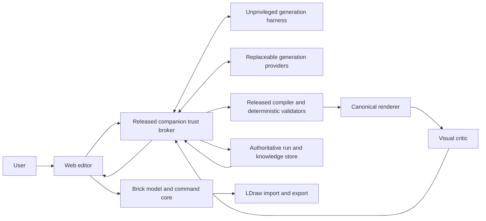

# AI-native brick modeling studio — product and architecture specification

Date: 2026-07-09

Status: design draft for review

## Decision summary

Build a separate AI-native brick modeling product in this repository. Do not merge it with `3d-maker` now.

The app combines three surfaces:

1. A precise manual brick editor.
2. An AI copilot that generates full assemblies or scoped, previewable patches.
3. A laboratory that records evidence, compares techniques, learns from accepted edits, and proposes improvements to generation, the harness, and the app.

The canonical source of truth is a versioned part-and-connection graph. Three.js scenes, renders, LDraw files, GLB files, and model-provider output are derived artifacts.

The load-bearing deterministic compilation invariant is:

> Base-document structural hash + exact normalized build-program bytes + compiler, schema, catalog, template, transform-policy, connector-taxonomy, collision-model, and validator snapshots produce the same document structural hash and validation report.

Generation replay is a separate, weaker contract because providers may be nondeterministic. A `full` replay uses captured provider and critic outputs; a `downstream-only` replay begins at the earliest retained output; a `metadata-only` record is not replayable. Compilation, validation, render configuration, and patch application remain deterministic at every replay level.

AI may propose data. It may not directly author unrestricted executable code in the model-building loop, silently mutate the user's document, waive deterministic validator failures, or rewrite the running application.

## Why this is a separate product

`3d-maker` is explicitly a procedural asset evolution studio whose source of truth is a compact genome and whose output is a generated mesh. This product's source of truth is an editable assembly graph containing real parts, explicit connections, submodels, and build steps.

The domains also mutate differently:

- `3d-maker` can safely jitter numeric parameters and rebuild a disposable mesh.
- Brick assemblies require graph-aware edits at compatible ports. Arbitrary mutation usually creates collisions or disconnected parts.
- Brick crossover is meaningful only at typed subassembly boundaries.

Co-evolution initially means shared concepts and compatible experiment envelopes, not merged repositories or shared domain models. A shared package is justified only after both projects independently implement the same behavior and the abstraction survives use in both.

## Product promise

The user can:

- Build accurately with a curated catalog of brick parts.
- Ask for an entire small model from text or reference images.
- Select a region or exposed connectors and ask the AI to add, replace, complete, repair, or restyle that portion.
- Compare several structurally valid candidates rather than receive one opaque answer.
- Inspect exactly what an AI patch adds, removes, or changes before accepting it.
- Edit an accepted candidate with the same commands used for manual work.
- Export to LDraw-compatible tools for additional editing, rendering, instructions, or sourcing.
- Replay any generation episode to the level permitted by its retained artifacts and consent policy.
- See whether a claim is known, inferred, advisory, unverified, or physically verified.

## Goals

1. Make AI output useful as an editable starting point even when it is not a finished design.
2. Make illegal or out-of-scope AI edits impossible to apply silently.
3. Support both full-model and bounded subassembly generation.
4. Improve through accepted designs, user edit diffs, validated templates, failure cases, and frozen benchmarks.
5. Let an engineering agent inspect renders and structured state, reproduce weaknesses, patch the system in isolation, and prove improvement before promotion.
6. Remain useful as an offline manual editor when no AI provider is available.
7. Preserve interchange with the LDraw ecosystem without making raw LDraw text the internal authoring model.

## Non-goals for the first product

- Rebuilding every BrickLink Studio feature.
- Full official-part coverage.
- Claiming perfect physical stability, clutch strength, or instruction accessibility from geometry alone.
- Photorealistic path tracing.
- Automatic purchasing or marketplace transactions.
- Real-time collaboration.
- Technic, flexible parts, arbitrary hinges, or complex articulated assemblies in the first catalog.
- Autonomous production deployment or self-approval of application code.
- Training a foundation model before retrieval, templates, search, and repair have been measured.

## Core workflows

### Manual building

The user searches a part palette, previews placement as a ghost, snaps compatible ports, rotates through legal orientations, and applies edits through an undoable command transaction.

Initial commands are place, move, attach, detach, copy, delete, recolor, group, create submodel, and assign build step. Collision, disconnected-component, and exposed-port overlays remain available during editing.

### Full generation

The user supplies a text brief and optionally one or more reference images, dimensions, palette, allowed inventory, piece budget, and style preferences. The system creates a hierarchical component plan, produces several candidates, validates and repairs them, renders canonical views, and presents the best diverse valid candidates.

### Scoped generation

The user defines one of four scopes:

- Selected parts that may be replaced.
- An empty insertion volume.
- Exposed connectors that a new subassembly must attach to.
- A frozen model with a named semantic region to complete or restyle.

The request captures locked parts, mutable parts, required attachment ports, allowed volume, allowed parts and colors, and a part budget. The AI returns an `AssemblyPatch`, never a replacement document.

### Repair

The system converts validator failures into typed, localized issues and attempts deterministic repair before asking a model to revise its proposal. Examples include replacing an unavailable part, reconnecting a detached component, resolving a collision, or moving a subassembly inside the allowed envelope.

### Variant exploration

The user can branch from a valid candidate, lock parts or semantic regions, and generate a small population of variants. Lineage is preserved. Mutation occurs through typed operations and parameterized templates, not arbitrary coordinate noise.

### Teaching the system

When the user accepts and edits a candidate, the app records the canonical command diff from candidate to final model. The user may promote a recurring subassembly or technique for later retrieval. Rejected candidates remain labeled negative evidence.

## System architecture



### Target repository layout

```text
apps/
  web/                       React, Vite, TypeScript, Three.js editor
  companion/                 Minimal released trust, ledger, seal and credential broker
  harness/                   Unprivileged Node/TypeScript maker and experiment worker
services/
  generators/                Optional Python model-provider adapters
packages/
  protocol/                  Versioned JSON Schema and generated types
  brick-domain/              Documents, commands, patches, migrations
  catalog/                   Parts, colors, geometry, ports, licenses
  build-program/             Restricted declarative assembly language
  validation/                Geometry and assembly truth
  rendering/                 Three.js derivation and canonical captures
  generation/                Briefs, providers, repair, ranking, lineage
  evaluation/                Native metrics, protected promotion, and optional fleet projection
knowledge/
  templates/                 Curated declarative subassemblies
  techniques/                Versioned construction and search strategies
  lessons/                   Evidence-backed scoped hypotheses
benchmarks/
  dev/
  regression/
var/
  state/                     Ignored local broker index, CAS, and development state
  runs/                      Ignored immutable run bundles
```

The real holdout is not stored in the agent-readable repository. An independently owned evaluator receives a sealed challenger artifact, runs masked cases with champion-pinned validators, renderer, cameras and metrics, and returns a tamper-evident aggregate report. Any leaked holdout case is rotated into regression.

This is the target boundary, not permission to scaffold every package immediately. Implementation begins as a small workspace and splits only when a boundary has real behavior.

### Technology decisions

- React manages editor panels and application state; it does not own the Three.js scene graph.
- Three.js renders disposable scene state derived from the canonical document.
- Pure TypeScript owns model semantics, commands, import/export normalization, and validators so the browser and released broker use identical rules. The worker may call the same packages, but its validity claims are never authoritative.
- Vitest covers pure domain behavior; Playwright covers interaction, deterministic capture, and visual workflows.
- Python is confined to optional provider adapters for research models such as BrickNet. It never becomes the source of truth for model validity.
- Cross-language provider messages conform to versioned JSON Schema and contract tests.
- The recursive engineering loop borrows `civ-engine`'s small improvement finding and run-manifest vocabulary through a LEGO-owned dev-time compatibility adapter against a pinned package version. The native sealed LEGO run remains authoritative; the browser, brick domain, broker, and production evaluator do not depend on game simulation types. Build and CI contract-test the adapter against that pin; each native run records the package, schema and adapter versions. Extract a domain-neutral package only after a second non-game product demonstrates the same stable mapping and the dev-only dependency has become a real maintenance cost.
- The manual editor starts and remains usable without the provider service.

### Interactive runtime topology

The first delivery is an installed browser/PWA shell, a minimal loopback companion trust broker, and an unprivileged maker worker. The trust broker is a separately released security boundary, not another mode of the mutable experiment harness.

- The browser owns the interactive document and offline manual editing in IndexedDB. A service-worker-cached shell keeps the primary per-install origin usable when the broker is stopped.
- `apps/companion` serves the pinned web bundle and versioned job API, owns the authoritative event ledger, SQLite index, content-addressed blobs, OS-keystore-backed signing identity and allowlisted provider credential proxy. At boot it verifies its release manifest; OS identity and keystore policy expose production keys and credentials only to an approved released binary. Dirty, development or challenger builds are forced into a visibly separate test namespace. The broker runs only released compiler, validator, canonicalization and policy code, never loads challenger code, and never exposes raw provider credentials.
- `apps/harness` is an unprivileged maker and experiment worker. It receives bounded capabilities and artifacts, proposes untrusted programs, and calls providers only through the broker's quota- and consent-enforcing proxy. Production uses a release-signed worker under a restricted OS identity. Engineering challengers use a separate test broker namespace, test keys and test provider credentials and can never write or sign production evidence.
- The broker and worker are separate processes with distinct identities and sanitized environments. The broker does not launch challenger builds. An evaluator accepts only broker- or evaluator-sealed artifacts from the expected namespace; a seal created by a worker or challenger identity is invalid.
- The primary web origin uses a stable per-install numeric-loopback scheme, host and reserved port so IndexedDB, the non-extractable device key, pairing pins and queued outbox events survive restarts. Tokens and nonces rotate, not the origin. An origin change requires an explicit authenticated migration served by both old and new origins; if the old origin cannot run, the app refuses automatic migration and preserves the old profile for recovery.
- Pairing launches the stable origin with a one-time secret in the URL fragment. The app exchanges it once and immediately removes it with `history.replaceState`. In return, it receives a short-lived capability token whose audience is the exact origin and whose scopes name permitted API families. The token stays only in app memory. Every request carries a non-extractable device-key proof over method, canonical path and query, content type, body digest, token audience and scopes, exact origin, nonce and token hash. The broker signing-key fingerprint and device public key are pinned for challenge-response token renewal after reload. One-time secrets and bearer material never enter query strings, persistent browser storage, logs or artifacts; no host-scoped cookie is used.
- Job events use a streaming transport with polling fallback. The same API supports hosted execution later without changing document semantics.
- If the broker is absent, manual editing, local projects, deterministic validation, rendering, LDraw interchange, and trusted browser-local template tools continue to work. A local template tool compiles directly into a hard-validated manual command transaction with `localTool` provenance; it is not an AI candidate or broker-sealed patch. Model-provider generation, recorded candidate creation, AI-patch acceptance, run-ledger queries and experiments are visibly unavailable.
- The worker shuts down provider adapters and releases resources on explicit stop; unexpected browser disconnect does not silently terminate an active recorded job.

The loopback API and every imported/provider-supplied artifact are untrusted boundaries. The service binds only numeric loopback addresses and rejects unexpected `Host` or `Origin` values, DNS-rebinding attempts, missing request proofs and replayed nonces. The implementation caps JSON depth and bytes, operation and part counts, image dimensions, archive expansion, LDraw recursion, external references, render memory and runtime. It rejects path traversal, escapes stored text in the UI, forbids dynamic evaluation, and treats artifact prose as evidence rather than operational instructions.

## Canonical domain model

### `BrickDocument`

```ts
interface BrickDocument {
  schemaVersion: string;
  id: string;
  revision: string;
  truth: TruthSnapshot;
  name: string;
  parts: PartInstance[];
  connections: ConnectionEdge[];
  submodels: Submodel[];
  steps: BuildStep[];
  semanticRegions: SemanticRegion[];
  constraints: DocumentConstraints;
  provenance: DocumentProvenance;
}
```

`TruthSnapshot` pins the catalog, connector taxonomy, collision model, transform policy and validator versions required to interpret the document. Saved documents never float to newer truth implicitly; migration produces a new revision with an explicit report.

Each part instance has a stable ID, namespaced catalog part ID, color ID, rigid transform, submodel and step membership, semantic tags, and provenance. Position is stored in integer LDraw units. Initial legal orientations are catalog IDs; articulated joints later add bounded joint parameters whose transforms are derived rather than accumulated.

Part transforms are authoritative. Connection edges are validated semantic annotations that must agree with the relative transforms implied by their ports. Moving a part must either preserve and revalidate an edge or detach it explicitly. The model rejects dangling IDs, duplicate edges, over-capacity ports, incompatible or multiply occupied ports, transform/edge disagreement, inconsistent loops, and invalid submodel or step membership.

Canonical serialization defines stable array ordering, ID generation, numeric normalization and the exact provenance fields excluded from or included in the structural hash. Cosmetic metadata never changes structural identity.

### Part catalog

A `PartDefinition` contains:

- Namespaced part ID and aliases.
- Geometry source and content hash.
- Bounds and simplified collision representation.
- Typed connection ports with local transforms and compatibility rules.
- Legal orientations and substitution rules.
- Available colors, mass or weight when known, and inventory metadata.
- Source, license, attribution, and catalog-version provenance.

Truth imported from differently licensed datasets remains in separately attributable catalog layers. It is not flattened into an untraceable application-owned blob.

### Connection graph

A connection edge joins two named ports and records connection kind, joint parameters, and provenance. The normalized taxonomy is extensible; the first catalog supports studs and tubes only. Pins, axles, hinges, clips, balls, and fixed connections arrive after the kernel is proven.

### Restricted `BuildProgram`

AI providers emit a restricted declarative program or typed operation suggestions. They never emit a trusted patch envelope, JavaScript, Python, shaders, SQL, or arbitrary commands.

Initial operations include:

- Instantiate a validated template with parameters and transform.
- Place a catalog part at a legal target port.
- Attach two compatible ports.
- Remove or replace named parts inside an allowed scope.
- Move or recolor a submodel.
- Assign parts to a build step.

Automatically generated templates, predicates, lessons, and operation patterns use the same schema-constrained, non-Turing-complete declarative AST. The trusted compiler enforces expansion depth, recursion, memory, operation, part-count and time budgets. Imports, scripts, callbacks, arbitrary expressions, dynamic evaluation, TypeScript and Python are forbidden even in quarantine.

The compiler deterministically turns a valid program into document commands. Compilation failure is a normal rejected candidate, not an application error.

Provider and critic output is always an `UntrustedCandidateProgram` or untrusted operation suggestion. It cannot author revision, scope, provenance, consent or validation fields. The harness submits that untrusted value with only the opaque broker-issued job and attempt IDs. The broker resolves the trusted revision, scope, provenance, consent, truth and budget context from its job record and supplies it to the released compiler; only that compiler can create an unsigned candidate patch.

### `AssemblyPatch`

```ts
interface AssemblyPatch {
  schemaVersion: string;
  baseRevision: string;
  baseDocumentHash: string;
  truthSnapshotHash: string;
  scopeCapabilityId: string;
  scopeDigest: string;
  operations: BuildOperation[];
  provenance: GenerationProvenance;
}

interface PresentedPatchEnvelope {
  schemaVersion: string;
  jobId: string;
  candidateId: string;
  cancellationGeneration: number;
  compilerSnapshotHash: string;
  buildProgramHash: string;
  validationReportHash: string;
  candidateState: "presented";
  patch: AssemblyPatch;
  seal: {
    algorithm: "Ed25519";
    keyId: string;
    keyEpoch: number;
    issuedAt: string;
    signature: string;
  };
}

interface AcceptanceAuthorization {
  schemaVersion: string;
  authorizationId: string;
  transactionId: string;
  envelopeHash: string;
  baseDocumentHash: string;
  truthSnapshotHash: string;
  browserDeviceKeyId: string;
  cancellationGeneration: number;
  issuedEventSequence: number;
  issuedEventRoot: string;
  seal: {
    algorithm: "Ed25519";
    keyId: string;
    keyEpoch: number;
    signature: string;
  };
}
```

The complete allowed scope lives in the trusted job record created from the user's action, and the browser retains an immutable copy of that original capability for the life of the job. `scopeCapabilityId` is an opaque reference; it does not grant authority. The trusted compiler creates the unsigned `AssemblyPatch`. Only after hard validation and transition to the terminal candidate state `presented` may the broker create a `PresentedPatchEnvelope`.

The broker signs the canonical serialization of the entire envelope except `seal.signature`, including both schema versions, every patch field, job and candidate identity, cancellation generation, compiler and build-program snapshots, validation report and terminal state. The browser pins the Ed25519 verification key during pairing and rejects an unknown key or noncanonical envelope. Envelope integrity has no browser-clock expiry, but an envelope alone is not applicable.

When the user clicks Accept, the online broker serializes that request with cancellation and revocation events, rechecks the exact base and truth hashes, and prepares a one-use `AcceptanceAuthorization` bound to the envelope, proposed transaction ID and paired browser device. The issuance event commits the hash of the authorization payload before `issuedEventRoot` and `seal`; after sealing that new ledger root, the broker fills the root and signs the canonical serialization of every final authorization field except `seal.signature`. If cancellation or revocation won the ordering race, authorization fails before any document write. Once recorded, the authorization is irrevocable for that one transaction even if the run later cancels or keys rotate. The browser verifies the signed authorization and inclusion proof, reruns the complete before/after scope diff against its retained capability, and only then starts its IndexedDB transaction. If the broker, authorization, envelope seal, original capability or verifier is unavailable, acceptance remains blocked. A disconnect after authorization may delay mirroring but cannot change the decision. Raw `AssemblyPatch` values are never directly applicable.

Presented-patch acceptance is transactional. It verifies the base revision, frozen part hashes, scope, truth snapshots, and hard validators before changing the document. Version 1 forbids rebasing a stale patch: the user must regenerate it. A later three-way rebase may proceed only when every touched entity, scope, catalog and constraint is proven unchanged, followed by recompilation and full validation.

Manual editing may temporarily create a draft-invalid document. An AI patch must introduce no new blocking issue outside its scope, must leave its affected scope hard-valid, and must preserve global validity when the base was globally valid. The UI distinguishes `patchValid` from `documentGloballyValid`.

An accepted AI patch is one undoable command transaction. Preview renders show additions, removals, changed parts, and unresolved advisory issues.

## Generation provider boundary

Every provider implements the same asynchronous contract:

1. Receive a normalized `BuildBrief`, optional base-document summary, retrieved examples, technique snapshot, and explicit budget.
2. Stream progress and immutable untrusted candidate programs; it never creates the trusted patch envelope.
3. Support cancellation.
4. Report exact provider, model, parameters, seed when supported, and raw response hash.
5. Never report its own output as valid; the shared compiler and validators decide.

Before any prompt, reference or model summary is transmitted, the broker evaluates a versioned `ProviderCapabilities` record from a maintainer-reviewed policy registry. Each registry entry is independently signed or pinned and declares supported protocol, schema and catalog versions; text, image and mesh inputs; tool-call and streaming support; real versus best-effort cancellation; seed behavior; size and budget limits; local or external execution; retention and training policy; and accepted consent classes. Runtime discovery may narrow this trusted record but can never broaden it or relax its data-handling policy. Incompatible or insufficiently consented jobs fail preflight without sending user data.

Visual-critic operations are subject to the same untrusted-program boundary and provider preflight.

Initial provider strategies are:

- Deterministic template composition and constrained search.
- A tool-using general model that calls restricted build operations.
- A research adapter for BrickNet or a successor, gated by licensing and benchmark results.
- Mesh or voxel target conversion for image and 3D-reference workflows.

No provider is architectural. Providers are challengers behind adapters and may be removed without changing the editor or canonical document.

### Generation job protocol

The trusted broker creates a job record containing `jobId`, idempotency key, base revision and structural hash, truth snapshots, scope capability, consent classification, budgets and cancellation generation. Job creation durably transfers the exact canonical base-document bytes, complete scope capability, and a resolvable immutable truth bundle into broker-owned content-addressed storage. Existing blobs may be referenced only after the broker resolves and verifies them. Browser and broker independently calculate the same hashes, and a job cannot leave `created` until those artifacts and the creation event are sealed. Events contain the job ID, candidate ID when applicable, a monotonic sequence, event schema, and terminal-state expectation.

The normative run states are `created`, `queued`, `running`, `draining`, `cancelling`, `cancelled`, `succeeded`, `failed`, `exhausted`, and `persistenceFailed`. `draining` stops new work, quiesces active work, seals eligible retained candidates and only then reaches a terminal state. Provider attempts, candidates and acceptance have separate normative state tables in the learning-system design. Cancellation is idempotent. Events arriving after a terminal state or from an older cancellation generation are retained only as diagnostics and cannot create presentable or applicable candidates.

Candidate acceptance is a compare-and-swap against the current document revision and truth snapshots. A late job cannot overwrite newer user work. Version 1 regenerates stale candidates rather than rebasing them.

## Validation hierarchy

Validity is lexicographic. A high visual score cannot compensate for a hard failure.

1. **Compilation:** supported schema, catalog parts and colors, finite canonical transforms, legal operations.
2. **Structural:** compatible ports, permitted orientations, no material collision under the defined model, required connectivity, allowed envelope, frozen scope, and part budget.
3. **Buildability advisory:** support, approximate stability, insertion accessibility, and plausible build order. These remain clearly advisory until calibrated with physical evidence.
4. **Intent:** required semantic features, dimensions, palette, silhouette, image or text resemblance.
5. **Product:** part count, rarity, estimated cost, generation latency, and provider cost.

Hard validators return typed issues with implicated part and port IDs, geometric evidence, and permitted repair classes. If no candidate passes the hard gates, the UI may show the best diagnostic draft but must not label it valid or buildable.

## Rendering and visual inspection

Every candidate receives a deterministic render packet:

- Fixed isometric presentation view.
- Front, back, left, right, top, and underside orthographic views.
- Silhouette and depth passes.
- Part-ID pass for grounding visual findings to model entities.
- Exploded or layer view when useful.
- Connection, collision, disconnected-component, exposed-port, and support overlays.
- Closeups around each blocking validator issue.

The visual critic sees the prompt or reference, render packet, structured document summary, validation report, and parent diff. It judges recognizability, proportion, color, style, obvious missing features, and visible awkwardness. It may propose typed repairs or a strategy restart. It cannot waive or alter validator results.

The generator and visual critic should not always be the same model. Randomized audit views and protected structural metrics reduce camera and critic gaming.

## User experience

The main workspace contains:

- A central 3D viewport.
- Part palette and template library.
- Scene, submodel, and step tree.
- Selection and constraint inspector.
- AI brief panel with full, region, completion, repair, and variant modes.
- Candidate tray with canonical views, scores, failures, lineage, cost, and patch diffs.
- Validation panel that distinguishes blocking, advisory, and unknown findings.
- Run inspector for replay, provenance, and learned evidence.

Candidate generation never blocks manual editing. A job is tied to the document revision at submission time, supports cancellation, and cannot win a race against newer user state.

## Persistence and provenance

- IndexedDB stores local projects, current revision history, thumbnails, and preferences needed by the browser.
- Accepting a candidate atomically commits the document command transaction and an outbox event. The event contains a stable transaction ID and acceptance ID, the `PresentedPatchEnvelope`, its `AcceptanceAuthorization`, base and resulting revision and structural hashes, canonical command-transaction hash, scope digest, and browser application-bundle identity. The browser considers the patch accepted only after that IndexedDB transaction commits. Before appending authoritative acceptance, the broker authenticates the paired browser, verifies that the one-use authorization exists in its ledger, verifies the envelope and capability, replays the patch against its retained canonical base and truth bundle, reproduces the result and command hashes, and deduplicates by transaction ID. A broker disconnect after authorization leaves the event safely queued without weakening those checks.
- The companion trust broker is the exclusive writer of the authoritative hash-chained append-only event stream. It authenticates user, curator, maintainer and evaluator capabilities before recording their events, and seals finalized event roots with a signing key accessible only to the minimal released broker identity through the OS keystore. Files are written to temporary names and atomically finalized; the final manifest contains all artifact hashes. Post-final acceptance, edit or deletion records are linked events, not mutations of the sealed manifest.
- Development-only test recorders use a separate namespace and may retain the exact canonical maker request and authority-free output only with explicit local artifact-retention consent. Every distinct retained CAS payload counts against the captured brief's hard stored-byte budget before I/O. Their bundle manifest binds those two CAS artifacts to non-diagnostic source events and an exact prefix-checked `draining → exhausted` terminal append. The exact capture bytes are bound before any neutral candidate receipt and quarantine events, so crash recovery cannot substitute a later capture. The recorder never projects an untrusted checkpoint into native compilation or hard-valid states. Its output remains unsealed and unauthenticated, preserves explicit candidate failure stage and code, and cannot assert a replay level, seal, production validity, acceptance, or promotion evidence.
- SQLite is a rebuildable query index over the authoritative events and bundles. It is not a competing record of truth.
- Content-addressed files store programs, documents, LDraw, renders, reports, and retained raw provider responses.
- Git stores schemas, migrations, curated templates, techniques, lessons, prompts, and benchmark definitions.
- Large part libraries, provider weights, raw run corpora, and generated images are not committed.
- Every run pins application, broker and harness commits plus source-tree/diff and built-bundle hashes, lockfiles, runtime versions, relevant non-secret configuration, schema and catalog hashes, provider and critic versions, prompt and technique hashes, reference hashes, budgets, and seeds. Retrievable content-addressed source patches and built bundles are retained only after secret and license scans; hashes without retrievable content are not sufficient for source-level replay.
- At finalization, the broker validates the transitive artifact closure and seals a replay certificate containing `sealedReplayLevel: full | downstream-only | metadata-only`, the earliest retained boundary, every required artifact hash and retrievability evidence. Callers may request retention but cannot set the result. Later tombstones leave this certificate unchanged while the API derives a separate `effectiveReplayLevel`.

Secrets remain behind the broker's credential proxy and outside worker environments, project artifacts and browser bundles. User references and accepted models require explicit opt-in before they are sent to external providers, committed as knowledge or benchmarks, or reused for training.

Deletion creates an authenticated signed tombstone, removes derived indexes, thumbnails and knowledge links, decrements content-addressed blob references, and garbage-collects unreferenced blobs. Sealed manifests and prior events remain unchanged. The index and API derive the current effective replay level from the tombstone lineage without retaining deleted sensitive content. Export and consent revocation follow the same lineage links.

## Interchange

- App JSON is the editable source format.
- LDraw `.ldr` and `.mpd` are the primary ecosystem interchange formats.
- Version 1 defines an exact LDraw subset covering supported parts, colors, rigid matrices, submodels and steps. Connection edges are inferred deterministically and supported golden fixtures must reproduce the same canonical edge set.
- Unsupported parts, arbitrary matrices, articulated poses, local or external references, and unknown metadata are rejected with diagnostics or preserved as explicitly opaque view-only records. They are never silently rounded, dropped or made editable.
- LDraw export preserves stable part transforms and steps and may include a namespaced metadata extension for provenance without requiring it for compatibility.
- GLB is a derived delivery or rendering export, never the authoring source.

Plain LDraw is lossy for AI provenance and unsupported connection semantics; exact complete replay uses app JSON or a metadata-bearing export. Supported-subset round trips are verified against golden models and external viewers. BrickLink Studio is an interoperability and behavior reference, not a code or asset dependency.

## External research and licensing gates

Research systems are evidence that the feature is viable, not permission to ship their data or weights.

- BrickNet code is a promising graph, connector, collision, and generation spike. Its model, dataset, connector, and collision-asset terms require a complete audit before redistribution or commercial use.
- BrickGPT is a useful restricted-catalog baseline; upstream dataset and solver terms require the same audit.
- The LDraw parts library must preserve file-level source, license, and attribution metadata.
- LDCad Shadow Library-derived connector data remains a separately attributed share-alike data artifact.
- Internet-curated models are not assumed to be training data merely because their referenced part geometry is reusable.
- The public product name, logo, domain, and non-affiliation language require trademark review before launch.

The first implementation artifact is a dependency and data bill of materials that records origin, version, license, redistribution rights, and runtime role.

Primary references for the first audit are the [LDraw legal terms](https://www.ldraw.org/legal-info), [LDCad Shadow Library](https://github.com/RolandMelkert/LDCadShadowLibrary), [BrickNet code](https://github.com/kulits/BrickNet) and [CVPR 2026 paper](https://openaccess.thecvf.com/content/CVPR2026/papers/Kulits_BrickNet_Graph-Backed_Generative_Brick_Assembly_CVPR_2026_paper.pdf), [BrickGPT code](https://github.com/AvaLovelace1/BrickGPT) and [ICCV 2025 paper](https://openaccess.thecvf.com/content/ICCV2025/papers/Pun_Generating_Physically_Stable_and_Buildable_Brick_Structures_from_Text_ICCV_2025_paper.pdf), and LEGO's [Fair Play policy](https://www.lego.com/en-us/legal/notices-and-policies/fair-play).

## Automation and testability

The app exposes a stable, test-only automation bridge:

- `window.render_app_to_text()` returns document, selection, active job, candidate, validation, lineage, and overlay state.
- `window.capture_model_views()` captures named canonical render passes.
- `window.get_model_snapshot()` returns a schema-versioned document summary and structural hash.
- `window.advanceTime(ms)` advances deterministic animations and timers used by automated tests.

These rich hooks are verifier instrumentation, not the browser actor's action surface. Trusted capture code in the test or evaluator boundary may call them and retain `VerifierEvidence`; an external or model-facing actor receives only a filtered, hashed `ActorObservation` and a bounded action API. It has no arbitrary browser evaluation, direct debug-hook access, or production authority. Production builds either omit the bridge or require a separately authenticated test namespace that cannot reach production documents, identities, credentials or ledgers.

The shared experimentation protocol can adapt `3d-maker`'s existing `render_game_to_text()` hook without forcing the two applications to share a domain API.

### Independent evaluator boundary

Promotion evaluation runs in an independently pinned sandboxed process or service, not in the challenger harness. It verifies broker or evaluator seals from the expected namespace and rejects worker- or challenger-originated signatures, accepts sealed canonical documents and scanned challenger artifacts, re-runs champion-owned validators, renderer, cameras and metrics, and executes masked holdout cases unavailable to the engineering agent. Challenger code has no arbitrary filesystem access or direct network egress. Provider access, when a case requires it, uses evaluator-owned ephemeral credentials through an allowlisted proxy. Outputs are size-bounded and schema-checked, and only aggregate masked reports cross back into the engineering workspace. The evaluator emits a hash-linked tamper-evident report. A change to validator or evaluator policy follows a separate dual-run contract-update workflow against labeled fixtures and cannot judge itself.

Tests include:

- Model and command property tests.
- Compiler and patch-scope invariants.
- Golden LDraw import/export round trips.
- Connector, collision, connectivity, and bounds fixtures.
- Provider contract and malformed-output tests.
- Cancellation, stale-result, and WebGL-context-loss paths.
- Browser interaction and screenshot tests.
- Actor- and maker-observation redaction, consent, scope, action-capability, stale-observation and browser-replay tests.
- Table-driven recursive-pass finalization and failure-injection tests covering idempotent `PassOpened` admission, admission-write failure, exact same-request retry, and same-key/different-request conflict; one-to-one pass/native-run identifier binding; every legal mode, progress state, stage and stop-reason mapping; rejection of unknown or mismatched mode, outcome, stop-reason and verdict tuples; bidirectional cleanup and rollback overrides including deterministic both-failed precedence in diagnosis, proposal and full modes; persistence failure at every stage; unavailable verifiers; append-committed/acknowledgement-lost deduplication; proof that no projection appears before a durable terminal append; and the requirement that `fixed-proven` reproduce a matching signed verifier verdict and complete affected-path coverage.
- Fixed generation benchmarks with immutable run manifests.
- Resource-disposal and large-model performance tests.
- Model-based job, candidate, feedback and promotion state-machine tests.
- Fleet-projection contract tests for strict findings, lightweight manifests, stable failure classes, explicit run IDs, and native-run references.
- Recursive-pass acceptance tests: two deterministic drives agree, a seeded defect reaches class-level `fixed-proven`, and failed or malformed runs still append valid terminal evidence.
- Acceptance-authorization ordering against cancellation and key rotation, outbox idempotency, compare-and-swap, rollback and crash-recovery tests.
- Pairing, full-request proof, nonce replay, stable-origin recovery and authenticated origin-migration tests.
- Trust-boundary tests proving workers and challenger builds cannot read production credentials, use signing keys, write the authoritative ledger or mint accepted namespaces.
- Evaluator and holdout access-boundary tests.
- Event-log hash-chain, truncated-final-record and sealed-bundle tamper tests.
- Replay-level downgrade, deletion, consent revocation and content-addressed garbage-collection tests.
- Template, technique and lesson lifecycle property tests.

## Delivery sequence and gates

### Gate 0 — Provenance and executable contracts

- Establish the dependency and data bill of materials.
- Define `BrickDocument`, `BuildProgram`, `AssemblyPatch`, `PresentedPatchEnvelope`, `AcceptanceAuthorization`, validator issue, render packet, actor and maker observation, attempt transcript, trust-namespace, native sealed run-manifest, `PassOpened`, `PassVerdict`, `PassTerminalRecord`, and rebuildable fleet-projection schemas.
- Specify and threat-model the broker/worker process boundary, production release identity, key access, credential proxy, stable web origin and test namespaces before provider integration.
- Define catalog and connector provenance rules.
- Generate `THIRD_PARTY_NOTICES`, preserve per-layer license files, and add a packaging test that excludes evaluation-only assets and weights while auditing required attribution.

Exit: every planned code, geometry, connector, collision, weight, and example source has an explicit allowed role or is marked evaluation-only, and a distributable test package proves those boundaries.

### Gate 1 — Deterministic assembly kernel

- Curate 8–20 basic bricks and plates with verified geometry and stud/tube ports.
- Implement the canonical graph, commands, build-program compiler, renderer, diagnostic overlays, and hard validators.
- Implement a minimal manual editor and LDraw round trip.

Exit:

- Supported-subset golden models round-trip with exact instance, transform and deterministically inferred connection-edge equality; unsupported data is rejected or preserved as opaque without loss.
- Seeded invalid fixtures are rejected with the expected typed issue.
- Every admitted output is connected, legal, collision-free under the defined validator, and reproducible by structural hash.
- No physical-stability claim is made.

### Gate 2 — Harness-first generation

- Add immutable run bundles, replay, canonical render packets, template composition, constrained search and repair, and candidate comparison.
- Add explicit recorded browser and maker transcripts, fresh-instance deterministic re-drive, and a dev-time fleet adapter for validated run summaries, strict findings, stable `data.class` keys, and append-only pass projections.
- Generate 10–40-part models from a restricted palette before integrating research weights.
- Add visible dev and regression suites, an evaluator-owned masked holdout, a pre-registered champion/challenger policy, stable default pointers and a verified rollback path before provider integration.
- Pass the engineering-loop acceptance drill: two clean drives agree, one deliberately seeded harness defect reaches a verified finding and class-level proven fix with a promoted regression, and a failed run still leaves valid terminal evidence.

Initial target:

- Every applied AI candidate is `patchValid`. A globally invalid result is allowed only when the base was already globally invalid, the patch adds no blocking issue outside its scope, and the UI continues to report `documentGloballyValid: false`.
- On a frozen basic-prompt suite, at least one of four candidates is recognizable and worth editing on 70% of tasks under declared latency and cost budgets.
- User rejection and edit diffs are captured without becoming automatic positive knowledge.

### Gate 3 — First AI provider and full-model generation

- Evaluate provider adapters behind the common contract.
- Add one end-to-end mode: small full-model generation from text with the restricted catalog.
- Add structured visual critique and one or two bounded repair cycles.

Exit: the first vertical slice can generate three valid small-model candidates, accept one transactionally, edit it manually, export LDraw, and replay the episode to its declared level.

### Gate 4 — Scoped copilot

- Add one scoped mode first: completion through explicitly selected exposed ports.
- Enforce frozen parts, target volume, required attachment ports, allowed palette and piece budget through the trusted scope capability.
- Add insertion-box generation, replacement, repair and variants only after exposed-port completion passes its own frozen suite.

Exit: scoped generation never changes frozen or out-of-scope state, stale patches must regenerate, and the complete accepted delta is inspectable and undoable.

### Gate 5 — Learning and engineering harness

- Add accepted-case retrieval and quarantined lesson and template proposals on top of the already working champion/challenger evaluator.
- Add bounded open-finding retrieval, sensor canaries, governed regression enrollment, and derived fleet dashboards without treating raw prose as instructions.
- Add app-improvement automation in disposable exact-base worktrees with patch capabilities, reserved proof budgets, browser visual QA, fresh oracle sweeps, full non-regression proof, and no mutation of the user's active checkout.

Exit: a challenger can be reproduced, compared fairly, expressed through the fleet pass vocabulary, promoted without changing its evaluator, and rolled back to the previous stable snapshot; every terminal outcome has sealed native evidence and a rebuildable pass projection.

### Gate 6 — Images and richer construction

- Treat a single image as semantic and style guidance with explicit hidden-geometry uncertainty.
- Prefer multiple views or image-plus-text constraints for reconstruction.
- Expand parts and connector types only with validator fixtures and provenance.
- Calibrate build order and stability advice with physical-build feedback.

Physical verification attaches only to an exact document and catalog hash and is invalidated by structural edits. The product continues to describe other output as digitally connection- and collision-validated; a general physical-buildability claim requires a separately reviewed calibration program, not an arbitrary count of successful builds.

### Gate 7 — Co-evolution with `3d-maker`

When both repositories contain proven duplicate behavior, extract only the stable generic pieces: run manifests, lineage, champion/challenger experiments, evaluator interfaces, and possibly candidate-gallery infrastructure.

Do not share brick documents, part catalogs, connection validators, procedural genomes, mesh generators, or persistence databases.

## Success criterion for the first release

A user can describe a small model, receive several connected and collision-free candidates from a restricted catalog, understand the evidence and remaining uncertainty, accept one as an undoable patch, edit it manually, export LDraw, and replay the episode to its declared level.

The system improves only through evidence: accepted edits, validated templates, typed failures, frozen benchmarks, and reversible experiments.
