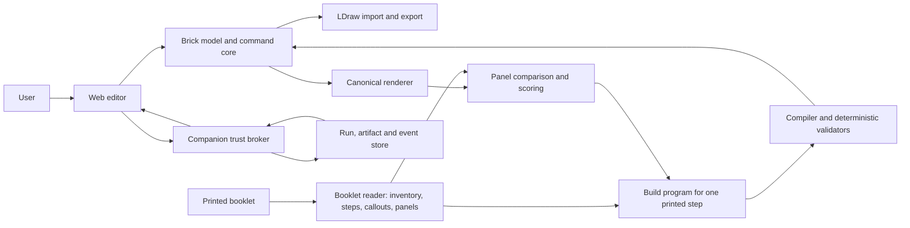

# Brick modeling studio and instruction-booklet build loop — product and architecture specification

Date: 2026-07-09

Revised 2026-08-22: current implementation includes catalog `/15` with the separately reviewed `25269` and `28802` exterior packets, bounded branch-aware farther-panel carry, one exact source- and data-attested step-5 origin shortcut, a deterministic post-search target-equivalence audit that withholds canonical completion when no proper upright world frame realizes the official target, and a generation-3 browser boundary that retains the exact eight-way empty-root camera frontier, routes fixed actions through a fail-closed physical-authority guard, and intentionally refuses before the first placement. Stable document-candidate and parent-bound lineage identities, bounded inspection-only lineage evidence, live panel-camera adapters, canonical candidate-document snapshots, a normalized farther DAG, prepared-search inspection and an automatic BuildProgram compiler now exist as prerequisites. A standalone inspection-only atomic compiled-branch batch snapshots detached enumerator offers, retains the exact ordered request and reservation, deduplicates convergent physical work, independently recompiles every unique transition in Node, and emits exact child snapshots plus parent-specific lineage edges. A separate compiled-observation-closure `/1` sidecar replays exact MSB-packed silhouette registration and convergent selection under a prepared policy, while a browser branch-evidence `/1` index binds dense external compiled-evidence and observation roles without base64 expansion. A refusal-only local consumer now rejects orphan closure tables and charges measured cumulative lineage rows, typed observations, source/camera rows, selection/accepted-transition references, exact root/child canonical-document bytes, proposals and raster work before bounded root reconstruction, then derives and charges conservative compiler graph/byte work-policy units including step preparation before semantic replay; typed observation reuse requires the exact replay-admitted work inspection. It exact-binds prepared step/compiler/proposal facts, requires legacy observation-generation, selection, and acceptance fields to remain empty, separately verifies each typed closure and any nonempty committed raw role, and returns an authority-absent summary of local lineage and observation calculations. An authority-free source-parity `/4` diagnostic now retains exact production, candidate, and XOR evidence for five mask classes across a dense 359-step opt-in browser path, with source/runtime, exact PDF, prepared-panel, served-response, browser-result, and publication bindings; its browser work-RGBA, policy, and derivation commitments remain explicitly opaque and its source-RGBA display column is visualization-only. The fixed five-panel path now adds a separate source-bound publication wrapper that reproduces the exact browser capture, full 359-row manifest, source snapshot, provenance, served source, checkout, and runtime closure before deriving an audit-only execution identity and retaining five roles plus ten PNGs under a content-addressed run. It remains pending and authority-free: the review foundation still returns `needs-adjudication`, and no human-owned issuer or admission capability exists. None of these seams forms browser-output `/4`, enters `runRealBuild`, mutates a document, or grants completion; browser-output `/3` therefore remains the exact eight-root step-1 refusal. Superseded implementation history lives in the devlog.

The atomic compiled-branch prerequisite now admits a bounded ordered set of distinct canonical root documents, keeps exact-byte-convergent identities in one root group, and adds an exact-lineage digest over the existing structural lineage ID, exact parent, canonical-byte digest and UTF-8 length. This prevents substitution between structurally equal but canonically distinct parents without changing the generic lineage `/1` contract. The producer resolves each proposal against its own privately retained branded parent snapshot, proves before reservation that the worst bounded zero-frontier terminal envelope fits, and reserves the aggregate frontier once before any compiler call. Root, unique-child and final-wire ceilings remain separate bounded limits, so a success envelope that grows too large can still fail late into that pre-admitted terminal evidence without exposing a partial frontier. A separate deterministic branch-role finalizer accepts only module-produced compiled batches, preflights both aggregate role sizes and the same cumulative lineage, closure, raster and compiler-work ceilings used by the semantic consumer before any raw observation-role copy, rechecks exact lineage and closure digests after that admission, verifies any supplied observation closure and raw role against the matching lineage and prepared policy, fills unexposed final role storage one step at a time, emits dense digest-bound roles, and returns fresh byte storage with transport authority explicitly absent. Both seams capture the private-brand, retained-store, serialization, encoder and byte-copy intrinsics they use after hostile data can execute. These additions still provide neither a browser-output `/4` report envelope nor a live capability issuer, source/camera provenance, terminal continuity, accepted document, or document mutation.

## Decision summary

This repository is scoped to two surfaces and nothing else; their current implementation status is stated below.

1. A precise manual brick editor.
2. A closed loop that reads a printed LEGO instruction booklet and assembles the set it describes — counting every part, compiling the printed steps into a build program, placing each piece, and verifying each step against the booklet's own printed panel before playing the result back.

Do not merge this with `3d-maker`. `3d-maker`'s source of truth is a compact genome whose output is a disposable mesh, and it can safely jitter numeric parameters; this product's source of truth is an editable assembly graph of real parts at real seats, where arbitrary mutation just makes collisions. Co-evolution means compatible experiment envelopes, not merged repositories — a shared package is justified only after both projects independently implement the same behavior.

The canonical source of truth is a versioned part-and-connection graph. Three.js scenes, renders, LDraw files, GLB files, printed-panel rasters, and model responses are derived artifacts.

The load-bearing deterministic compilation invariant is:

> Base-document structural hash + exact normalized build-program bytes + compiler, schema, catalog, template, transform-policy, connector-taxonomy, collision-model, and validator snapshots produce the same document structural hash and validation report.

Run replay is a separate, weaker contract, because a run may call a model and a model may be nondeterministic. Under the target replay contract, a `full` replay uses captured model outputs, a `downstream-only` replay begins at the earliest retained output, and a `metadata-only` record is not replayable. Compilation, validation, render configuration and operation application remain deterministic at every replay level; current tooling performs data-only closure inspection rather than executable replay.

A model may propose data. It may not author executable code in the build loop, silently mutate the user's document, waive a deterministic validator failure, or rewrite the running application.

## Status and how to read this specification

This document contains both implemented behavior and target product contracts. Durable domain, validation, authority, consent, provenance and untrusted-input rules bind now. Product promises, end-state workflows, production topology, complete user experience, delivery exits and the success criterion describe the target unless a section explicitly says that it is current.

As of 2026-08-14, the current product is an offline-capable manual React and Three.js editor with integrity-checked IndexedDB projects, a searchable catalog, snapped placement and attachment, precise transform and color editing, deletion, undo and redo, live structural validation, manual build playback, and bounded LDraw import and export. The deterministic document, command, compiler, validator, catalog and rendering packages are implemented. Builtin catalog `/15` has 87 definitions: 61 render parametric recipes and 26 render bundled LDraw surfaces with source-faithful normals. Sixteen are render-only promotions that preserve their preceding connector, allowance, and conservative collision declarations; the other ten are fully measured definitions.

The booklet loop currently runs through internal Node, Python, Vitest and Playwright tooling. The web app's Instructions control ingests a PDF locally into bounded page and text metadata plus a content hash, but does not render panels, compile build steps, verify placements or apply a run to a user document. `building-system.md` owns the exact measured reconstruction frontier and the ordered work still missing.

Current retained-run infrastructure is local and development-only: `apps/companion` is a library and test slice for artifact storage, a test run ledger and a test recorder, while ignored run evidence lives under `var/` and `output/`. There is no released loopback broker, credential proxy, production signing identity, unprivileged worker, production authority namespace or executable sealed replay path.

Current model-assistance code consists of a hard-disabled strict `/5` local transport intended for cropped part-identification cards, one opt-in legacy script that describes a cropped printed-step placement, and a quarantined N/N+1/conditional-K checker contract and one-tool subscription-CLI adapter exercised only by mocked tests. The former part-identification `/4` transport was retired after a live child created local files despite its nominal `Read` allowance; 73 current-input replies captured before termination remain quarantined and cannot resume under `/5`. The replacement exposes exactly one no-argument MCP image tool, validates a sanitized five-event stream, and binds exact card bytes, answer lines, call proofs and content-addressed checkpoint predecessors, but both production entrypoints throw before runtime work because there is no immutable crop-scoped authorization/provider-policy record or launch settlement that charges failed calls and aggregate usage. The older panel script accepts one arbitrary resolved local file path without containment, file-type, dimension, PDF, page, or crop-bounds validation and exposes an authenticated temporary copy of those bytes to the CLI with piece text and a fixed relation prompt. It supplies no candidate render, later panel, alternate view, deterministic face-parity record, or source provenance, and its record keeps digests and the raw reply but not the exact input bytes. The quarantined checker binds and validates exact source/render bytes, face and candidate lineage, hard budgets, strict same/different/unjudgeable refusal semantics, and an exact MCP tool result without granting repository `Read`, but no producer proves PDF/crop correspondence or consent, no driver consumes it, and no successful live verdict has been retained. These ignored outputs are not called by the studio or wired into the real-booklet driver; candidate panel agreement in that driver is scored deterministically from renders and pixels. The prepared transition classifier is raster-blind, blind same-or-different verdicts are retained evidence rather than an integrated checker, and the driver remains linear instead of using the implemented backtracking library. Model output remains untrusted under every current and target path.

The deterministic real-booklet driver now integrates a bounded branch-aware farther-panel path for an ambiguous step N: it retains every origin with its cached exact N+1 score render, carries one intervening step under shared candidate and narrowing ledgers, and scores conditional K only after the carry completes atomically. Hash, piece-witness, lineage, report, parser and artifact bindings prevent one branch or image from being relabeled as another. A family decision may reject an origin family but cannot falsely settle an ambiguous descendant, and a typed budget or observability refusal leaves all completed alternatives immutable without changing the document. A separate calibrated shortcut applies only when the exact retained step-5 origin IDs and piece witnesses, prepared step-5/6/7 data, run options, input digests, and captured source closure match their reviewed attestation; it scores those two origins directly against panel 7 after panel 6 remains ambiguous. Generic carry still earns K only after its intervening step completes, and neither path is generic deep backtracking or an integration of the model checker.

The live browser boundary deep-detaches the complete JSON-like run input before asynchronous preparation, including panels, order and page bindings, digests, accounting, coverage, and budgets, then re-snapshots the caller input after module and PDF preparation and refuses any drift before raster, search, or placement. It globally sorts the detached panels by printed step, asserts exact contiguous execution before each page raster, and renders booklet pages on demand. Page-render failure retains one row for every requested step, the exact preceding document, and causal blocking; module, page, PDF-document, or loading-task failures use bounded non-invoking diagnostics, and cleanup failure produces typed failed output without erasing already completed reports, document bytes, or input digests. Browser-output `/3` bounds the terminal `documentJson` before parsing it once, derives only the requested transition-prefix witnesses, exact-binds every report action and action-evidence digest to its prepared panel, and then binds the terminal hash, part count, global validity, ordered accepted `BuildStep` IDs, indexes, semantic names and owned-part counts, plus canonical document identity, root ownership, metadata and manual provenance. A genuine validated zero-piece transition advances the accepted hash only through one unique empty canonical `BuildStep` whose independently reconstructed target prefix changes the hash without changing the part count; a forged hash-preserving no-op is rejected. A root rendering refusal may retain bounded elapsed time but no successful raster or candidate work, while every later blocked row must retain exact zero-work causality, including zero elapsed work, with no validation, candidate, raster, render or document drift; a genuine camera-handedness refusal alone may retain the panel evidence it measured before refusing. These execution guarantees do not make the still-unthreaded panel-camera frontier authoritative.

The separate source-raster diagnostic distinguishes H, the high-resolution cleaned-art mask; P, production assembly obtained by isolating at high resolution and then downsampling; D, the counterfactual obtained by downsampling before isolation; and W, the work-raster candidate. Its exact-byte stage trace makes H, P, D, intermediate masks, topology, and bounded component summaries inspectable while labeling source descriptors opaque and non-reproducing. The opt-in source-parity `/4` path then compares production and W over assembly, own-panel source, own-panel exclusion, built, and exclusion classes for every prepared step, retaining exact packed production/candidate/XOR evidence under the bound execution closure. The current implementation unit has not executed the full 359-step probe, and none of these measurements establishes source truth, physical truth, or browser-output authority.

The exact-five calibration path binds only steps/pages 90/79, 101/87, 346/213, 358/218, and 359/219 to a contract derived from all 359 prepared panels. Its browser-only constructor retains exact high/work RGBA, H/P/D stage bytes, W, pairwise P/D/W facts, and ten lossless PNGs in five bounded external roles; the Node parser reconstructs the transient wire, decodes every PNG to the retained RGBA, replays H/P/D, and independently re-derives W from the work raster and prepared crop. The source-bound publication wrapper accepts only a reproduced capture plus the exact full 359-row manifest and held source closure, cross-binds the PDF, subset contract, browser-result bytes, source snapshot, provenance, served source, checkout, and runtime facts, then derives its execution identity internally as audit data. It writes the capture manifest, full manifest, five roles, ten PNGs, and provenance into a content-addressed run tree and atomically replaces the discoverable summary last. Authority remains explicitly absent and review state pending-unreviewed; the separate review parser still labels human review as an unverified claim, and adjudication remains `needs-adjudication` for missing truth, drift, W mismatch, and exact W equality alike because no human-owned review issuer or admission boundary exists. The real-booklet exact-five opt-in has now published those fixed rows under audit-only execution identity `sha256:979157ed12ef36fcd59a85aba13268d56a47d77ee886070cd31221805d756462`; its summary remains `pending-unreviewed` with authority absent, and the publication cannot admit or launch the full 359-step source-parity probe.

A structurally valid searched document is not automatically the official target. After finalization binds the retained document, reports, exact identity metadata, searched transforms, build sequence, canonical step ownership, and structural validation, the deterministic target-equivalence audit exhausts the four proper upright yaws with one global integer-LDU translation. It matches same-step identities as exact design/material/catalog/color groups, compares complete connector, collision, allowance, bounds, and flat render triangle-and-normal realization modulo catalog-proved upright self-symmetry, and accepts only a proper frame that realizes every placement. Inputs are bounded to 1..1,464 unique identity/part rows with safe-integer upright transforms, and a per-audit catalog-definition and relative-transform cache prevents repeated realization work. Official transforms enter only this post-search evaluator, never enumeration or scoring. A D4 reflection may be retained as a physical-layer and inferred-contact diagnostic, but it is never accepted as a world frame or completion. When no proper frame survives, the exact candidate bytes remain only a `diagnosticPrefix` with `targetEquivalence: "unreconciled"`; canonical `documentJson`, `structuralHash`, and `finalParts` remain null, null, and zero.

## Target product promise

The user can:

- Build accurately with a curated catalog of brick parts, with every illegal placement refused at the command rather than flagged afterwards.
- Hand the app a printed instruction booklet and have it read the set's inventory, printed steps, callouts, and panels.
- Watch it build that set step by step, each placement checked against the booklet's own drawing before the build moves on.
- See exactly why a step was refused, in the booklet's own terms — which panel, which highlight, which arrow, which candidate, and by how much it missed.
- Edit the resulting model with the same commands used for manual work.
- Export to LDraw-compatible tools for further editing, rendering, instructions, or sourcing.
- Replay any booklet run to the level permitted by its retained artifacts and consent policy.
- See whether a claim is known, inferred, advisory, unverified, or physically verified.

## Goals

1. Read a printed booklet accurately enough that the booklet's own internal checks — step numbering, callout counts, inventory totals — reconcile.
2. Place every piece the booklet places, in the frame the booklet draws, and prove it against the printed panel rather than against a hash.
3. Make an illegal placement unreachable through the editor, not merely detectable after the fact.
4. Keep every step's verdict measurable and reproducible, so a change with no number attached is visibly not progress.
5. Recover from a wrong placement by backtracking, rather than by trying to be right the first time.
6. Remain useful as an offline manual editor with no network and no model available.
7. Preserve interchange with the LDraw ecosystem without making raw LDraw text the internal authoring model.

## Non-goals

- Rebuilding every BrickLink Studio feature, or full official-part coverage.
- Claiming physical stability, clutch strength, or instruction accessibility from geometry alone.
- Photorealistic path tracing, marketplace transactions, or real-time collaboration.
- Generating an original model from a text brief, or any copilot that proposes designs the user did not draw or print.
- Autonomous production deployment or self-approval of application code.
- Training a foundation model on anything here.

## Current and target workflows

### Current manual editor

The current UI searches a part palette, previews placement as a ghost, places or attaches a catalog part, moves and rotates a selected part, edits its transform and color, deletes it, and applies undo and redo through bounded command history. Explicit viewport placements create manual playback steps; connected transforms detach explicitly rather than silently preserving an invalid edge.

The current interface has single-part selection and does not expose copy, grouping, submodel creation or direct step assignment as user commands. The target authoring workflow adds those operations, explicit attach and detach controls, scene/submodel/step organization, and collision, disconnected-component and exposed-port overlays while preserving the rule that an illegal placement is refused by the command that would create it and the refusal names the observed values.

### Target: reading a booklet

The reader derives the set inventory, the printed step sequence, each step's callouts and quantities, each step's panel raster, and the printed annotations on that panel — highlight regions, displacement arrows, and the rotation icon that says which face the panel is drawn from.

The booklet checks itself, and those checks are the loop's early measurable: step numbers run 1..N with no gaps, callout quantities reconcile against the back-matter inventory, and a parts-bin quantity is distinguished from a repeat multiplier by printed type size, with an unclassifiable size failing rather than defaulting into either class.

Panel geometry is fitted from the panel's own printed stud lattice, which gives azimuth, scale and phase but cannot give the face or horizontal hand — a projected square lattice reads identically from above and below and under reversal of one horizontal basis vector. The face comes from the printed rotation icon as a running parity from a named seed step, while the horizontal hand is resolved only from asymmetric bound visual evidence; a step outside the contiguous read prefix refuses rather than defaulting to studs-up, and an exact cross-hand tie retains the ambiguity rather than defaulting to an enumeration order.

### Target: building and verifying a printed step

A printed step compiles into build-program operations against the settled prefix — the single canonical document representing every step already settled. Candidates are enumerated from the prefix's own free connectors, seeded from both sides of a stud-tube joint, and pruned by lattice, connector graph, collision and the build-plate rule before anything is rendered. The whole printed step is proposed as one object, because its pieces are placed together and scored together.

A placement is settled only inside a bound observation packet. For a placement made at step N, inspect panel N, panel N+1 as the minimum later witness, and the first farther panel that actually reveals the placement when N+1 occludes it or remains ambiguous. N+1 is not a guarantee: if no retained panel exposes the claimed surface or relation, record it as `not-observable` rather than infer correctness from silence. A booklet image cannot certify a hidden surface it never shows.

Steps therefore have distinct evidence classes, chosen from a free signal rather than assumed: a panel with a usable highlight is scored against it, a step drawn exploded has each candidate redrawn back along the printed arrow's line and compared against the drawn ghost, and a step with neither begins later-panel deferral at N+1 and continues under the observation packet above. Every bar in that comparison is derived from the panel's own geometry, never from a global constant — a panel has a reachable ceiling, so one fixed threshold asks a different question on every page.

The printed arrow states a direction, not a length: an exploded step's seat is occluded, so the ink stops at the visible surface while the part comes to rest behind it. A candidate that ranks first on pixel agreement is not thereby correct; when a score and an image disagree, the image is the evidence and the score is a lossy summary of it.

Missing parts are work items, not blockers. A step needing a part the catalog lacks gets the part added, with family, real LDraw identifier, connectors, collision primitives and provenance; it is never substituted or skipped.

`building-system.md` owns the measured position of this loop and the ordered plan for what is missing. Outside the exact attested step-5 shortcut, the current runner does not yet produce the complete arbitrary-depth N/N+1/farther observation packet, does not use raster evidence in transition classification, has no integrated vision checker, and does not backtrack. Its deterministic post-search audit refuses the measured reflection after complete catalog-realization comparison. The pure registration primitive scores all four proper quarter turns and all four x-reflected counterparts with a separate translation for each and refuses an exact cross-hand silhouette tie. `RealBuildPanelCameraRegistration` validates, copies, and deeply freezes `{latticeHand,latticeDeterminant,registrationPanelStepNumber,turnDegrees,shiftPx}` as panel-local raster evidence, never as authority for a physical transform. The resolver snapshots the canonical document, masks, and shared ledger state around hashing and rendering, verifies the supplied document digest before work, requires every observation panel to be strictly later than the candidate prefix, and atomically reserves complete eight-way D4 families. Browser-output `/3` now creates the exact canonical empty `real-build` document, reserves and retains its eight explicitly unregistered step-0 roots before any panel placement callback, and then refuses printed step 1 because placement scoring is not yet carried through those immutable lineages; the document stays empty and every later requested row is causally blocked. Nested panel-camera evidence `/2` commits the prepared PDF/page/crop/face, exact retained panel and build captures, camera, raster dimensions, built/excluded/render-mask digests, score, centre, shift, hand, determinant, and turn, but it does not retain the exact mask bytes required to recompute the score, so a positive-piece completion remains unauthorized. The new source-parity `/4` schema is a separate authority-free diagnostic generation, not browser-output `/4`; it binds how source-stage and work-raster comparisons were produced but does not cross-bind those masks to compiled candidates or report continuity. Omitted-piece and `multi-build-copy` runner call sites still enter the opaque fixed-action guard before their executor and return `fixed-ledger-frame-unresolved` because no trusted physical-frame authority producer exists. The horizontal-hand repair therefore remains open even though the root and fixed-action refusals are executable in the live runner.

### Target: backtracking

A locally symmetric placement contradicts nothing at the step that makes it, and the model keeps growing on top of every placement, so a symmetric mistake surfaces later rather than never.

The requirement is therefore not to resolve every ambiguity before committing, but to go back far enough when one surfaces: the search commits to its best candidate, retains every rejected alternative as counterevidence, and walks back to the shallowest step with an untried one. That gives the loop a measurable — how many steps were undone and how far back the deepest reversal reached — where "prove this placement is unique" gives none.

### Current manual playback and target booklet playback

The current editor plays back manually authored placement steps. The target booklet workflow plays a completed reconstructed build step by step from the canonical document, using the same renderer and the same step membership the build produced.

## Architecture

### Target product architecture

The following diagram is the target end state. The web editor, domain core, interchange, booklet derivation, deterministic compilation, rendering and panel-scoring slices exist in different degrees; the companion trust-broker path does not.


```mermaid
flowchart LR
  U["User"] --> W["Web editor"]
  W --> M["Brick model and command core"]
  M --> X["LDraw import and export"]
  K["Printed booklet"] --> RB["Booklet reader: inventory, steps, callouts, panels"]
  RB --> PG["Build program for one printed step"]
  PG --> C["Compiler and deterministic validators"]
  C --> M
  M --> R["Canonical renderer"]
  R --> CP["Panel comparison and scoring"]
  RB --> CP
  CP --> PG
  W --> B["Companion trust broker"]
  B --> S["Run, artifact and event store"]
  S --> B
  B --> W
```

### Repository layout (current)

```text
apps/
  web/                       React, Vite, TypeScript, Three.js editor and booklet run driver
  companion/                 Library/test artifact store, test run ledger and test recorder; future broker home
packages/
  protocol/                  Versioned JSON Schema and generated types and validators
  brick-kernel/              Documents, commands, compiler, patches, validation, migrations
  catalog/                   Parts, colors, geometry, connectors, collision, licenses
  rendering/                 Three.js derivation, canonical captures, render packets
scripts/                     Booklet, LDraw, Builder and catalog derivation tooling
docs/                        Design, policy, provenance and devlog
var/state/                   Ignored local broker index, CAS, and development state
var/runs/                    Ignored immutable run bundles
output/                      Ignored booklet run evidence and scoreboards
```

Split a package only when a boundary has real behavior.

### Technology decisions: current boundaries and target obligations

- React manages editor panels and application state; it does not own the Three.js scene graph, which renders disposable state derived from the canonical document.
- Pure TypeScript owns model semantics, commands, import/export normalization and validators. The browser and current companion test slice use those rules; a future released broker must use the same packages. A future worker may call them, but its validity claims are never authoritative.
- Vitest covers pure domain behavior; Playwright covers interaction, deterministic capture, booklet runs, and visual workflows.
- Python is confined to derivation tooling — LDraw, LDCad and Builder source measurement — and never becomes the source of truth for model validity.
- Cross-language messages conform to versioned JSON Schema and contract tests.
- The manual editor starts and remains usable without the broker and without any model.

### Target production runtime topology (unbuilt)

The target delivery is an installed browser/PWA shell, a minimal loopback companion trust broker and an unprivileged worker. None of the released broker, production identity, credential proxy, production authority namespace or worker exists today. `apps/companion` currently exports library/test implementations of an artifact store, test ledger and test recorder; it has no server entry point and confers no production authority.

The target production contract is:

- The browser owns the interactive document and offline manual editing in IndexedDB. A service-worker-cached shell keeps the primary per-install origin usable when the broker is stopped.
- The released companion serves the pinned web bundle and versioned job API, and exclusively owns the authoritative event ledger, rebuildable SQLite index, content-addressed blobs, OS-keystore-backed signing identity and allowlisted model-credential proxy. At boot it verifies its release manifest; production keys and credentials are reachable only by the approved released binary, while dirty, development and challenger builds are forced into a visibly separate test namespace. The broker runs only released compiler, validator, canonicalization and policy code, never loads challenger code, and never exposes raw credentials.
- The unprivileged worker holds bounded capabilities and calls models only through the broker's quota- and consent-enforcing proxy. Broker and worker are separate processes with distinct identities and sanitized environments, and a seal created by a worker or challenger identity is invalid.
- The primary web origin uses a stable per-install numeric-loopback scheme, host and reserved port so IndexedDB, the non-extractable device key, pairing pins and queued outbox events survive restarts. Tokens and nonces rotate, not the origin; an origin change requires an explicit authenticated migration served by both origins, and if the old origin cannot run the app refuses to migrate and preserves the old profile for recovery.
- Pairing passes a one-time secret in the URL fragment, exchanged once and immediately removed with `history.replaceState` for a short-lived capability token whose audience is the exact origin and whose scopes name permitted API families. The token stays only in app memory, and every request carries a non-extractable device-key proof over method, canonical path and query, content type, body digest, token audience and scopes, exact origin, nonce and token hash. One-time secrets and bearer material never enter query strings, persistent browser storage, logs or artifacts; no host-scoped cookie is used.
- If the target broker is absent, manual editing, local projects, deterministic validation, rendering, LDraw interchange and trusted browser-local template tools continue to work. A local template tool compiles directly into a hard-validated manual command transaction with local provenance; it is not a broker-sealed patch. Broker-mediated model calls, recorded production runs, ledger queries and sealed evidence are visibly unavailable.

The future loopback API and every current or future imported, printed or model-supplied artifact are untrusted boundaries. The production service must bind only numeric loopback addresses and reject unexpected `Host` or `Origin` values, DNS-rebinding attempts, missing request proofs and replayed nonces. Every implementation path must cap JSON depth and bytes, operation and part counts, image dimensions, archive expansion, LDraw recursion, external references, render memory and runtime; reject path traversal; escape stored text in the UI; forbid dynamic evaluation; and treat artifact prose as evidence rather than operational instructions.

## Canonical domain model

### `BrickDocument`

```ts
interface BrickDocument {
  schemaVersion: string;
  id: string;
  revision: string;
  truth: TruthSnapshot;
  name: string;
  parts: PartInstance[];
  connections: ConnectionEdge[];
  submodels: Submodel[];
  steps: BuildStep[];
  semanticRegions: SemanticRegion[];
  constraints: DocumentConstraints;
  provenance: DocumentProvenance;
}
```

`TruthSnapshot` pins the catalog, connector taxonomy, collision model, transform policy and validator versions required to interpret the document. Saved documents never float to newer truth implicitly; migration produces a new revision with an explicit report.

Each part instance has a stable ID, namespaced catalog part ID, color ID, rigid transform, submodel and step membership, semantic tags, and provenance. Position is stored in integer LDraw units. Legal orientations are catalog IDs; articulated joints add bounded joint parameters whose transforms are derived rather than accumulated.

Part transforms are authoritative and connection edges are validated annotations that must agree with the relative transforms implied by their ports. This ordering exists because of the booklet: instructions give placements and never connections, so the loop derives which studs meet which tubes from geometry — and if edges were authoritative a document could assert a connection the geometry contradicts, with nothing able to say which was right.

Moving a part must either preserve and revalidate an edge or detach it explicitly. The model rejects dangling IDs, duplicate edges, over-capacity ports, incompatible or multiply occupied ports, transform/edge disagreement, inconsistent loops, and invalid submodel or step membership.

Canonical serialization defines stable array ordering, ID generation, numeric normalization and the exact provenance fields excluded from or included in the structural hash. Cosmetic metadata never changes structural identity. The structural hash covers part identifiers, so it answers whether two documents are the same document, not whether two models are the same model.

### Part catalog

`part-model.md` owns how a part is organised, indexed, defined and constructed. A `PartDefinition` carries namespaced ID and aliases, geometry source and content hash, bounds and simplified collision representation, typed connection ports with local transforms and compatibility rules, legal orientations, a substitution-group identifier, available colors, inventory metadata, and source/license/attribution/catalog-version provenance. Current builtin inventory records leave `knownMassGrams` unset; richer substitution rules and measured mass are not implemented catalog truth.

Catalog measurement, mesh generation, semantic checks, and focused tests automate parts of admission, but no tool or model admits a part automatically. Admission remains a reviewed repository change that records sources, inspects matched views, advances the truth snapshot, and passes migration and verification gates; an unexposed surface is named `not-observable`, not approved by omission.

Truth imported from differently licensed datasets stays in separately attributable catalog layers, never flattened into an untraceable application-owned blob.

Adding a part is a catalog-truth change: it advances the builtin catalog version, extends the migratable set, and the migration report says what changed. The preceding version is kept as a historical migration snapshot so existing documents keep hashing as they did.

### Connection graph

A connection edge joins two named ports and records a wire-level connection class, joint parameters and provenance. Catalog ports implement ten kinds: `stud`, `undersideClutch`, `axle`, `axleHole`, `pin`, `pinHole`, `bar`, `clip`, `hinge` and `hingeSocket`.

The six catalog pair rules are `stud` to `undersideClutch` with rigid quarter-turn alignment and opposed axes; `axle` to `axleHole` with rigid quarter-turn alignment and collinear axes; `axle` to `pinHole` with continuous revolute motion and collinear axes; `pin` to `pinHole` with continuous revolute motion and collinear axes; `bar` to `clip` with continuous revolute motion and collinear axes; and `hinge` to `hingeSocket` with continuous revolute motion and opposed axes. Placement discovery uses those port rules, but `ConnectionEdge.kind` and `AttachInstruction.connectionKind` still carry only `stud-tube`; the referenced ports currently supply the more specific pair. End-to-end edge semantics require a versioned protocol expansion before the other pair identities can travel on the wire.

### Restricted `BuildProgram`

A printed step or other proposer emits a restricted declarative program or typed operation suggestions. Nothing emits a trusted patch envelope, JavaScript, Python, shaders, SQL, or arbitrary commands.

The current program schema and compiler, not the studio's exposed command set, support placing a catalog part at an explicit rigid transform, attaching two named ports through the `stud-tube` wire class, removing or replacing a named part, moving or recoloring a named part, and assigning one part to a build step. The schema also contains `instantiateTemplate`, but the current compiler rejects it explicitly because no template compiler is installed.

The current compiler validates the closed operation schema and enforces exactly three trusted scope budgets—maximum operations, added parts, and removed parts—before deterministically producing document commands; compilation failure is a normal rejected result rather than an application error. Expansion depth, recursion, memory, elapsed time, and template part counts are not current compiler budgets.

The target template path uses a schema-constrained, non-Turing-complete declarative AST and adds expansion-depth, recursion, memory, part-count and time budgets. Imports, scripts, callbacks, arbitrary expressions, dynamic evaluation, TypeScript and Python remain forbidden even in quarantine. Those template-expansion capabilities and resource limits are specified, not implemented.

Model output is always untrusted candidate data. It cannot author revision, scope, provenance, consent or validation fields. Current local model tooling remains outside the user-document command path. Under the target broker topology, a caller submits an untrusted value with only opaque broker-issued job and attempt IDs; the broker resolves the trusted revision, scope, provenance, consent, truth and budget context from its job record and hands it to the released compiler, and only that compiler can create an unsigned candidate patch.

### Compiled patch and scope

The compiler's output is an `AssemblyPatch`: schema version, base revision, base document hash, truth snapshot hash, scope capability ID, scope digest, operations, and provenance. It is a compiler product, not a proposer product, and a raw patch is never directly applicable.

The current compiler and verifier receive scope as a separate trusted input; no proposer may supply or widen it. In the target broker topology, the complete allowed scope lives in the trusted job record created from the user's action and the browser retains an immutable copy for the life of the job. `scopeCapabilityId` is an opaque reference and grants no authority.

`verifyAssemblyPatchAgainstCapability` in `packages/brick-kernel` independently rechecks a received patch against the exact retained base document and scope capability, returning typed issues. It is a verification boundary only: it authorizes nothing and writes nothing.

Manual editing may temporarily create a draft-invalid document. A compiled patch must introduce no new blocking issue outside its scope, must leave its affected scope hard-valid, and must preserve global validity when the base was globally valid. The UI distinguishes `patchValid` from `documentGloballyValid`.

There is no automatic path from a compiled patch into a user document, and the former presented-envelope and acceptance-authorization types do not exist. A user document changes only through an explicit manual command. Any future automatic path is a new design decision requiring a newly specified, user-originated, scope-bounded and one-use authorization ceremony; it cannot be re-enabled from retained code.

## Model calls and consent

The current repository has one opt-in legacy model-assisted derivation producer that describes placement relations from one printed panel. Part-identification first-pass and re-ask provider execution are disabled: strict `/5` code can construct and replay synthetic local proofs, but cannot launch a real child until the missing authorization and launch-settlement contracts are added; the retired `/4` answers are explicitly non-resumable. A third quarantined local foundation defines source-bound multi-panel checker requests, attempts, results, refusal consumption, and a one-tool subscription-CLI adapter, but it has no real-PDF/candidate-render producer, driver consumer, consent preflight, or successful live verdict. All write or are designed to write ignored development evidence, are not broker-backed or exposed in the web product, are not wired into the real-booklet driver, and have no path to mutate a user document.

Current booklet placement and panel agreement are decided by deterministic candidate enumeration, rendering and pixel scoring. Blind same-or-different pair verdicts are retained trust evidence produced outside the integrated runtime and consumed by the coverage tooling. A verdict applies only to the exact full crop SHA-256 plus claimed element that was judged; similarity or refined-cluster membership never transfers it to another crop or member. Two blind raters agreed on all 84 presented pairs, recording 82 verdicts and two unjudgeable pairs, while the earlier open pick-one-of-N vision pass managed 39.9 percent self-consistency. That is an agreement measurement, not independent proof that every verdict is correct; the retained evidence is not a live checker service, and narrowing can discard the settled truth while leaving only safe candidates. No integrated checker model or broker-backed provider path exists today.

The target booklet loop may use a **proposer** to read printed art and a **checker** to ask the closed same-or-different question over a render and printed panel. Both current and target uses are bound by the same authority rule: model output is untrusted data. It proposes while a deterministic check disposes, and it cannot declare itself valid, author trusted scope or provenance, execute code, waive a hard validator, admit a part, or mutate the user document. A production call must record provider, model, parameters, seed where supported and a raw response hash.

Under the target broker topology, before any prompt, reference or model summary is transmitted, the broker evaluates a versioned `ProviderCapabilities` record from a maintainer-reviewed policy registry. Each entry is independently signed or pinned and declares supported protocol, schema and catalog versions, accepted input kinds, cancellation and seed behavior, size and budget limits, local or external execution, retention and training policy, and accepted consent classes. Runtime discovery may narrow that trusted record but never broaden it or relax its data-handling policy, and an incompatible or insufficiently consented job fails preflight without sending user data.

Consent is scoped and specific under both the current local tooling and any target broker path. Cropped regions of the user's own instruction booklets — callout thumbnails and step panels — may be sent to a model for part identification or printed-step placement description only after explicit authorization. Crops only: never a whole booklet, other repository content, credentials, or another user reference, design, or artifact; retained responses stay under ignored local output roots. The strict part-identification transport therefore remains hard-disabled: no tracked or ignored record yet binds purpose, the exact ordered card/request digests, provider and model, privacy/provider-policy evidence, consent, one-launch scope, and budgets through request, launch ticket, proof and checkpoint. Its sanitized proof intentionally discards raw stream/session data and is `local-diagnostic`, `authenticated: false`, and non-executable; it cannot establish that Anthropic ran, which remote weights or policy applied, or that no process wrote outside the final audited task root. The current panel-placement script intends the crop boundary but accepts any resolved local path without source or image validation, launches the CLI from the repository with repository-wide `Read`, and retains no tool trace, so that boundary is policy rather than an enforced or auditable data limit. The quarantined checker constrains which already-bound bytes its adapter can expose and minimizes model-visible metadata, but a digest plus claimed PDF/page/bounds is not proof of crop origin or consent, and candidate-render transmission also requires explicit scoped authorization. A replayable successor must enforce the exact authorized snapshot rather than merely state the restriction in its prompt.

The model a product calls is pinned in this repository at the call site's own module. No model ID is hardcoded anywhere else.

## Validation hierarchy

Validity is lexicographic. A high visual score cannot compensate for a hard failure.

1. **Compilation:** supported schema, catalog parts and colors, finite canonical transforms, legal operations.
2. **Structural:** compatible ports, permitted orientations, no material collision under the defined model, required connectivity, support against the build plate, allowed envelope, frozen scope, and part budget.
3. **Buildability advisory:** support, approximate stability, insertion accessibility, and plausible build order — clearly advisory until calibrated with physical evidence.
4. **Panel agreement:** does the render of this candidate match what the booklet draws, at that panel's own camera, face, horizontal hand, and reachable ceiling.
5. **Set accounting:** does the finished build reconcile with the booklet's own inventory, callout quantities and piece totals.

Hard validators return typed issues with implicated part and port IDs, geometric evidence, and permitted repair classes. Pixels cannot prove graph correctness, and graph correctness cannot prove the model is the one the booklet draws; both are inspected.

A physical claim applies only to the exact document and catalog hash actually tested, and any structural edit invalidates it. A general physical-buildability claim requires a separately reviewed calibration program, not an arbitrary count of successful builds.

## Rendering and visual inspection

Part admission uses a dedicated browser harness rather than treating the editor's seven-view presentation hook as review evidence. It materializes a checksum-pinned LDraw closure, renders it through an independent `LDrawLoader`, renders the production catalog definition in a clean detached scene, and captures matched top, bottom, front, back, left, right, isometric, and underside-oblique pairs through one union-fitted camera packet. Generated packets bind sources, frames, renderer policy, cameras, PNG and decoded-RGBA hashes, and diagnostics, but remain `pending` until a separate immutable explicit review records `same`, `different`, or `not-observable` for every view. The `/13` tranche has that separate review for all 192 visible pairs, `/14` separately closes all eight `25269` pairs, and `/15` separately closes all eight `28802` pairs; exterior agreement still cannot certify a hidden cavity, collision volume, clutch, sideways attachment, or stability.

The target deterministic render packet contains a fixed isometric presentation view; front, back, left, right, top and underside orthographic views; an underside-oblique view for internal walls and clutch geometry; silhouette and depth passes; a part-ID pass grounding visual findings to model entities; an exploded or layer view when useful; connection, collision, disconnected-component, exposed-port and support overlays; and closeups around each blocking validator issue. Current browser capture returns PNG data URLs from seven canonical cameras — `isometric`, `front`, `back`, `left`, `right`, `top`, and `underside` — over the live presentation scene. It has no underside-oblique view, clean admission scene, source-image pairing, artifact hashes, renderer receipt, or render-packet binding, and the presentation grid, shadow plate, lighting, and current selection overlay may be present.

For a booklet step the render that matters is the one taken at the printed panel's own camera, face, and horizontal hand, because that is the only render comparable to the drawing. The panel supplies azimuth, scale and phase from its stud lattice; the printed rotation icon supplies the face correction, including the sign of the elevation and model-up; asymmetric bound geometry must settle the remaining horizontal determinant. Binary-silhouette registration may compare both hands, but reflection reverses depth, so a silhouette winner alone does not prove RGB, occlusion, or a physical document branch.

Instruction rendering imitates measured booklet art rather than an asserted dialect: parts carry three face tones, a near-black stud wall and a per-colour ink, not one flat fill.

Renders are looked at, not only scored. Matched top, bottom, front, back, left, right, isometric, and underside-oblique views delimit what was observed; hidden surfaces remain `not-observable`. Visual defects have repeatedly escaped passing tests and been found by looking at renders; nonvisual defects are also found by source audits, digest checks, tests, and review.

## Target user experience

The current workspace provides the central 3D viewport, searchable catalog, project controls, selection and transform/color inspector, live validation and manual build playback. Its Instructions control currently extracts bounded page and text metadata and a content hash from a local PDF; it does not render booklet panels or expose placement candidates, compiled steps, verification, or a run inspector.

The main workspace contains a central 3D viewport; a part palette and template library grouped by family and searchable by name, size and identifier, with previews derived from each part's own geometry so the palette cannot drift from what gets placed; a scene, submodel and step tree; a selection and constraint inspector; a booklet panel showing the loaded booklet, its printed step list, the current step's panel with its highlight, arrows and face, and the candidate under consideration beside it; a validation panel distinguishing blocking, advisory and unknown findings; and a run inspector for replay, provenance and retained evidence.

A booklet run never blocks manual editing. A run is tied to the document revision at submission time, supports cancellation, and cannot win a race against newer user state.

## Persistence, provenance and consent

### Current implementation

- The web app stores integrity-checked local project envelopes in IndexedDB. Reloading the page is not a fresh plate; any run driver must load the intended document revision rather than assume an empty document.
- `apps/companion` provides a content-addressed artifact store, hash-chained test run ledger and development-only test recorder as importable library code with tests. It is a test namespace, has no production signing identity and is not an authoritative service.
- Development-only recorders may retain exact canonical requests and authority-free outputs only under explicit local artifact-retention consent and hard byte budgets. Their output is unsealed, unauthenticated and cannot assert production authority, a seal or promotion.
- Booklet run bundles, closure metadata, renders, panels and scoreboards live under ignored `var/` and `output/` roots. Current replay tooling verifies and inspects retained bytes but deliberately does not execute retained source as an authoritative or diagnostic replay.
- Git stores schemas, migrations, curated templates, fixtures, goldens and benchmark definitions. Run evidence enters Git only when review promotes it into a repository input. Large part libraries, model weights, raw run corpora and generated images are not committed.
- No current component writes an authoritative production ledger, holds production signing or provider credentials, issues production seals, authenticates a paired browser or performs signed deletion and consent-revocation lineage.

### Target production contract (unbuilt)

- The released companion is the exclusive writer of the authoritative hash-chained append-only event stream. It authenticates user, curator, maintainer and evaluator capabilities before recording events, seals finalized event roots with a signing key reachable only by the minimal released broker identity through the OS keystore, writes files to temporary names before atomic finalization, and includes every artifact hash in the final manifest. Later correction, edit or deletion records are linked events, never mutations of a sealed manifest.
- SQLite is a rebuildable query index over authoritative events and bundles, not a competing record of truth. Content-addressed files store programs, documents, LDraw, renders, reports, panel rasters and consented raw model responses.
- Every production run pins application, broker and worker commits plus source-tree/diff and built-bundle hashes, lockfiles, runtime versions, non-secret configuration, schema and catalog hashes, model and prompt hashes, booklet and panel hashes, budgets and seeds. Retrievable content-addressed source patches and built bundles are retained only after secret and license scans; a hash without retrievable content is insufficient for source-level replay.
- At finalization the broker validates the transitive artifact closure and seals a replay certificate containing `sealedReplayLevel: full | downstream-only | metadata-only`, the earliest retained boundary, and every required artifact hash with its retrievability evidence. Callers may request retention but cannot set the result. Later tombstones leave the certificate unchanged while the API derives a separate `effectiveReplayLevel`.
- Deletion creates an authenticated signed tombstone, removes derived indexes and thumbnails, decrements blob references and garbage-collects unreferenced blobs. Sealed manifests and prior events remain unchanged, and the API derives the effective replay level from tombstone lineage without retaining deleted sensitive content. Export and consent revocation follow the same lineage links.
- Secrets stay behind the broker's credential proxy and outside worker environments, project artifacts and browser bundles.

User references and designs are local by default under both current and target implementations. External transmission, training, benchmark inclusion, sharing and Git retention are separate consent decisions.

## Interchange

- App JSON is the editable source format; LDraw `.ldr` and `.mpd` are the primary ecosystem interchange formats.
- The supported LDraw subset covers supported parts, colors, rigid matrices, submodels and steps. Connection edges are inferred deterministically and supported golden fixtures must reproduce the same canonical edge set.
- Unsupported parts, arbitrary matrices, articulated poses, local or external references, and unknown metadata are rejected with diagnostics or preserved as explicitly opaque view-only records. They are never silently rounded, dropped or made editable.
- LDraw export preserves stable part transforms and steps and may carry a namespaced provenance metadata extension without requiring it for compatibility.
- Any future GLB support is a derived delivery or rendering export, never the authoring source; no GLB export path is implemented today.

Plain LDraw is lossy for unsupported connection semantics; exact complete replay uses app JSON or a metadata-bearing export. Round trips are verified against golden models and external viewers through the actual consumer path — a string round trip does not prove a model loads. BrickLink Studio is an interoperability and behavior reference, not a code or asset dependency.

An official set export is a corroborating witness, not an oracle. Where the repository's own derivation and a published export disagree, the disagreement is settled by geometry — collision, interlock, and support — and the outcome is recorded with its numbers.

## External research and licensing gates

Permission to reuse geometry does not imply permission to train, and that right stays unheld everywhere in this repository.

- The LDraw parts library preserves file-level source, license, and attribution metadata. Bundled LDraw geometry ships under CC BY 4.0 with per-file authorship preserved in `docs/bundled-geometry-notices.md`, rendered from the catalog itself.
- LDCad Shadow Library-derived connector data is admitted as catalog truth under the owner's 2026-08-05 decision that licence must not block private, noncommercial work. It stays separately attributed: its provenance record carries the CC BY-SA 4.0 attribution and the pinned library digest, share-alike attaches to the derived data on redistribution, and no shadow file is committed — derived positions, not source text.
- LEGO Builder native source is used for measurement and frame derivation. Native payloads stay local where practical, exact identities and hashes are preserved for reproducibility, and upstream material is never described as project-owned.
- Research systems such as BrickNet and BrickGPT remain recorded in the bill of materials as evaluation-only. Their model, dataset, connector and collision-asset terms require a complete audit before any redistribution or commercial use, and nothing here depends on them.
- Internet-curated models are not assumed to be training data merely because their referenced part geometry is reusable.
- The public product name, logo, domain, and non-affiliation language require trademark review before launch.

The dependency and data bill of materials records origin, version, license, attribution, redistribution/training rights and allowed runtime role for every code, geometry, connector, collision, model and example source.

Primary references for that audit are the [LDraw legal terms](https://www.ldraw.org/legal-info), [LDCad Shadow Library](https://github.com/RolandMelkert/LDCadShadowLibrary), and LEGO's [Fair Play policy](https://www.lego.com/en-us/legal/notices-and-policies/fair-play).

## Automation and testability

The current app exposes a stable, test-only automation bridge: `window.render_app_to_text()` returns the canonical document and hash, selection, validation, overlay, renderer snapshot and command error; `window.capture_model_views()` returns seven named canonical-camera PNG data URLs from the current presentation scene; and `window.get_model_snapshot()` returns a schema-versioned document summary and structural hash. The capture hook is not wired to the render-packet artifact contract and does not itself bind the PNGs to the structured snapshot. `window.advanceTime(ms)` currently validates a bounded delay, yields once and returns the snapshot; it does not yet drive an animation clock.

These are verifier instrumentation, not a model-facing action surface. Trusted capture code in the test boundary may call them and retain evidence; an external or model-facing actor receives only a filtered, hashed observation and a bounded action API, with no arbitrary browser evaluation, direct debug-hook access or production authority. A future production build must either omit the bridge or require a separately authenticated test namespace that cannot reach production documents, identities, credentials or ledgers.

A feature is not approved from source or hook presence alone, nor structural behavior from a pleasing screenshot alone: the served app is driven in a real browser, canonical views are captured, and pixels, structured state and intended behavior are confirmed to agree.

Current Python, Vitest, and Playwright suites cover the implemented document and command core, compiler and patch-scope invariants, LDraw expansion and source-normal reproduction, catalog and part-standard admission, connector/collision/connectivity/support/bounds rules, LDraw round trips, matched part-view capture and review contracts, editor interactions, persistence, rendering, booklet extraction, panel registration and scoring, placement search, retained partial-run evidence, data-only replay-closure inspection, and the companion artifact-store/test-ledger/test-recorder slice. Live model calls are opt-in and ordinary tests use retained or mocked responses. Those tests establish the packet and review contracts, not that a human or independent reviewer performed a particular inspection; the `/13` tranche and separate `/14` `25269` and `/15` `28802` visible-surface conclusions instead come from their retained native-resolution review records. Neither source proves that the unbuilt production broker, worker, credential, signing, pairing, deletion, or executable replay contracts exist.

The target production suite must additionally prove that workers and challenger builds cannot read production credentials, use signing keys, write the authoritative ledger or mint production namespaces; that event-log hash chains, finalization and sealed bundles resist truncation and tampering; and that replay-level downgrade, deletion, consent revocation and content-addressed garbage collection preserve the specified lineage.

## Delivery sequence and gates

These are target exit contracts, not assertions that each gate is complete. Gates 0 through 2 have substantial implemented slices but retain open production-topology and replay work. Gate 3 is the current active product frontier; `building-system.md` owns its measured prefix, current refusal and ordered next action.

### Gate 0 — Provenance and executable contracts

Establish the dependency and data bill of materials. Define the `BrickDocument`, `BuildProgram`, `AssemblyPatch`, validator-issue, render-packet, observation, attempt-transcript, trust-namespace, sealed run-manifest and replay-closure schemas. Specify and threat-model the broker/worker process boundary, production release identity, key access, credential proxy, stable web origin and test namespaces before any broker-integrated production model path. Define catalog and connector provenance rules. Generate `THIRD_PARTY_NOTICES`, preserve per-layer license files, and add a packaging test that excludes evaluation-only assets while auditing required attribution.

Exit: every planned code, geometry, connector, collision, model and example source has an explicit allowed role or is marked evaluation-only, and a distributable test package proves those boundaries.

### Gate 1 — Deterministic assembly kernel

Curate basic bricks and plates with verified geometry and stud/tube ports. Implement the canonical graph, commands, build-program compiler, renderer, diagnostic overlays and hard validators, plus a manual editor and LDraw round trip.

Exit: supported-subset golden models round-trip with exact instance, transform and deterministically inferred connection-edge equality, and unsupported data is rejected or preserved as opaque without loss; seeded invalid fixtures are rejected with the expected typed issue; every admitted output is connected, legal, collision-free under the defined validator, and reproducible by structural hash; and no physical-stability claim is made.

### Gate 2 — Booklet reading, and run evidence

Read a real booklet into its inventory, printed steps, callouts, panels, highlights, arrows and faces. Reconcile the booklet against itself — sequence coverage, callout quantities, piece totals, and type-size classification with an unclassifiable outcome. Fit the panel camera from the printed stud lattice and derive the panel face from the printed rotation icon. Add immutable run bundles, replay levels, canonical render packets, and retained per-step evidence.

Exit: the booklet's own internal checks reconcile with recorded numbers, every panel the loop uses carries a fitted camera and a derived face or a named refusal, and a run's evidence is retained and replayable to its declared level.

### Gate 3 — Current frontier: building and verifying a printed step

Status: active. The internal real-booklet runner can settle and retain a contiguous diagnostic prefix under its frozen legacy path, carry a bounded ambiguous origin through one intervening printed step with immutable lineage, aggregate render reservations before work, aggregate child reservations before retention, exact N+1 captures, conditional K, and named numerical refusals. One source- and data-attested calibration may score the exact two measured step-5 origins directly at panel 7, while the generic path remains conditional on completing its intervening carry. Node finalization applies the bounded proper-upright target-equivalence audit after exact identity binding and separates structurally valid diagnostic bytes from canonical target completion. The current generation-3 browser path uses the pure `LatticeHand` transform and resolver only to derive and atomically retain the exact eight-way canonical empty-root frontier, records that evidence on report 1, and refuses before step-1 placement because candidate scoring has not been carried across `lineageId`; later rows name that first refusal as their causal block. Browser-local provisional preparation now commits the detached input, source/module closure, fetched PDF, panel, crop, action, raster, mask and fitted-camera facts, but `/3` consumes preparation defects only in shadow mode so that they cannot replace its exact root refusal. The separate atomic compiled-branch batch can reserve, compile, replay and retain convergent parent-specific lineage evidence from exact detached offers. The observation sidecar independently replays exact retained mask bytes, optimal shift, score, ranking and selected compiled transitions under a bounded prepared policy, including own-panel step 359 and strictly later lookahead, while treating typed observation failures as unverified and granting no authority. The branch-role index independently binds the external compiled and observation byte roles. Its refusal-only local semantic consumer rejects internally orphaned source/camera tables and charges cumulative root groups/identities, search parents/proposals, child candidates, transitions, edges, witnesses/operations, legacy and typed observations, source/camera tables, selection/accepted-transition reference arrays, exact root/child canonical-document bytes and raster work before bounded root reconstruction; it then derives and charges conservative compiler work-policy units before graph/compiler or mask replay. The established public lineage `/1` parser retains its prior semantic contract while the aggregate gate is explicit on the semantic and bytes-only observation paths, and typed observation preflight requires the exact replay-admitted work inspection. The consumer exact-binds prepared step/compiler/proposal facts, requires legacy observation-generation, selection and acceptance fields to remain empty, separately verifies typed closure bytes and any nonempty raw role, and emits only authority-absent summaries; it does not bind source/camera provenance, report order or terminal continuity. The separate source-parity `/4` diagnostic retains exact H/P/D stage facts and five production-versus-W comparisons over a dense 359-step opt-in browser path under source/runtime/PDF/prepared/browser binding, but the full probe has not been run; its browser work/policy/derivation commitments remain opaque and its source-RGBA column is visualization-only. Its exact-five publication now reproduces the captured W evidence against the exact source execution and derives an audit-only identity, but it cannot admit the full probe: missing truth, review drift, W mismatch, and exact W equality all remain `needs-adjudication` until a human-owned issuer and one-use admission boundary exist. These seams still do not validate browser-output `/4` report continuity or run in the live builder, so current positive completion remains impossible. Fixed-ledger omissions and `multi-build-copy` call sites enter the opaque physical-frame guard before any executor and also refuse because no trusted authority producer exists. Current retained-build publication code requires the exact tuple artifact-manifest `/4`, run-contract `/3`, browser-output `/3`, and result/score `/5`; only a `downstream-only` closure beginning at browser output is eligible, while metadata-only or input-rejection publication and verification are deliberately refused until the closure retains a typed digest-bound witness from which Node can reproduce the rejection. No current production artifact exists. The retained 10:28 run remains immutable inspection-only evidence under artifact-manifest `/3`, run-contract `/2`, browser-output `/2`, and result/score `/4`; its end-to-end inspector rejects the retained identification match `/2` because semantic replay now requires match `/3`. The regression independently pins the replay closure and exact prepared-options/browser-output roles and applies frozen generation-local browser predicates only to the browser role, so neither current verifier evolution nor this narrower check can reinterpret the full historical tuple as authority. Corrected search camera/world handedness, lineage-aware deferred/farther integration, source/camera provenance closure from source parity into compiled branch evidence, a trusted physical-frame authority producer, generic deep backtracking, farther reach beyond the measured paths, and one-frame reconciliation with the official ledger therefore remain open. The exact measured frontier belongs only in `building-system.md` and retained run scoreboards.

Enumerate candidate placements from the settled prefix's free connectors on both sides of a joint, pruned by lattice, connectors, collision and the build plate. Score a step by its own evidence class—highlight, exploded ghost, or later-panel deferral—against bars derived from that panel's geometry, retaining N, N+1, and the first farther panel that reveals an otherwise occluded or ambiguous placement. Keep the document node's stable candidate identity while appending panel-bound hand, determinant, turn, and registration observations at N, N+1, and K; a reflected silhouette may propose an observation but cannot authorize physical truth. Name every refusal and `not-observable` limit, publish the number it refused on, add deep backtracking with retained alternatives, and report the reversal depth.

Exit: a contiguous prefix of printed steps is placed, each settled against a printed panel and each refusal named; the placed transforms reconcile with the official ledger in one frame; and the prefix length and reversal depth are recorded in `building-system.md` and driven deliberately.

The standalone atomic path can now represent multiple distinct root documents under one batch reservation and can serialize a contiguous prefix into the two branch roles through the authority-absent finalizer. The live runner still cannot mint the prepared execution authority needed to invoke that path, and public browser output remains `/3`.

### Gate 4 — Full set, and playback

Extend catalog coverage until the set's leaf designs are all present. Complete the run to the last printed step and play the build back step by step. Calibrate build-order and stability advice with physical-build feedback before making any physical claim.

Exit: the set rebuilds end to end from its printed booklet, the finished document reconciles with the set accounting, and playback reproduces the printed step order.

### Gate 5 — Co-evolution with `3d-maker`

When both repositories contain proven duplicate behavior, extract only the stable generic pieces: run manifests, lineage, evaluator interfaces, and comparison infrastructure.

Do not share brick documents, part catalogs, connection validators, procedural genomes, mesh generators, or persistence databases.

## Target success criterion

A user hands the app a printed instruction booklet, watches it build the set that booklet describes with every step checked against the booklet's own picture, sees each refusal named in the booklet's own terms, edits the finished model manually, exports LDraw, plays the build back, and replays the run to its declared level.

The system improves only through evidence: measured booklet numbers, typed failures, promoted regression fixtures, and reversible experiments. `learning-system.md` owns what a run retains, what lifecycle its candidates travel, and what must hold before any of that becomes a repository input.

## Removed product surface

The AI copilot that generated original models from text briefs was cut on 2026-08-07 and is neither deferred nor a later gate. Its generation package, harness, browser candidate UI and automatic acceptance ceremony are not product surfaces and no acceptance path remains. Detailed removal history belongs in the devlog.

Contracts still required by the booklet loop remain normative: untrusted model output, restricted `BuildProgram` compilation, deterministic validation, scoped consent for external transmission, retained run evidence and the target production replay and sealing contracts described above.
