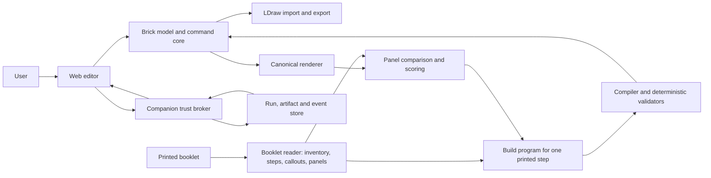

# Brick modeling studio and instruction-booklet build loop — product and architecture specification

Date: 2026-07-09 · Revised 2026-09-24

This document owns the product, domain, trust and authority contracts for the manual editor and the booklet build loop. It is not a status report. Where the booklet loop stands is the executive status in [`building-system.md`](building-system.md#executive-status), measured by `npm run booklet`; the active plan is [`docs/work/1_booklet-reset/plan.md`](../work/1_booklet-reset/plan.md). History, including the retired first-50 campaign, is in [`docs/devlog/summary.md`](../devlog/summary.md) and on branch `archive/first50-campaign-wip-20260908` (`f44f1b8`).

## Decision summary

This repository is scoped to two surfaces and nothing else; the next section says what of each is current.

1. A precise manual brick editor.
2. A closed loop that reads a printed LEGO instruction booklet and assembles the set it describes — counting every part, compiling the printed steps into a build program, placing each piece, and verifying each step against the booklet's own printed panel before playing the result back.

Do not merge this with `3d-maker`. `3d-maker`'s source of truth is a compact genome whose output is a disposable mesh, and it can safely jitter numeric parameters; this product's source of truth is an editable assembly graph of real parts at real seats, where arbitrary mutation just makes collisions. Co-evolution means compatible experiment envelopes, not merged repositories — a shared package is justified only after both projects independently implement the same behavior.

The canonical source of truth is a versioned part-and-connection graph. Three.js scenes, renders, LDraw files, GLB files, printed-panel rasters, and model responses are derived artifacts.

The load-bearing deterministic compilation invariant is:

> Base-document structural hash + exact normalized build-program bytes + compiler, schema, catalog, template, transform-policy, connector-taxonomy, collision-model, and validator snapshots produce the same document structural hash and validation report.

Run replay is a separate, weaker contract, because a run may call a model and a model may be nondeterministic. Under the target replay contract, a `full` replay uses captured model outputs, a `downstream-only` replay begins at the earliest retained output, and a `metadata-only` record is not replayable. Compilation, validation, render configuration and operation application remain deterministic at every replay level; current tooling performs data-only closure inspection rather than executable replay.

A model may propose data. It may not author executable code in the build loop, silently mutate the user's document, waive a deterministic validator failure, or rewrite the running application.

## Status and how to read this specification

This document contains both implemented behavior and target product contracts. Durable domain, validation, authority, consent, provenance and untrusted-input rules bind now. Product promises, end-state workflows, production topology, complete user experience, delivery exits and the success criterion describe the target unless a section explicitly says that it is current.

The current product is an offline-capable manual React and Three.js editor with integrity-checked IndexedDB projects, a searchable catalog, snapped placement and attachment, precise transform and color editing, deletion, undo and redo, live structural validation, manual build playback, and bounded LDraw import and export. The deterministic document, command, compiler, validator, catalog and rendering packages are implemented.

Builtin catalog `/30` has 106 definitions: 61 parametric and 45 mesh-backed, the latter rendering bundled LDraw surfaces with source-faithful normals. `/30` adds no part. It makes every parametric part's LDraw-to-catalog frame catalog truth, measured by `scripts/derive-ldraw-catalog-frames.mjs` from the byte-pinned official LDraw archive, and gives `15573` a centre underside seat. Current overall truth is `sha256:cf2d67907369f85551055665b6df0f849dd978d2e63330130ec2d2db8f6ccc0b`, with catalog `sha256:4662bd517d807a952bda5fc3964c02e34e0ae502255f747635b6c969fb564ebc`. Historical truths stay pinned separately and are never relabeled as current evidence.

The fail-closed migration-history gate (`npm run migration-history:check`) reconstructs 31 reviewed source truths and verifies 2,340 current endpoints, 524 reviewed endpoint deltas, and zero reachable-pair deltas. The `/29`→`/30` report names the 61 parametric definitions whose LDraw interchange frame it measured, and separately `15573`'s connector and connection-conditioned collision semantics. A saved `/4`–`/29` edge on a `15573` grid clutch (`undersideClutch:0:0` or `:0:1`) carries forward under one reviewed delta class that the gate proves: the connector only gains shared-capacity cells whose other members the source truth did not have. The report lists those carried endpoints; the gate proves 56 carried endpoint deltas across 28 rows. Any other source port that disappeared, moved or changed still refuses.

Each migration interpretation row is selected by its exact predecessor truth hash, intersected with the exact source catalog roster, and distinguishes render, construction, connector and collision changes. The editor notice intersects those rows with the part definitions the opened model actually uses and reports the union of their changed-field categories. It never describes a connector, collision or construction change as an appearance change, and never presents a successor as purely additive when it changes semantics.

The booklet loop runs as internal tooling, not in the studio. `npm run booklet` (`tools/booklet/`) reads the booklet, aligns its steps with LEGO's official model of the set, checks catalog coverage and export frames, and plays the official-pose reference back step by step, scoring each stage against that model. Its headline counts are committed in `status/booklet-baseline.json` and compared on each run; the comparison is reported, not yet enforced as a failing gate. Callout part identification is the deterministic closed-set identifier in `apps/web/src/instructions/identify/`, run by `node scripts/identify-booklet.mjs`. The experimental `apps/web/e2e/real-build-*` family remains in the tree and is scheduled for retirement; it is not the current path. The web app's Instructions control ingests a PDF locally into bounded page and text metadata plus a content hash only. It does not render panels, compile build steps, verify placements or apply a run to a user document.

Current retained-run infrastructure is local and development-only: `apps/companion` is a library and test slice for artifact storage, a test run ledger and a test recorder, while ignored run evidence lives under `var/` and `output/`. There is no released loopback broker, credential proxy, production signing identity, unprivileged worker, production authority namespace or executable sealed replay path.

No current identification or verification path calls a model; [Model calls and consent](#model-calls-and-consent) says what was retired and what binds any future call.

A structurally valid searched document is not automatically the official target. Official transforms enter only post-search evaluation, never enumeration or scoring. Target equivalence accepts only a proper frame that realizes every placement; a reflection may be retained as a diagnostic but is never accepted as a world frame or as completion, and a candidate with no surviving proper frame stays diagnostic rather than becoming a canonical document.

## Target product promise

The user can:

- Build accurately with a curated catalog of brick parts, with every illegal placement refused at the command rather than flagged afterwards.
- Hand the app a printed instruction booklet and have it read the set's inventory, printed steps, callouts, and panels.
- Watch it build that set step by step, each placement checked against the booklet's own drawing before the build moves on.
- See exactly why a step was refused, in the booklet's own terms — which panel, which highlight, which arrow, which candidate, and by how much it missed.
- Edit the resulting model with the same commands used for manual work.
- Export to LDraw-compatible tools for further editing, rendering, instructions, or sourcing.
- Replay any booklet run to the level permitted by its retained artifacts and consent policy.
- See whether a claim is known, inferred, advisory, unverified, or physically verified.

## Goals

1. Read a printed booklet accurately enough that the booklet's own internal checks — step numbering, callout counts, inventory totals — reconcile.
2. Place every piece the booklet places, in the frame the booklet draws, and prove it against the printed panel rather than against a hash.
3. Make an illegal placement unreachable through the editor, not merely detectable after the fact.
4. Keep every step's verdict measurable and reproducible, so a change with no number attached is visibly not progress.
5. Recover from a wrong placement by backtracking, rather than by trying to be right the first time.
6. Remain useful as an offline manual editor with no network and no model available.
7. Preserve interchange with the LDraw ecosystem without making raw LDraw text the internal authoring model.

## Non-goals

- Rebuilding every BrickLink Studio feature, or full official-part coverage.
- Claiming physical stability, clutch strength, or instruction accessibility from geometry alone.
- Photorealistic path tracing, marketplace transactions, or real-time collaboration.
- Generating an original model from a text brief, or any copilot that proposes designs the user did not draw or print.
- Autonomous production deployment or self-approval of application code.
- Training a foundation model on anything here.

## Current and target workflows

### Current manual editor

The current UI searches a part palette, previews placement as a ghost, places or attaches a catalog part, moves and rotates a selected part, edits its transform and color, deletes it, and applies undo and redo through bounded command history. Explicit viewport placements create manual playback steps; connected transforms detach explicitly rather than silently preserving an invalid edge.

The current interface has single-part selection and does not expose copy, grouping, submodel creation or direct step assignment as user commands. The target authoring workflow adds those operations, explicit attach and detach controls, scene/submodel/step organization, and collision, disconnected-component and exposed-port overlays while preserving the rule that an illegal placement is refused by the command that would create it and the refusal names the observed values.

### Target: reading a booklet

The reader derives the set inventory, the printed step sequence, each step's callouts and quantities, each step's panel raster, and the printed annotations on that panel — highlight regions, displacement arrows, and the rotation icon that says which face the panel is drawn from.

The booklet checks itself, and those checks are the loop's early measurable: step numbers run 1..N with no gaps, callout quantities reconcile against the back-matter inventory, and a parts-bin quantity is distinguished from a repeat multiplier by printed type size, with an unclassifiable size failing rather than defaulting into either class.

Panel geometry is fitted from the panel's own printed stud lattice, which gives azimuth, scale and phase but cannot give the face or horizontal hand — a projected square lattice reads identically from above and below and under reversal of one horizontal basis vector. The face comes from the printed rotation icon as a running parity from a named seed step, while the horizontal hand is resolved only from asymmetric bound visual evidence; a step outside the contiguous read prefix refuses rather than defaulting to studs-up, and an exact cross-hand tie retains the ambiguity rather than defaulting to an enumeration order.

### Target: building and verifying a printed step

A printed step compiles into build-program operations against the settled prefix — the single canonical document representing every step already settled. Candidates are enumerated from the prefix's own free connectors, seeded from both sides of a stud-tube joint, and pruned by lattice, connector graph, collision and the build-plate rule before anything is rendered. The whole printed step is proposed as one object, because its pieces are placed together and scored together.

A placement is settled only inside a bound observation packet. For a placement made at step N, inspect panel N, panel N+1 as the minimum later witness, and the first farther panel that actually reveals the placement when N+1 occludes it or remains ambiguous. N+1 is not a guarantee: if no retained panel exposes the claimed surface or relation, record it as `not-observable` rather than infer correctness from silence. A booklet image cannot certify a hidden surface it never shows.

Steps therefore have distinct evidence classes, chosen from a free signal rather than assumed: a panel with a usable highlight is scored against it, a step drawn exploded has each candidate redrawn back along the printed arrow's line and compared against the drawn ghost, and a step with neither begins later-panel deferral at N+1 and continues under the observation packet above. Every bar in that comparison is derived from the panel's own geometry, never from a global constant — a panel has a reachable ceiling, so one fixed threshold asks a different question on every page.

The printed arrow states a direction, not a length: an exploded step's seat is occluded, so the ink stops at the visible surface while the part comes to rest behind it. A candidate that ranks first on pixel agreement is not thereby correct; when a score and an image disagree, the image is the evidence and the score is a lossy summary of it.

Missing parts are work items, not blockers. A step needing a part the catalog lacks gets the part added, with family, real LDraw identifier, connectors, collision primitives and provenance; it is never substituted or skipped.

`building-system.md` owns the measured position of this loop and the ordered plan for what is missing. This workflow is not built: there is no camera fit, no placement scored against the key, no per-step verification of a rebuild against the printed panel, and no runner that backtracks across steps. Two rules bind any implementation. A panel registration's hand, determinant, turn and shift are panel-local raster evidence, never authority for a physical transform. An exact cross-hand silhouette tie is retained as ambiguity, never broken by enumeration order.

### Target: backtracking

A locally symmetric placement contradicts nothing at the step that makes it, and the model keeps growing on top of every placement, so a symmetric mistake surfaces later rather than never.

The requirement is therefore not to resolve every ambiguity before committing, but to go back far enough when one surfaces: the search commits to its best candidate, retains every rejected alternative as counterevidence, and walks back to the shallowest step with an untried one. That gives the loop a measurable — how many steps were undone and how far back the deepest reversal reached — where "prove this placement is unique" gives none.

### Current manual playback and target booklet playback

The current editor plays back manually authored placement steps. The target booklet workflow plays a completed reconstructed build step by step from the canonical document, using the same renderer and the same step membership the build produced.

## Architecture

### Target product architecture

The following diagram is the target end state. The web editor, domain core, interchange, booklet derivation, deterministic compilation, rendering and panel-scoring slices exist in different degrees; the companion trust-broker path does not.


```mermaid
flowchart LR
  U["User"] --> W["Web editor"]
  W --> M["Brick model and command core"]
  M --> X["LDraw import and export"]
  K["Printed booklet"] --> RB["Booklet reader: inventory, steps, callouts, panels"]
  RB --> PG["Build program for one printed step"]
  PG --> C["Compiler and deterministic validators"]
  C --> M
  M --> R["Canonical renderer"]
  R --> CP["Panel comparison and scoring"]
  RB --> CP
  CP --> PG
  W --> B["Companion trust broker"]
  B --> S["Run, artifact and event store"]
  S --> B
  B --> W
```

### Repository layout (current)

```text
apps/
  web/                       React, Vite, TypeScript, Three.js editor; closed-set part identifier; experimental real-build code
  companion/                 Library/test artifact store, test run ledger and test recorder; future broker home
packages/
  protocol/                  Versioned JSON Schema and generated types and validators
  brick-kernel/              Documents, commands, compiler, patches, validation, migrations
  catalog/                   Parts, colors, geometry, connectors, collision, licenses
  rendering/                 Three.js derivation, canonical captures, render packets
scripts/                     Booklet, identification, LDraw, Builder and catalog derivation tooling
tools/booklet/               `npm run booklet`: per-step harness scored against the official model
status/                      Committed booklet baseline that each harness run is compared with
docs/                        Design, policy, provenance and devlog
var/state/                   Ignored local broker index, CAS, and development state
var/runs/                    Ignored immutable run bundles
output/                      Ignored booklet run evidence and scoreboards
```

Split a package only when a boundary has real behavior.

### Technology decisions: current boundaries and target obligations

- React manages editor panels and application state; it does not own the Three.js scene graph, which renders disposable state derived from the canonical document.
- Pure TypeScript owns model semantics, commands, import/export normalization and validators. The browser and current companion test slice use those rules; a future released broker must use the same packages. A future worker may call them, but its validity claims are never authoritative.
- Vitest covers pure domain behavior; Playwright covers interaction, deterministic capture, booklet runs, and visual workflows.
- Python is confined to derivation tooling — LDraw, LDCad and Builder source measurement — and never becomes the source of truth for model validity.
- Cross-language messages conform to versioned JSON Schema and contract tests. Each claimed closed shape or canonical scalar spelling requires an explicit schema gate; relationships across messages require an explicitly exported semantic contract.
- The manual editor starts and remains usable without the broker and without any model.

### Target production runtime topology (unbuilt)

The target delivery is an installed browser/PWA shell, a minimal loopback companion trust broker and an unprivileged worker. None of the released broker, production identity, credential proxy, production authority namespace or worker exists today. `apps/companion` currently exports library/test implementations of an artifact store, test ledger and test recorder; it has no server entry point and confers no production authority.

The target production contract is:

- The browser owns the interactive document and offline manual editing in IndexedDB. A service-worker-cached shell keeps the primary per-install origin usable when the broker is stopped.
- The released companion serves the pinned web bundle and versioned job API, and exclusively owns the authoritative event ledger, rebuildable SQLite index, content-addressed blobs, OS-keystore-backed signing identity and allowlisted model-credential proxy. At boot it verifies its release manifest; production keys and credentials are reachable only by the approved released binary, while dirty, development and challenger builds are forced into a visibly separate test namespace. The broker runs only released compiler, validator, canonicalization and policy code, never loads challenger code, and never exposes raw credentials.
- The unprivileged worker holds bounded capabilities and calls models only through the broker's quota- and consent-enforcing proxy. Broker and worker are separate processes with distinct identities and sanitized environments, and a seal created by a worker or challenger identity is invalid.
- The primary web origin uses a stable per-install numeric-loopback scheme, host and reserved port so IndexedDB, the non-extractable device key, pairing pins and queued outbox events survive restarts. Tokens and nonces rotate, not the origin; an origin change requires an explicit authenticated migration served by both origins, and if the old origin cannot run the app refuses to migrate and preserves the old profile for recovery.
- Pairing passes a one-time secret in the URL fragment, exchanged once and immediately removed with `history.replaceState` for a short-lived capability token whose audience is the exact origin and whose scopes name permitted API families. The token stays only in app memory, and every request carries a non-extractable device-key proof over method, canonical path and query, content type, body digest, token audience and scopes, exact origin, nonce and token hash. One-time secrets and bearer material never enter query strings, persistent browser storage, logs or artifacts; no host-scoped cookie is used.
- If the target broker is absent, manual editing, local projects, deterministic validation, rendering, LDraw interchange and trusted browser-local template tools continue to work. A local template tool compiles directly into a hard-validated manual command transaction with local provenance; it is not a broker-sealed patch. Broker-mediated model calls, recorded production runs, ledger queries and sealed evidence are visibly unavailable.

The future loopback API and every current or future imported, printed or model-supplied artifact are untrusted boundaries. The production service must bind only numeric loopback addresses and reject unexpected `Host` or `Origin` values, DNS-rebinding attempts, missing request proofs and replayed nonces. Every implementation path must cap JSON depth and bytes, operation and part counts, image dimensions, archive expansion, LDraw recursion, external references, render memory and runtime; reject path traversal; escape stored text in the UI; forbid dynamic evaluation; and treat artifact prose as evidence rather than operational instructions.

## Canonical domain model

### `BrickDocument`

```ts
interface BrickDocument {
  schemaVersion: string;
  id: string;
  revision: string;
  truth: TruthSnapshot;
  name: string;
  parts: PartInstance[];
  connections: ConnectionEdge[];
  submodels: Submodel[];
  steps: BuildStep[];
  semanticRegions: SemanticRegion[];
  constraints: DocumentConstraints;
  provenance: DocumentProvenance;
}
```

`TruthSnapshot` pins the catalog, connector taxonomy, collision model, transform policy and validator versions required to interpret the document. Saved documents never float to newer truth implicitly; migration produces a new revision with an explicit report. Every reviewed historical full-truth hash selects an immutable catalog-part and color roster plus an exact source-commit connector-semantics authority; caller-owned constraints may narrow the roster, but neither constraints, actual part instances, nor connection edges may introduce an identifier or port that the selected source truth did not define. Migration refuses a source port that disappeared, moved, or otherwise changed and a pair whose behavior changed, except for an endpoint change of a reviewed class that the migration-history gate proves (today only shared-capacity cells added whose other members the source truth lacked), while a stable endpoint still carries forward even when the document remains draft-invalid for an unrelated transform. `npm run migration-history:check` independently rebuilds all reviewed source catalogs from their Git archives and proves the complete source/current endpoint and reachable-pair delta before absence from the compact runtime manifest is trusted.

Each part instance has a stable ID, namespaced catalog part ID, color ID, rigid transform, submodel and step membership, semantic tags, and provenance. Position is stored in integer LDraw units. Legal orientations are catalog IDs; articulated joints add bounded joint parameters whose transforms are derived rather than accumulated.

Part transforms are authoritative and connection edges are validated annotations that must agree with the relative transforms implied by their ports. This ordering exists because of the booklet: instructions give placements and never connections, so the loop derives which studs meet which tubes from geometry — and if edges were authoritative a document could assert a connection the geometry contradicts, with nothing able to say which was right.

Moving a part must either preserve and revalidate an edge or detach it explicitly. The model rejects dangling IDs, duplicate edges, over-capacity ports, incompatible or multiply occupied ports, transform/edge disagreement, inconsistent loops, and invalid submodel or step membership.

Canonical serialization defines stable array ordering, ID generation, numeric normalization and the exact provenance fields excluded from or included in the structural hash. Cosmetic metadata never changes structural identity. The structural hash covers part identifiers, so it answers whether two documents are the same document, not whether two models are the same model.

### Part catalog

`part-model.md` owns how a part is organised, indexed, defined and constructed. A `PartDefinition` carries namespaced ID and aliases, geometry source and content hash, bounds and simplified collision representation, typed connection ports with local transforms and compatibility rules, legal orientations, a substitution-group identifier, available colors, inventory metadata, and source/license/attribution/catalog-version provenance. Current builtin inventory records leave `knownMassGrams` unset; richer substitution rules and measured mass are not implemented catalog truth.

Catalog measurement, mesh generation, semantic checks, and focused tests automate parts of admission, but no tool or model admits a part automatically. Admission remains a reviewed repository change that records sources, inspects matched views, advances the truth snapshot, and passes migration and verification gates; an unexposed surface is named `not-observable`, not approved by omission.

Truth imported from differently licensed datasets stays in separately attributable catalog layers, never flattened into an untraceable application-owned blob.

Adding a part is a catalog-truth change: it advances the builtin catalog version, extends the migratable set, and the migration report says what changed. Reviewed historical full-truth hashes keep their exact immutable catalog-part/color rosters and source-commit connector projections so existing documents keep hashing as they did and migration cannot legitimize a future identifier, later port, removed port, or changed connection frame through current definitions or caller-owned constraints.

### Connection graph

A connection edge joins two named ports and records a wire-level connection class, joint parameters and provenance. Catalog ports implement ten kinds: `stud`, `undersideClutch`, `axle`, `axleHole`, `pin`, `pinHole`, `bar`, `clip`, `hinge` and `hingeSocket`.

The six catalog pair rules are `stud` to `undersideClutch` with rigid quarter-turn alignment and opposed axes; `axle` to `axleHole` with rigid quarter-turn alignment and collinear axes; `axle` to `pinHole` with continuous revolute motion and collinear axes; `pin` to `pinHole` with continuous revolute motion and collinear axes; `bar` to `clip` with continuous revolute motion and collinear axes; and `hinge` to `hingeSocket` with continuous revolute motion and opposed axes. Placement discovery uses those port rules, but `ConnectionEdge.kind` and `AttachInstruction.connectionKind` still carry only `stud-tube`; the referenced ports currently supply the more specific pair. End-to-end edge semantics require a versioned protocol expansion before the other pair identities can travel on the wire.

### Restricted `BuildProgram`

A printed step or other proposer emits a restricted declarative program or typed operation suggestions. Nothing emits a trusted patch envelope, JavaScript, Python, shaders, SQL, or arbitrary commands.

The current program schema and compiler, not the studio's exposed command set, support placing a catalog part at an explicit rigid transform, attaching two named ports through the `stud-tube` wire class, removing or replacing a named part, moving or recoloring a named part, and assigning one part to a build step. The schema also contains `instantiateTemplate`, but the current compiler rejects it explicitly because no template compiler is installed.

The current compiler validates the closed operation schema and enforces exactly three trusted scope budgets—maximum operations, added parts, and removed parts—before deterministically producing document commands; compilation failure is a normal rejected result rather than an application error. Expansion depth, recursion, memory, elapsed time, and template part counts are not current compiler budgets.

The target template path uses a schema-constrained, non-Turing-complete declarative AST and adds expansion-depth, recursion, memory, part-count and time budgets. Imports, scripts, callbacks, arbitrary expressions, dynamic evaluation, TypeScript and Python remain forbidden even in quarantine. Those template-expansion capabilities and resource limits are specified, not implemented.

Model output is always untrusted candidate data. It cannot author revision, scope, provenance, consent or validation fields. Current local model tooling remains outside the user-document command path. Under the target broker topology, a caller submits an untrusted value with only opaque broker-issued job and attempt IDs; the broker resolves the trusted revision, scope, provenance, consent, truth and budget context from its job record and hands it to the released compiler, and only that compiler can create an unsigned candidate patch.

### Compiled patch and scope

The compiler's output is an `AssemblyPatch`: schema version, base revision, base document hash, truth snapshot hash, scope capability ID, scope digest, operations, and provenance. It is a compiler product, not a proposer product, and a raw patch is never directly applicable.

The current compiler and verifier receive scope as a separate trusted input; no proposer may supply or widen it. In the target broker topology, the complete allowed scope lives in the trusted job record created from the user's action and the browser retains an immutable copy for the life of the job. `scopeCapabilityId` is an opaque reference and grants no authority.

`verifyAssemblyPatchAgainstCapability` in `packages/brick-kernel` independently rechecks a received patch against the exact retained base document and scope capability, returning typed issues. It is a verification boundary only: it authorizes nothing and writes nothing.

Manual editing may temporarily create a draft-invalid document. A compiled patch must introduce no new blocking issue outside its scope, must leave its affected scope hard-valid, and must preserve global validity when the base was globally valid. The UI distinguishes `patchValid` from `documentGloballyValid`.

There is no automatic path from a compiled patch into a user document, and the former presented-envelope and acceptance-authorization types do not exist. A user document changes only through an explicit manual command. Any future automatic path is a new design decision requiring a newly specified, user-originated, scope-bounded and one-use authorization ceremony; it cannot be re-enabled from retained code.

## Model calls and consent

Current part identification makes no model call. The deterministic closed-set identifier (`apps/web/src/instructions/identify/`, run by `node scripts/identify-booklet.mjs`) matches callout drawings against the set's own inventory thumbnails. The earlier model-assisted routes — the part-identification pilot transports, the panel-placement description script and the multi-panel checker foundation — are retired. Their code remains in `scripts/` as unwired development tooling: it is not called by the studio or the booklet harness and has no path to mutate a user document. No integrated checker model or broker-backed provider path exists.

A retained same-or-different verdict applies only to the exact full crop SHA-256 plus the claimed element that was judged; similarity or cluster membership never transfers it to another crop. Agreement between raters is a measurement, not proof that each verdict is correct.

The target booklet loop may use a **proposer** to read printed art and a **checker** to ask the closed same-or-different question over a render and printed panel. Both current and target uses are bound by the same authority rule: model output is untrusted data. It proposes while a deterministic check disposes, and it cannot declare itself valid, author trusted scope or provenance, execute code, waive a hard validator, admit a part, or mutate the user document. A production call must record provider, model, parameters, seed where supported and a raw response hash.

Under the target broker topology, before any prompt, reference or model summary is transmitted, the broker evaluates a versioned `ProviderCapabilities` record from a maintainer-reviewed policy registry. Each entry is independently signed or pinned and declares supported protocol, schema and catalog versions, accepted input kinds, cancellation and seed behavior, size and budget limits, local or external execution, retention and training policy, and accepted consent classes. Runtime discovery may narrow that trusted record but never broaden it or relax its data-handling policy, and an incompatible or insufficiently consented job fails preflight without sending user data.

Consent is scoped and specific under both local tooling and any target broker path. Cropped regions of the user's own instruction booklets — callout thumbnails and step panels — may be sent to a model for part identification or printed-step placement description only after explicit operational authorization. A candidate render needs its own explicit scoped authorization. Crops only: never a whole booklet, other repository content, credentials, or another user reference, design, or artifact; retained responses stay under ignored local output roots.

A digest plus a claimed PDF, page and bounds is not proof of crop origin or consent. A local assertion that does not authenticate a user event cannot prove the authorization that preceded it, and a sanitized local proof cannot establish which remote model or policy ran. A crop boundary stated only in a prompt, or undermined by repository-wide read access, is policy rather than an enforced limit. A replayable successor must enforce an authenticated exact authorized snapshot rather than state the restriction in its prompt.

The model a product calls is pinned in this repository at the call site's own module. No model ID is hardcoded anywhere else.

## Validation hierarchy

Validity is lexicographic. A high visual score cannot compensate for a hard failure.

1. **Compilation:** supported schema, catalog parts and colors, finite canonical transforms, legal operations.
2. **Structural:** compatible ports, permitted orientations, no material collision under the defined model, required connectivity, support against the build plate, allowed envelope, frozen scope, and part budget.
3. **Buildability advisory:** support, approximate stability, insertion accessibility, and plausible build order — clearly advisory until calibrated with physical evidence.
4. **Panel agreement:** does the render of this candidate match what the booklet draws, at that panel's own camera, face, horizontal hand, and reachable ceiling.
5. **Set accounting:** does the finished build reconcile with the booklet's own inventory, callout quantities and piece totals.

Hard validators return typed issues with implicated part and port IDs, geometric evidence, and permitted repair classes. Pixels cannot prove graph correctness, and graph correctness cannot prove the model is the one the booklet draws; both are inspected.

A physical claim applies only to the exact document and catalog hash actually tested, and any structural edit invalidates it. A general physical-buildability claim requires a separately reviewed calibration program, not an arbitrary count of successful builds.

## Rendering and visual inspection

Part admission uses a dedicated browser harness rather than treating the editor's seven-view presentation hook as review evidence. It materializes a checksum-pinned LDraw closure, renders it through an independent `LDrawLoader`, renders the production catalog definition in a clean detached scene, and captures matched top, bottom, front, back, left, right, isometric, and underside-oblique pairs through one union-fitted camera packet. Generated packets bind sources, frames, renderer policy, cameras, PNG and decoded-RGBA hashes, and diagnostics, but remain `pending` until a separate immutable explicit review records `same`, `different`, or `not-observable` for every view. Each admission's packet and review stay evidence under the truth they were made for and are never relabeled as current; per-part records live in `part-model.md`. Exterior agreement cannot certify hidden material, exact collision, connector fit, grip, stability, insertion access, or trusted placement, and an exact catalog identity does not bind a Builder frame or a placement.

An editor capture certifies only what it shows. The straight underside view is occluded by the build grid, so the clean admission underside-oblique pair, not the editor capture, carries any claim about tubes, rails or cavities.

The target deterministic render packet contains a fixed isometric presentation view; front, back, left, right, top and underside orthographic views; an underside-oblique view for internal walls and clutch geometry; silhouette and depth passes; a part-ID pass grounding visual findings to model entities; an exploded or layer view when useful; connection, collision, disconnected-component, exposed-port and support overlays; and closeups around each blocking validator issue. Current browser capture returns PNG data URLs from seven canonical cameras — `isometric`, `front`, `back`, `left`, `right`, `top`, and `underside` — over the live presentation scene. It has no underside-oblique view, clean admission scene, source-image pairing, artifact hashes, renderer receipt, or render-packet binding, and the presentation grid, shadow plate, lighting, and current selection overlay may be present.

For a booklet step the render that matters is the one taken at the printed panel's own camera, face, and horizontal hand, because that is the only render comparable to the drawing. The panel supplies azimuth, scale and phase from its stud lattice; the printed rotation icon supplies the face correction, including the sign of the elevation and model-up; asymmetric bound geometry must settle the remaining horizontal determinant. Binary-silhouette registration may compare both hands, but reflection reverses depth, so a silhouette winner alone does not prove RGB, occlusion, or a physical document branch.

Instruction rendering imitates measured booklet art rather than an asserted dialect: parts carry three face tones, a near-black stud wall and a per-colour ink, not one flat fill.

Renders are looked at, not only scored. Matched top, bottom, front, back, left, right, isometric, and underside-oblique views delimit what was observed; hidden surfaces remain `not-observable`. Visual defects have repeatedly escaped passing tests and been found by looking at renders; nonvisual defects are also found by source audits, digest checks, tests, and review.

## Target user experience

The current workspace provides the central 3D viewport, searchable catalog, project controls, selection and transform/color inspector, live validation and manual build playback. Its Instructions control currently extracts bounded page and text metadata and a content hash from a local PDF; it does not render booklet panels or expose placement candidates, compiled steps, verification, or a run inspector.

The main workspace contains a central 3D viewport; a part palette and template library grouped by family and searchable by name, size and identifier, with previews derived from each part's own geometry so the palette cannot drift from what gets placed; a scene, submodel and step tree; a selection and constraint inspector; a booklet panel showing the loaded booklet, its printed step list, the current step's panel with its highlight, arrows and face, and the candidate under consideration beside it; a validation panel distinguishing blocking, advisory and unknown findings; and a run inspector for replay, provenance and retained evidence.

A booklet run never blocks manual editing. A run is tied to the document revision at submission time, supports cancellation, and cannot win a race against newer user state.

## Persistence, provenance and consent

### Current implementation

- The web app stores integrity-checked local project envelopes in IndexedDB. Reloading the page is not a fresh plate; any run driver must load the intended document revision rather than assume an empty document.
- `apps/companion` provides a content-addressed artifact store, hash-chained test run ledger and development-only test recorder as importable library code with tests. It is a test namespace, has no production signing identity and is not an authoritative service.
- Development-only recorders may retain exact canonical requests and authority-free outputs only under explicit local artifact-retention consent and hard byte budgets. Their output is unsealed, unauthenticated and cannot assert production authority, a seal or promotion.
- Booklet run bundles, closure metadata, renders, panels and scoreboards live under ignored `var/` and `output/` roots. Current replay tooling verifies and inspects retained bytes but deliberately does not execute retained source as an authoritative or diagnostic replay.
- Git stores schemas, migrations, curated templates, fixtures, goldens and benchmark definitions. Run evidence enters Git only when review promotes it into a repository input. Large part libraries, model weights, raw run corpora and generated images are not committed.
- No current component writes an authoritative production ledger, holds production signing or provider credentials, issues production seals, authenticates a paired browser or performs signed deletion and consent-revocation lineage.

### Target production contract (unbuilt)

- The released companion is the exclusive writer of the authoritative hash-chained append-only event stream. It authenticates user, curator, maintainer and evaluator capabilities before recording events, seals finalized event roots with a signing key reachable only by the minimal released broker identity through the OS keystore, writes files to temporary names before atomic finalization, and includes every artifact hash in the final manifest. Later correction, edit or deletion records are linked events, never mutations of a sealed manifest.
- SQLite is a rebuildable query index over authoritative events and bundles, not a competing record of truth. Content-addressed files store programs, documents, LDraw, renders, reports, panel rasters and consented raw model responses.
- Every production run pins application, broker and worker commits plus source-tree/diff and built-bundle hashes, lockfiles, runtime versions, non-secret configuration, schema and catalog hashes, model and prompt hashes, booklet and panel hashes, budgets and seeds. Retrievable content-addressed source patches and built bundles are retained only after secret and license scans; a hash without retrievable content is insufficient for source-level replay.
- At finalization the broker validates the transitive artifact closure and seals a replay certificate containing `sealedReplayLevel: full | downstream-only | metadata-only`, the earliest retained boundary, and every required artifact hash with its retrievability evidence. Callers may request retention but cannot set the result. Later tombstones leave the certificate unchanged while the API derives a separate `effectiveReplayLevel`.
- Deletion creates an authenticated signed tombstone, removes derived indexes and thumbnails, decrements blob references and garbage-collects unreferenced blobs. Sealed manifests and prior events remain unchanged, and the API derives the effective replay level from tombstone lineage without retaining deleted sensitive content. Export and consent revocation follow the same lineage links.
- Secrets stay behind the broker's credential proxy and outside worker environments, project artifacts and browser bundles.

User references and designs are local by default under both current and target implementations. External transmission, training, benchmark inclusion, sharing and Git retention are separate consent decisions.

## Interchange

- App JSON is the editable source format; LDraw `.ldr` and `.mpd` are the primary ecosystem interchange formats.
- The supported LDraw subset covers supported parts, colors, rigid matrices, submodels and steps. Connection edges are inferred deterministically and supported golden fixtures must reproduce the same canonical edge set.
- Unsupported parts, arbitrary matrices, articulated poses, local or external references, and unknown metadata are rejected with diagnostics or preserved as explicitly opaque view-only records. They are never silently rounded, dropped or made editable.
- LDraw export preserves stable part transforms and steps and may carry a namespaced provenance metadata extension without requiring it for compatibility.
- Any future GLB support is a derived delivery or rendering export, never the authoring source; no GLB export path is implemented today.

Plain LDraw is lossy for unsupported connection semantics; exact complete replay uses app JSON or a metadata-bearing export. Round trips are verified against golden models and external viewers through the actual consumer path — a string round trip does not prove a model loads. BrickLink Studio is an interoperability and behavior reference, not a code or asset dependency.

An official set export is a corroborating witness, not an oracle. Where the repository's own derivation and a published export disagree, the disagreement is settled by geometry — collision, interlock, and support — and the outcome is recorded with its numbers.

## External research and licensing gates

Permission to reuse geometry does not imply permission to train, and that right stays unheld everywhere in this repository.

- The LDraw parts library preserves file-level source, license, and attribution metadata. Bundled LDraw geometry ships under CC BY 4.0 with per-file authorship preserved in `docs/bundled-geometry-notices.md`, rendered from the catalog itself.
- LDCad Shadow Library-derived connector data is admitted as catalog truth under the owner's 2026-08-05 decision that licence must not block private, noncommercial work. It stays separately attributed: its provenance record carries the CC BY-SA 4.0 attribution and the pinned library digest, share-alike attaches to the derived data on redistribution, and no shadow file is committed — derived positions, not source text.
- LEGO Builder native source is used for measurement and frame derivation. Native payloads stay local where practical, exact identities and hashes are preserved for reproducibility, and upstream material is never described as project-owned.
- Research systems such as BrickNet and BrickGPT remain recorded in the bill of materials as evaluation-only. Their model, dataset, connector and collision-asset terms require a complete audit before any redistribution or commercial use, and nothing here depends on them.
- Internet-curated models are not assumed to be training data merely because their referenced part geometry is reusable.
- The public product name, logo, domain, and non-affiliation language require trademark review before launch.

The dependency and data bill of materials records origin, version, license, attribution, redistribution/training rights and allowed runtime role for every code, geometry, connector, collision, model and example source.

Primary references for that audit are the [LDraw legal terms](https://www.ldraw.org/legal-info), [LDCad Shadow Library](https://github.com/RolandMelkert/LDCadShadowLibrary), and LEGO's [Fair Play policy](https://www.lego.com/en-us/legal/notices-and-policies/fair-play).

## Automation and testability

The current app exposes a stable, test-only automation bridge: `window.render_app_to_text()` returns the canonical document and hash, selection, validation, overlay, renderer snapshot and command error; `window.capture_model_views()` returns seven named canonical-camera PNG data URLs from the current presentation scene; and `window.get_model_snapshot()` returns a schema-versioned document summary and structural hash. The capture hook is not wired to the render-packet artifact contract and does not itself bind the PNGs to the structured snapshot. `window.advanceTime(ms)` currently validates a bounded delay, yields once and returns the snapshot; it does not yet drive an animation clock.

These are verifier instrumentation, not a model-facing action surface. Trusted capture code in the test boundary may call them and retain evidence; an external or model-facing actor receives only a filtered, hashed observation and a bounded action API, with no arbitrary browser evaluation, direct debug-hook access or production authority. A future production build must either omit the bridge or require a separately authenticated test namespace that cannot reach production documents, identities, credentials or ledgers.

A feature is not approved from source or hook presence alone, nor structural behavior from a pleasing screenshot alone: the served app is driven in a real browser, canonical views are captured, and pixels, structured state and intended behavior are confirmed to agree.

Current Python, Vitest, and Playwright suites cover the implemented document and command core, compiler and patch-scope invariants, LDraw expansion and source-normal reproduction, catalog and part-standard admission, connector/collision/connectivity/support/bounds rules, LDraw round trips, matched part-view capture and review contracts, editor interactions, persistence, rendering, booklet extraction and alignment, closed-set identification, data-only replay-closure inspection, and the companion artifact-store/test-ledger/test-recorder slice. `npm run test:score` runs the scoring suites that `npm test` leaves out, and a test that reads ignored run evidence runs only under `LEGO_RUN_EVIDENCE=1`. Live model calls are opt-in and ordinary tests use retained or mocked responses. Tests establish packet and review contracts, not that a human or independent reviewer performed a particular inspection; that is recorded separately, per part, in `part-model.md`. No test proves that the unbuilt production broker, worker, credential, signing, pairing, deletion, or executable replay contracts exist.

The target production suite must additionally prove that workers and challenger builds cannot read production credentials, use signing keys, write the authoritative ledger or mint production namespaces; that event-log hash chains, finalization and sealed bundles resist truncation and tampering; and that replay-level downgrade, deletion, consent revocation and content-addressed garbage collection preserve the specified lineage.

## Delivery sequence and gates

These are target exit contracts, not assertions that each gate is complete. Gates 0 through 2 have substantial implemented slices but retain open production-topology and replay work. Gate 3 is the active gate. Where it stands is the executive status in `building-system.md`, measured by `npm run booklet`.

### Gate 0 — Provenance and executable contracts

Establish the dependency and data bill of materials. Define the `BrickDocument`, `BuildProgram`, `AssemblyPatch`, validator-issue, render-packet, observation, attempt-transcript, trust-namespace, sealed run-manifest and replay-closure schemas. Specify and threat-model the broker/worker process boundary, production release identity, key access, credential proxy, stable web origin and test namespaces before any broker-integrated production model path. Define catalog and connector provenance rules. Generate `THIRD_PARTY_NOTICES`, preserve per-layer license files, and add a packaging test that excludes evaluation-only assets while auditing required attribution.

Exit: every planned code, geometry, connector, collision, model and example source has an explicit allowed role or is marked evaluation-only, and a distributable test package proves those boundaries.

### Gate 1 — Deterministic assembly kernel

Curate basic bricks and plates with verified geometry and stud/tube ports. Implement the canonical graph, commands, build-program compiler, renderer, diagnostic overlays and hard validators, plus a manual editor and LDraw round trip.

Exit: supported-subset golden models round-trip with exact instance, transform and deterministically inferred connection-edge equality, and unsupported data is rejected or preserved as opaque without loss; seeded invalid fixtures are rejected with the expected typed issue; every admitted output is connected, legal, collision-free under the defined validator, and reproducible by structural hash; and no physical-stability claim is made.

### Gate 2 — Booklet reading, and run evidence

Read a real booklet into its inventory, printed steps, callouts, panels, highlights, arrows and faces. Reconcile the booklet against itself — sequence coverage, callout quantities, piece totals, and type-size classification with an unclassifiable outcome. Fit the panel camera from the printed stud lattice and derive the panel face from the printed rotation icon. Add immutable run bundles, replay levels, canonical render packets, and retained per-step evidence.

Exit: the booklet's own internal checks reconcile with recorded numbers, every panel the loop uses carries a fitted camera and a derived face or a named refusal, and a run's evidence is retained and replayable to its declared level.

### Gate 3 — Building and verifying a printed step

Enumerate candidate placements from the settled prefix's free connectors on both sides of a joint, pruned by lattice, connectors, collision and the build plate. Score a step by its own evidence class — highlight, exploded ghost, or later-panel deferral — against bars derived from that panel's geometry, retaining N, N+1, and the first farther panel that reveals an otherwise occluded or ambiguous placement. Keep the document node's stable candidate identity while appending panel-bound hand, determinant, turn, and registration observations at N, N+1, and K; a reflected silhouette may propose an observation but cannot authorize physical truth. Name every refusal and `not-observable` limit, publish the number it refused on, add deep backtracking with retained alternatives, and report the reversal depth.

Rules that bind this gate's work:

- The full printed source index and one execution request are separate contracts. A run over a prefix of steps retains and checks the whole index, but rows past the request cannot expose their action or pieces, emit a report, invoke placement or mutate a document, and completing a prefix never implies the untouched suffix was reconstructed.
- Semantic identity derived from repeated source art is narrower than rendered-pixel equality and much narrower than placement authority. An identity or coverage result grants no source execution, physical assignment, frame, transform, placement, replay, document mutation, acceptance or completion.
- Printed-step quantities do not authorize an independent cut through an official source order; a reconciliation must conserve the exact piece multiset it repartitions.
- An official set export is a witness, not an oracle, and its transforms enter only post-search evaluation (see [Status](#status-and-how-to-read-this-specification)).
- Fixed actions with no trusted physical-frame authority refuse before any executor runs.

Exit: a contiguous prefix of printed steps is placed, each settled against a printed panel and each refusal named; the placed transforms reconcile with the official ledger in one frame; and the prefix length and reversal depth are recorded in `building-system.md` and driven deliberately.

Status is not kept here. The current measured position is the executive status in [`building-system.md`](building-system.md#executive-status), from `npm run booklet`; the active plan is [`docs/work/1_booklet-reset/plan.md`](../work/1_booklet-reset/plan.md). The retired first-50 campaign's history is in the devlog and on branch `archive/first50-campaign-wip-20260908`.

### Gate 4 — Full set, and playback

Extend catalog coverage until the set's leaf designs are all present. Complete the run to the last printed step and play the build back step by step. Calibrate build-order and stability advice with physical-build feedback before making any physical claim.

Exit: the set rebuilds end to end from its printed booklet, the finished document reconciles with the set accounting, and playback reproduces the printed step order.

### Gate 5 — Co-evolution with `3d-maker`

When both repositories contain proven duplicate behavior, extract only the stable generic pieces: run manifests, lineage, evaluator interfaces, and comparison infrastructure.

Do not share brick documents, part catalogs, connection validators, procedural genomes, mesh generators, or persistence databases.

## Target success criterion

A user hands the app a printed instruction booklet, watches it build the set that booklet describes with every step checked against the booklet's own picture, sees each refusal named in the booklet's own terms, edits the finished model manually, exports LDraw, plays the build back, and replays the run to its declared level.

The system improves only through evidence: measured booklet numbers, typed failures, promoted regression fixtures, and reversible experiments. `learning-system.md` owns what a run retains, what lifecycle its candidates travel, and what must hold before any of that becomes a repository input.

## Removed product surface

The AI copilot that generated original models from text briefs was cut on 2026-08-07 and is neither deferred nor a later gate. Its generation package, harness, browser candidate UI and automatic acceptance ceremony are not product surfaces and no acceptance path remains. Detailed removal history belongs in the devlog.

Contracts still required by the booklet loop remain normative: untrusted model output, restricted `BuildProgram` compilation, deterministic validation, scoped consent for external transmission, retained run evidence and the target production replay and sealing contracts described above.
