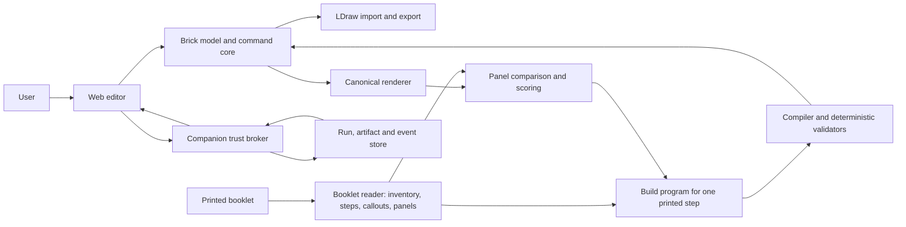

# Brick modeling studio and instruction-booklet build loop — product and architecture specification

Date: 2026-07-09

Revised 2026-08-07: the AI copilot product was cut. See [Cut: the AI copilot](#cut-the-ai-copilot) for what went, what survives it in code, and what that code now serves.

## Decision summary

This repository builds two surfaces and nothing else.

1. A precise manual brick editor.
2. A closed loop that reads a printed LEGO instruction booklet and assembles the set it describes — counting every part, compiling the printed steps into a build program, placing each piece, and verifying each step against the booklet's own printed panel before playing the result back.

Do not merge this with `3d-maker`. `3d-maker`'s source of truth is a compact genome whose output is a disposable mesh, and it can safely jitter numeric parameters; this product's source of truth is an editable assembly graph of real parts at real seats, where arbitrary mutation just makes collisions. Co-evolution means compatible experiment envelopes, not merged repositories — a shared package is justified only after both projects independently implement the same behavior.

The canonical source of truth is a versioned part-and-connection graph. Three.js scenes, renders, LDraw files, GLB files, printed-panel rasters, and model responses are derived artifacts.

The load-bearing deterministic compilation invariant is:

> Base-document structural hash + exact normalized build-program bytes + compiler, schema, catalog, template, transform-policy, connector-taxonomy, collision-model, and validator snapshots produce the same document structural hash and validation report.

Run replay is a separate, weaker contract, because a run may call a model and a model may be nondeterministic. A `full` replay uses captured model outputs; a `downstream-only` replay begins at the earliest retained output; a `metadata-only` record is not replayable. Compilation, validation, render configuration, and operation application remain deterministic at every replay level.

A model may propose data. It may not author executable code in the build loop, silently mutate the user's document, waive a deterministic validator failure, or rewrite the running application.

## Product promise

The user can:

- Build accurately with a curated catalog of brick parts, with every illegal placement refused at the command rather than flagged afterwards.
- Hand the app a printed instruction booklet and have it read the set's inventory, printed steps, callouts, and panels.
- Watch it build that set step by step, each placement checked against the booklet's own drawing before the build moves on.
- See exactly why a step was refused, in the booklet's own terms — which panel, which highlight, which arrow, which candidate, and by how much it missed.
- Edit the resulting model with the same commands used for manual work.
- Export to LDraw-compatible tools for further editing, rendering, instructions, or sourcing.
- Replay any booklet run to the level permitted by its retained artifacts and consent policy.
- See whether a claim is known, inferred, advisory, unverified, or physically verified.

## Goals

1. Read a printed booklet accurately enough that the booklet's own internal checks — step numbering, callout counts, inventory totals — reconcile.
2. Place every piece the booklet places, in the frame the booklet draws, and prove it against the printed panel rather than against a hash.
3. Make an illegal placement unreachable through the editor, not merely detectable after the fact.
4. Keep every step's verdict measurable and reproducible, so a change with no number attached is visibly not progress.
5. Recover from a wrong placement by backtracking, rather than by trying to be right the first time.
6. Remain useful as an offline manual editor with no network and no model available.
7. Preserve interchange with the LDraw ecosystem without making raw LDraw text the internal authoring model.

## Non-goals

- Rebuilding every BrickLink Studio feature, or full official-part coverage.
- Claiming physical stability, clutch strength, or instruction accessibility from geometry alone.
- Photorealistic path tracing, marketplace transactions, or real-time collaboration.
- Generating an original model from a text brief, or any copilot that proposes designs the user did not draw or print.
- Autonomous production deployment or self-approval of application code.
- Training a foundation model on anything here.

## Core workflows

### Manual building

The user searches a part palette, previews placement as a ghost, snaps compatible ports, rotates through legal orientations, and applies edits through an undoable command transaction.

Commands are place, move, attach, detach, copy, delete, recolor, group, create submodel, and assign build step. Collision, disconnected-component, and exposed-port overlays remain available during editing. A placement nothing would hold up is refused at the command, and the refusal names the observed values rather than a class.

### Reading a booklet

The reader derives the set inventory, the printed step sequence, each step's callouts and quantities, each step's panel raster, and the printed annotations on that panel — highlight regions, displacement arrows, and the rotation icon that says which face the panel is drawn from.

The booklet checks itself, and those checks are the loop's early measurable: step numbers run 1..N with no gaps, callout quantities reconcile against the back-matter inventory, and a parts-bin quantity is distinguished from a repeat multiplier by printed type size, with an unclassifiable size failing rather than defaulting into either class.

Panel geometry is fitted from the panel's own printed stud lattice, which gives azimuth, scale and phase but cannot give the face — a projected square lattice reads identically from above and below. The face comes from the printed rotation icon as a running parity from a named seed step, and a step outside the contiguous read prefix refuses rather than defaulting to studs-up.

### Building and verifying a printed step

A printed step compiles into build-program operations against the settled prefix — the single canonical document representing every step already accepted. Candidates are enumerated from the prefix's own free connectors, seeded from both sides of a stud-tube joint, and pruned by lattice, connector graph, collision and the build-plate rule before anything is rendered. The whole printed step is proposed as one object, because its pieces are placed together and scored together.

A placement is settled by comparing a render of the candidate against a printed panel at that panel's own camera and face. The panel that settles step N is usually panel N+1, which draws everything placed at step N as already-built, seated and unhighlighted; that makes it an independent witness step N's own panel frequently cannot be, since an exploded step outlines a floating ghost rather than a seat and the first step outlines nothing at all.

Steps therefore have distinct evidence classes, chosen from a free signal rather than assumed: a panel with a usable highlight is scored against it, a step drawn exploded has each candidate redrawn back along the printed arrow's line and compared against the drawn ghost, and a step with neither defers to the next panel. Every bar in that comparison is derived from the panel's own geometry, never from a global constant — a panel has a reachable ceiling, so one fixed threshold asks a different question on every page.

The printed arrow states a direction, not a length: an exploded step's seat is occluded, so the ink stops at the visible surface while the part comes to rest behind it. A candidate that ranks first on pixel agreement is not thereby correct; when a score and an image disagree, the image is the evidence and the score is a lossy summary of it.

Missing parts are work items, not blockers. A step needing a part the catalog lacks gets the part added, with family, real LDraw identifier, connectors, collision primitives and provenance; it is never substituted or skipped.

`building-system.md` owns the measured position of this loop and the ordered plan for what is missing.

### Backtracking

A locally symmetric placement contradicts nothing at the step that makes it, and the model keeps growing on top of every placement, so a symmetric mistake surfaces later rather than never.

The requirement is therefore not to resolve every ambiguity before committing, but to go back far enough when one surfaces: the search commits to its best candidate, retains every rejected alternative as counterevidence, and walks back to the shallowest step with an untried one. That gives the loop a measurable — how many steps were undone and how far back the deepest reversal reached — where "prove this placement is unique" gives none.

### Playback

A completed build is played back step by step from the canonical document, using the same renderer and the same step membership the build produced.

## System architecture


```mermaid
flowchart LR
  U["User"] --> W["Web editor"]
  W --> M["Brick model and command core"]
  M --> X["LDraw import and export"]
  K["Printed booklet"] --> RB["Booklet reader: inventory, steps, callouts, panels"]
  RB --> PG["Build program for one printed step"]
  PG --> C["Compiler and deterministic validators"]
  C --> M
  M --> R["Canonical renderer"]
  R --> CP["Panel comparison and scoring"]
  RB --> CP
  CP --> PG
  W --> B["Companion trust broker"]
  B --> S["Run, artifact and event store"]
  S --> B
  B --> W
```

### Repository layout

```text
apps/
  web/                       React, Vite, TypeScript, Three.js editor and booklet run driver
  companion/                 Artifact store, run ledger, run recorder; the released trust broker's home
packages/
  protocol/                  Versioned JSON Schema and generated types and validators
  brick-kernel/              Documents, commands, compiler, patches, validation, migrations
  catalog/                   Parts, colors, geometry, connectors, collision, licenses
  rendering/                 Three.js derivation, canonical captures, render packets
scripts/                     Booklet, LDraw, Builder and catalog derivation tooling
docs/                        Design, policy, provenance and devlog
var/state/                   Ignored local broker index, CAS, and development state
var/runs/                    Ignored immutable run bundles
output/                      Ignored booklet run evidence and scoreboards
```

Split a package only when a boundary has real behavior.

### Technology decisions

- React manages editor panels and application state; it does not own the Three.js scene graph, which renders disposable state derived from the canonical document.
- Pure TypeScript owns model semantics, commands, import/export normalization, and validators so the browser and the released broker use identical rules. A worker may call the same packages, but its validity claims are never authoritative.
- Vitest covers pure domain behavior; Playwright covers interaction, deterministic capture, booklet runs, and visual workflows.
- Python is confined to derivation tooling — LDraw, LDCad and Builder source measurement — and never becomes the source of truth for model validity.
- Cross-language messages conform to versioned JSON Schema and contract tests.
- The manual editor starts and remains usable without the broker and without any model.

### Runtime topology

The delivery is an installed browser/PWA shell, a minimal loopback companion trust broker, and an unprivileged worker. The trust broker is a separately released security boundary, not another mode of the mutable worker.

- The browser owns the interactive document and offline manual editing in IndexedDB. A service-worker-cached shell keeps the primary per-install origin usable when the broker is stopped.
- `apps/companion` serves the pinned web bundle and versioned job API, and owns the authoritative event ledger, the SQLite index, content-addressed blobs, an OS-keystore-backed signing identity and an allowlisted model-credential proxy. At boot it verifies its release manifest; keystore policy exposes production keys and credentials only to an approved released binary, and dirty, development or challenger builds are forced into a visibly separate test namespace. The broker runs only released compiler, validator, canonicalization and policy code, never loads challenger code, and never exposes raw credentials.
- An unprivileged worker holds bounded capabilities and calls models only through the broker's quota- and consent-enforcing proxy. Broker and worker are separate processes with distinct identities and sanitized environments, and a seal created by a worker or challenger identity is invalid. No such worker exists in this repository today: `apps/harness` was the captured-output replay worker and it was deleted on 2026-08-07 with `packages/generation`, whose output was the only thing it replayed.
- The primary web origin uses a stable per-install numeric-loopback scheme, host and reserved port so IndexedDB, the non-extractable device key, pairing pins and queued outbox events survive restarts. Tokens and nonces rotate, not the origin; an origin change requires an explicit authenticated migration served by both origins, and if the old origin cannot run the app refuses to migrate and preserves the old profile for recovery.
- Pairing passes a one-time secret in the URL fragment, exchanged once and immediately removed with `history.replaceState` for a short-lived capability token whose audience is the exact origin and whose scopes name permitted API families. The token stays only in app memory, and every request carries a non-extractable device-key proof over method, canonical path and query, content type, body digest, token audience and scopes, exact origin, nonce and token hash. One-time secrets and bearer material never enter query strings, persistent browser storage, logs or artifacts; no host-scoped cookie is used.
- If the broker is absent, manual editing, local projects, deterministic validation, rendering, LDraw interchange, and trusted browser-local template tools continue to work. A local template tool compiles directly into a hard-validated manual command transaction with local provenance; it is not a broker-sealed patch. Model calls, recorded runs, ledger queries and sealed evidence are visibly unavailable.

The loopback API and every imported, printed or model-supplied artifact are untrusted boundaries. The service binds only numeric loopback addresses and rejects unexpected `Host` or `Origin` values, DNS-rebinding attempts, missing request proofs and replayed nonces. The implementation caps JSON depth and bytes, operation and part counts, image dimensions, archive expansion, LDraw recursion, external references, render memory and runtime. It rejects path traversal, escapes stored text in the UI, forbids dynamic evaluation, and treats artifact prose as evidence rather than operational instructions.

## Canonical domain model

### `BrickDocument`

```ts
interface BrickDocument {
  schemaVersion: string;
  id: string;
  revision: string;
  truth: TruthSnapshot;
  name: string;
  parts: PartInstance[];
  connections: ConnectionEdge[];
  submodels: Submodel[];
  steps: BuildStep[];
  semanticRegions: SemanticRegion[];
  constraints: DocumentConstraints;
  provenance: DocumentProvenance;
}
```

`TruthSnapshot` pins the catalog, connector taxonomy, collision model, transform policy and validator versions required to interpret the document. Saved documents never float to newer truth implicitly; migration produces a new revision with an explicit report.

Each part instance has a stable ID, namespaced catalog part ID, color ID, rigid transform, submodel and step membership, semantic tags, and provenance. Position is stored in integer LDraw units. Legal orientations are catalog IDs; articulated joints add bounded joint parameters whose transforms are derived rather than accumulated.

Part transforms are authoritative and connection edges are validated annotations that must agree with the relative transforms implied by their ports. This ordering exists because of the booklet: instructions give placements and never connections, so the loop derives which studs meet which tubes from geometry — and if edges were authoritative a document could assert a connection the geometry contradicts, with nothing able to say which was right.

Moving a part must either preserve and revalidate an edge or detach it explicitly. The model rejects dangling IDs, duplicate edges, over-capacity ports, incompatible or multiply occupied ports, transform/edge disagreement, inconsistent loops, and invalid submodel or step membership.

Canonical serialization defines stable array ordering, ID generation, numeric normalization and the exact provenance fields excluded from or included in the structural hash. Cosmetic metadata never changes structural identity. The structural hash covers part identifiers, so it answers whether two documents are the same document, not whether two models are the same model.

### Part catalog

`part-model.md` owns how a part is organised, indexed, defined and constructed. A `PartDefinition` carries namespaced ID and aliases, geometry source and content hash, bounds and simplified collision representation, typed connection ports with local transforms and compatibility rules, legal orientations and substitution rules, available colors and known mass, and source/license/attribution/catalog-version provenance.

Truth imported from differently licensed datasets stays in separately attributable catalog layers, never flattened into an untraceable application-owned blob.

Adding a part is a catalog-truth change: it advances the builtin catalog version, extends the migratable set, and the migration report says what changed. The preceding version is kept as a historical migration snapshot so existing documents keep hashing as they did.

### Connection graph

A connection edge joins two named ports and records connection kind, joint parameters, and provenance. The taxonomy is extensible; the shipped kinds are `stud` and `undersideClutch`. Axles, pins, clips, bars and hinges are the next expansion and are ordered in `building-system.md`.

### Restricted `BuildProgram`

A printed step, a template instantiation, or any other proposer emits a restricted declarative program or typed operation suggestions. Nothing emits a trusted patch envelope, JavaScript, Python, shaders, SQL, or arbitrary commands.

Operations instantiate a validated template with parameters and transform, place a catalog part at a legal target port, attach two compatible ports, remove or replace named parts inside an allowed scope, move or recolor a submodel, and assign parts to a build step.

Generated templates, predicates and operation patterns use the same schema-constrained, non-Turing-complete declarative AST. The trusted compiler enforces expansion depth, recursion, memory, operation, part-count and time budgets. Imports, scripts, callbacks, arbitrary expressions, dynamic evaluation, TypeScript and Python are forbidden even in quarantine. The compiler deterministically turns a valid program into document commands, and compilation failure is a normal rejected result rather than an application error.

Model output is always an untrusted candidate program or operation suggestion. It cannot author revision, scope, provenance, consent or validation fields. A caller submits that untrusted value with only opaque broker-issued job and attempt IDs; the broker resolves the trusted revision, scope, provenance, consent, truth and budget context from its job record and hands it to the released compiler, and only that compiler can create an unsigned candidate patch.

### Compiled patch and scope

The compiler's output is an `AssemblyPatch`: schema version, base revision, base document hash, truth snapshot hash, scope capability ID, scope digest, operations, and provenance. It is a compiler product, not a proposer product, and a raw patch is never directly applicable.

The complete allowed scope lives in the trusted job record created from the user's action, and the browser retains an immutable copy of that capability for the life of the job. `scopeCapabilityId` is an opaque reference and grants no authority.

`verifyAssemblyPatchAgainstCapability` in `packages/brick-kernel` independently rechecks a received patch against the exact retained base document and scope capability, returning typed issues. It is a verification boundary only: it authorizes nothing and writes nothing.

Manual editing may temporarily create a draft-invalid document. A compiled patch must introduce no new blocking issue outside its scope, must leave its affected scope hard-valid, and must preserve global validity when the base was globally valid. The UI distinguishes `patchValid` from `documentGloballyValid`.

There is no automatic path from a compiled patch into a user document. The acceptance ceremony that once guarded one — a broker-signed presented envelope, plus a one-use authorization bound to that envelope, the transaction and the paired device — was removed with the copilot on 2026-08-07, its schemas, validators and contract tests included. A user document changes only through an explicit manual command. Reopening an automatic path is a new design decision that would have to re-specify that ceremony, not a matter of re-enabling retained code.

## Model calls

The repository calls vision models at runtime, for two jobs only.

A **proposer** reads printed art — which floating piece belongs where, on which face, which way up, and which catalog part a callout thumbnail shows. This is open-ended and cheap to be wrong about, because a wrong candidate is discarded by the next panel.

A **checker** asks whether a render matches a printed panel, and must be posed as a closed same-or-different question over two pictures. The closed form measured 84 of 84 on this booklet where the open pick-one-of-N form managed 39.9 percent self-consistency.

Both are bound by the same contract. Model output is untrusted data: it proposes while a deterministic check disposes, and it cannot declare itself valid, author trusted scope or provenance, execute code, waive a hard validator, admit a part, or mutate the user document. Every call records provider, model, parameters, seed where supported, and a raw response hash.

Before any prompt, reference or model summary is transmitted, the broker evaluates a versioned `ProviderCapabilities` record from a maintainer-reviewed policy registry. Each entry is independently signed or pinned and declares supported protocol, schema and catalog versions, accepted input kinds, cancellation and seed behavior, size and budget limits, local or external execution, retention and training policy, and accepted consent classes. Runtime discovery may narrow that trusted record but never broaden it or relax its data-handling policy, and an incompatible or insufficiently consented job fails preflight without sending user data.

Consent is scoped and specific. Cropped regions of the user's own instruction booklets — callout thumbnails and step panels — may be sent to a model for part identification and step classification. Crops only: never a whole booklet, never other repository content, never credentials, and nothing retained beyond local evidence under the ignored output roots. That consent does not extend to any other user reference, design, or artifact.

The model a product calls is pinned in this repository at the call site's own module. No model ID is hardcoded anywhere else.

## Validation hierarchy

Validity is lexicographic. A high visual score cannot compensate for a hard failure.

1. **Compilation:** supported schema, catalog parts and colors, finite canonical transforms, legal operations.
2. **Structural:** compatible ports, permitted orientations, no material collision under the defined model, required connectivity, support against the build plate, allowed envelope, frozen scope, and part budget.
3. **Buildability advisory:** support, approximate stability, insertion accessibility, and plausible build order — clearly advisory until calibrated with physical evidence.
4. **Panel agreement:** does the render of this candidate match what the booklet draws, at that panel's own camera, face, and reachable ceiling.
5. **Set accounting:** does the finished build reconcile with the booklet's own inventory, callout quantities and piece totals.

Hard validators return typed issues with implicated part and port IDs, geometric evidence, and permitted repair classes. Pixels cannot prove graph correctness, and graph correctness cannot prove the model is the one the booklet draws; both are inspected.

A physical claim applies only to the exact document and catalog hash actually tested, and any structural edit invalidates it. A general physical-buildability claim requires a separately reviewed calibration program, not an arbitrary count of successful builds.

## Rendering and visual inspection

A candidate can be rendered into a deterministic render packet: a fixed isometric presentation view; front, back, left, right, top and underside orthographic views; silhouette and depth passes; a part-ID pass grounding visual findings to model entities; an exploded or layer view when useful; connection, collision, disconnected-component, exposed-port and support overlays; and closeups around each blocking validator issue.

For a booklet step the render that matters is the one taken at the printed panel's own camera and face, because that is the only render comparable to the drawing. The panel supplies azimuth, scale and phase from its stud lattice; the printed rotation icon supplies the sign of the elevation.

Instruction rendering imitates measured booklet art rather than an asserted dialect: parts carry three face tones, a near-black stud wall and a per-colour ink, not one flat fill.

Renders are looked at, not only scored. Every real defect this project has found was found by looking at a render, and none came from a passing test.

## User experience

The main workspace contains a central 3D viewport; a part palette and template library grouped by family and searchable by name, size and identifier, with previews derived from each part's own geometry so the palette cannot drift from what gets placed; a scene, submodel and step tree; a selection and constraint inspector; a booklet panel showing the loaded booklet, its printed step list, the current step's panel with its highlight, arrows and face, and the candidate under consideration beside it; a validation panel distinguishing blocking, advisory and unknown findings; and a run inspector for replay, provenance and retained evidence.

A booklet run never blocks manual editing. A run is tied to the document revision at submission time, supports cancellation, and cannot win a race against newer user state.

## Persistence and provenance

- IndexedDB stores local projects, revision history, thumbnails, and browser preferences. Reloading the page is not a fresh plate; a run that assumes it is will read its second placement as a collision.
- The companion trust broker is the exclusive writer of the authoritative hash-chained append-only event stream. It authenticates user, curator, maintainer and evaluator capabilities before recording their events, and seals finalized event roots with a signing key reachable only by the minimal released broker identity through the OS keystore. Files are written to temporary names and atomically finalized, and the final manifest contains all artifact hashes. Post-final acceptance, edit or deletion records are linked events, never mutations of a sealed manifest.
- Committing an accepted transaction atomically writes the document command transaction and an outbox event carrying the transaction and acceptance IDs, the presented envelope and its authorization, base and resulting hashes, the canonical command-transaction hash, the scope digest, and the browser bundle identity. Before appending authoritative acceptance the broker authenticates the paired browser, verifies the one-use authorization in its ledger, replays against its retained canonical base and truth bundle, reproduces the result and command hashes, and deduplicates by transaction ID.
- Development-only test recorders use a separate namespace and may retain the exact canonical request and authority-free output only under explicit local artifact-retention consent, counting every retained payload against a hard stored-byte budget before I/O. Their output stays unsealed and unauthenticated and cannot assert a replay level, seal, production validity, acceptance, or promotion evidence.
- SQLite is a rebuildable query index over the authoritative events and bundles, not a competing record of truth. Content-addressed files store programs, documents, LDraw, renders, reports, panel rasters, and retained raw model responses.
- Git stores schemas, migrations, curated templates, fixtures, goldens and benchmark definitions. Run evidence lives only under ignored paths and enters Git only when review promotes it into a repository input. Large part libraries, model weights, raw run corpora, and generated images are not committed.
- Every run pins application, broker and worker commits plus source-tree/diff and built-bundle hashes, lockfiles, runtime versions, non-secret configuration, schema and catalog hashes, model and prompt hashes, booklet and panel hashes, budgets, and seeds. Retrievable content-addressed source patches and built bundles are retained only after secret and license scans; a hash without retrievable content is not sufficient for source-level replay.
- At finalization the broker validates the transitive artifact closure and seals a replay certificate containing `sealedReplayLevel: full | downstream-only | metadata-only`, the earliest retained boundary, and every required artifact hash with its retrievability evidence. Callers may request retention but cannot set the result. Later tombstones leave the certificate unchanged while the API derives a separate `effectiveReplayLevel`.
- Deletion creates an authenticated signed tombstone, removes derived indexes and thumbnails, decrements blob references, and garbage-collects unreferenced blobs. Sealed manifests and prior events are unchanged, and the API derives the current effective replay level from the tombstone lineage without retaining deleted sensitive content. Export and consent revocation follow the same lineage links.

Secrets stay behind the broker's credential proxy and outside worker environments, project artifacts and browser bundles. User references and designs are local by default; external transmission, training, benchmark inclusion, sharing, and Git retention are separate consent decisions.

## Interchange

- App JSON is the editable source format; LDraw `.ldr` and `.mpd` are the primary ecosystem interchange formats.
- The supported LDraw subset covers supported parts, colors, rigid matrices, submodels and steps. Connection edges are inferred deterministically and supported golden fixtures must reproduce the same canonical edge set.
- Unsupported parts, arbitrary matrices, articulated poses, local or external references, and unknown metadata are rejected with diagnostics or preserved as explicitly opaque view-only records. They are never silently rounded, dropped or made editable.
- LDraw export preserves stable part transforms and steps and may carry a namespaced provenance metadata extension without requiring it for compatibility.
- GLB is a derived delivery or rendering export, never the authoring source.

Plain LDraw is lossy for unsupported connection semantics; exact complete replay uses app JSON or a metadata-bearing export. Round trips are verified against golden models and external viewers through the actual consumer path — a string round trip does not prove a model loads. BrickLink Studio is an interoperability and behavior reference, not a code or asset dependency.

An official set export is a corroborating witness, not an oracle. Where the repository's own derivation and a published export disagree, the disagreement is settled by geometry — collision, interlock, and support — and the outcome is recorded with its numbers.

## External research and licensing gates

Permission to reuse geometry does not imply permission to train, and that right stays unheld everywhere in this repository.

- The LDraw parts library preserves file-level source, license, and attribution metadata. Bundled LDraw geometry ships under CC BY 4.0 with per-file authorship preserved in `docs/bundled-geometry-notices.md`, rendered from the catalog itself.
- LDCad Shadow Library-derived connector data is admitted as catalog truth under the owner's 2026-08-05 decision that licence must not block private, noncommercial work. It stays separately attributed: its provenance record carries the CC BY-SA 4.0 attribution and the pinned library digest, share-alike attaches to the derived data on redistribution, and no shadow file is committed — derived positions, not source text.
- LEGO Builder native source is used for measurement and frame derivation. Native payloads stay local where practical, exact identities and hashes are preserved for reproducibility, and upstream material is never described as project-owned.
- Research systems such as BrickNet and BrickGPT remain recorded in the bill of materials as evaluation-only. Their model, dataset, connector and collision-asset terms require a complete audit before any redistribution or commercial use, and nothing here depends on them.
- Internet-curated models are not assumed to be training data merely because their referenced part geometry is reusable.
- The public product name, logo, domain, and non-affiliation language require trademark review before launch.

The first implementation artifact is a dependency and data bill of materials recording origin, version, license, attribution, redistribution/training rights, and allowed runtime role for every code, geometry, connector, collision, model and example source.

Primary references for that audit are the [LDraw legal terms](https://www.ldraw.org/legal-info), [LDCad Shadow Library](https://github.com/RolandMelkert/LDCadShadowLibrary), and LEGO's [Fair Play policy](https://www.lego.com/en-us/legal/notices-and-policies/fair-play).

## Automation and testability

The app exposes a stable, test-only automation bridge: `window.render_app_to_text()` returns document, selection, active run, validation and overlay state; `window.capture_model_views()` captures named canonical render passes; `window.get_model_snapshot()` returns a schema-versioned document summary and structural hash; and `window.advanceTime(ms)` advances deterministic animations and timers.

These are verifier instrumentation, not a model-facing action surface. Trusted capture code in the test boundary may call them and retain evidence; an external or model-facing actor receives only a filtered, hashed observation and a bounded action API, with no arbitrary browser evaluation, direct debug-hook access, or production authority. Production builds either omit the bridge or require a separately authenticated test namespace that cannot reach production documents, identities, credentials or ledgers.

A feature is not approved from source or hook presence alone, nor structural behavior from a pleasing screenshot alone: the served app is driven in a real browser, canonical views are captured, and pixels, structured state and intended behavior are confirmed to agree.

Tests include model and command property tests; compiler, patch-scope and operation-inversion invariants; golden LDraw round trips through the real consumer path; connector, collision, connectivity, support and bounds fixtures; booklet reading fixtures covering step-sequence coverage, callout reconciliation, inventory totals, type-size classification and panel-face parity against blind-judged ground truth; panel scoring and registration fixtures including the reachable-ceiling bound and the registration's own noise floor; placement-enumeration and backtracking tests driven through the real renderer and camera rather than hand-drawn masks; whole-loop drives on a synthetic booklet including a face-blind control that must do measurably worse; model-call contract and malformed-output tests with live calls mocked by default; cancellation, stale-result and WebGL-context-loss paths; browser interaction and screenshot tests; resource-disposal and large-model performance tests; trust-boundary tests proving workers and challenger builds cannot read production credentials, use signing keys, write the authoritative ledger or mint accepted namespaces; event-log hash-chain, truncated-final-record and sealed-bundle tamper tests; and replay-level downgrade, deletion, consent-revocation and content-addressed garbage-collection tests.

## Delivery sequence and gates

### Gate 0 — Provenance and executable contracts

Establish the dependency and data bill of materials. Define the `BrickDocument`, `BuildProgram`, `AssemblyPatch`, validator-issue, render-packet, observation, attempt-transcript, trust-namespace, sealed run-manifest and replay-closure schemas. Specify and threat-model the broker/worker process boundary, production release identity, key access, credential proxy, stable web origin and test namespaces before any model integration. Define catalog and connector provenance rules. Generate `THIRD_PARTY_NOTICES`, preserve per-layer license files, and add a packaging test that excludes evaluation-only assets while auditing required attribution.

Exit: every planned code, geometry, connector, collision, model and example source has an explicit allowed role or is marked evaluation-only, and a distributable test package proves those boundaries.

### Gate 1 — Deterministic assembly kernel

Curate basic bricks and plates with verified geometry and stud/tube ports. Implement the canonical graph, commands, build-program compiler, renderer, diagnostic overlays and hard validators, plus a manual editor and LDraw round trip.

Exit: supported-subset golden models round-trip with exact instance, transform and deterministically inferred connection-edge equality, and unsupported data is rejected or preserved as opaque without loss; seeded invalid fixtures are rejected with the expected typed issue; every admitted output is connected, legal, collision-free under the defined validator, and reproducible by structural hash; and no physical-stability claim is made.

### Gate 2 — Booklet reading, and run evidence

Read a real booklet into its inventory, printed steps, callouts, panels, highlights, arrows and faces. Reconcile the booklet against itself — sequence coverage, callout quantities, piece totals, and type-size classification with an unclassifiable outcome. Fit the panel camera from the printed stud lattice and derive the panel face from the printed rotation icon. Add immutable run bundles, replay levels, canonical render packets, and retained per-step evidence.

Exit: the booklet's own internal checks reconcile with recorded numbers, every panel the loop uses carries a fitted camera and a derived face or a named refusal, and a run's evidence is retained and replayable to its declared level.

### Gate 3 — Building and verifying a printed step

Enumerate candidate placements from the settled prefix's free connectors on both sides of a joint, pruned by lattice, connectors, collision and the build plate. Score a step by its own evidence class — highlight, exploded ghost, or deferral to the next panel — against bars derived from that panel's geometry. Name every refusal and publish the number it refused on. Add deep backtracking with retained alternatives, and report the reversal depth.

Exit: a contiguous prefix of printed steps is placed, each settled against a printed panel and each refusal named; the placed transforms reconcile with the official ledger in one frame; and the prefix length and reversal depth are recorded in `building-system.md` and driven deliberately.

### Gate 4 — Full set, and playback

Extend catalog coverage until the set's leaf designs are all present. Complete the run to the last printed step and play the build back step by step. Calibrate build-order and stability advice with physical-build feedback before making any physical claim.

Exit: the set rebuilds end to end from its printed booklet, the finished document reconciles with the set accounting, and playback reproduces the printed step order.

### Gate 5 — Co-evolution with `3d-maker`

When both repositories contain proven duplicate behavior, extract only the stable generic pieces: run manifests, lineage, evaluator interfaces, and comparison infrastructure.

Do not share brick documents, part catalogs, connection validators, procedural genomes, mesh generators, or persistence databases.

## Success criterion

A user hands the app a printed instruction booklet, watches it build the set that booklet describes with every step checked against the booklet's own picture, sees each refusal named in the booklet's own terms, edits the finished model manually, exports LDraw, plays the build back, and replays the run to its declared level.

The system improves only through evidence: measured booklet numbers, typed failures, promoted regression fixtures, and reversible experiments. `learning-system.md` owns what a run retains, what lifecycle its candidates travel, and what must hold before any of that becomes a repository input.

## Cut: the AI copilot

The original specification described a third surface — an AI copilot that generated a model from a text brief, produced scoped patches, ranked candidates, criticized and repaired them, and learned from accepted edits. That product is cut, on the owner's decision of 2026-08-07. It is not deferred and it is not a later gate.

What went with it: full and scoped generation from a text brief as a product workflow; the AI brief panel and candidate tray; variant exploration; the teach-the-system loop over accepted-and-edited candidates; the generation provider strategy list, including research adapters and mesh or voxel target conversion; the visual critic as a judge of generated designs; and the gates whose deliverable was any of those.

What survives it, and why: several contracts the copilot introduced are load-bearing for the booklet loop and remain normative above — sealed runs and replay levels; consent for external transmission of user material; artifact sealing and the authoritative event ledger; the untrusted-model-output rule, which binds harder now that the loop calls vision models at runtime; the restricted `BuildProgram` and its trusted compiler, which is how a printed step becomes document commands at all; and the deterministic validation hierarchy.

What survives it in code, stated plainly because the spec must describe what exists. `AssemblyPatch` is the live output type of `packages/brick-kernel`'s compiler, consumed by patch diffing and patch verification. `BuildBrief`, `ProviderCapabilities`, `ActorObservation` and the sealed-replay records are live schemas, validators and exported types in `packages/protocol` with their own contract tests. `PresentedPatchEnvelope` and `AcceptanceAuthorization` are not: they were deleted on 2026-08-07, having never had a producer or a consumer.

What went with it in code, on the same day. `packages/generation` — the deterministic local candidate lab that bound a text-only brief to the current document, ran a fixed maker population in workers and previewed the selected candidate — was deleted along with the browser's Candidate population panel and its workers. It called no model and mutated no document, but generating a model from a brief is the cut product whatever its implementation. `apps/harness` went with it: all six of its modules existed to capture and replay that maker's population, so it could not survive the package it replayed. The `DeterministicMakerOutput` and `DeterministicMakerCaptureManifest` wire contracts in `packages/protocol` outlive both, because the companion's retained run-bundle recorder still validates bytes in that shape; they now have a consumer and no producer, and the recorder's tests state the fixture directly.

What remains is the compiler spine a booklet step would have to travel through to reach a user document automatically. Deleting a contract the booklet loop relies on would be the more expensive mistake, which is why the surviving names above are listed by their live call sites rather than by their origin.
