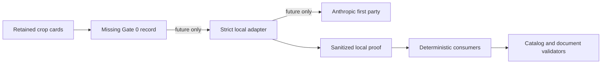

# Current implementation threat model

Status date: 2026-08-22

This document covers executable code in the repository today: the browser editor and its booklet-reading modules, protocol, catalog, brick kernel, renderer, opt-in real-booklet tooling, source-derivation scripts, and the companion package's library-level content-addressed store, unsealed test ledger, and test run recorder.

The production companion broker, provider credential proxy, production signing identity, sealed replay service, and independent evaluator specified in [spec.md](spec.md) and [learning-system.md](learning-system.md) are not implemented and are never credited as mitigations here.

The text-brief candidate lab, deterministic maker population, browser candidate panel, and replay harness were deleted with the AI copilot on 2026-08-07. The companion test recorder still validates legacy maker-shaped wire fixtures, but no current component produces them.

## Assets and security objectives

- Preserve the exact user-authored `BrickDocument`, its pinned truth, identities, transforms, connections, memberships, provenance, and undo history.
- Prevent imported files, booklet data, source archives, build programs, reports, vision answers, and runtime JavaScript values from executing code, forging authority, weakening hard validation, exhausting a process without a bounded refusal, or silently mutating a document.
- Keep local source payloads, booklet crops, development hooks, credentials, and session material out of production bundles, committed artifacts, and logs.
- Preserve retained artifact bytes exactly, reject missing or changed content-addressed objects, and prevent metadata from becoming filesystem authority.
- Keep structural validity, visual agreement, source provenance, replay, and physical claims separate so evidence for one cannot self-certify another.

## Current trust boundaries

| Boundary | Untrusted input | Implemented authority and limits |
| --- | --- | --- |
| LDraw import | Bytes, metadata, identifiers, transforms, counts, provenance claims, and internal references | Bounded parser, strict supported profile, protocol schema, catalog truth, canonical graph construction, and deterministic validators |
| Booklet extraction and real-build tooling | Local PDF bytes, text-layer records, page geometry, rasters, highlights, arrows, callouts, and retained classifications | Explicit file and raster limits, digest-bound real-build input chains, typed extraction records, internal consistency checks, and fail-closed publication contracts |
| Branch-aware farther-panel driver | Deferred origin documents, callback-produced children, candidate identifiers and hashes, piece witnesses, panel scores, PNG captures, lineage reports, and budget claims | Immutable parent/child lineages, structural-hash checks before and after callbacks, exact atomic piece-identity bindings, shared narrowing reservations before render work and child reservations before retention, bounded conditional-K scoring, strict cross-field report parsing, exact capture-set and artifact-byte projection, family-only settlement, and typed refusal without partial document mutation |
| Prepared atomic branch inspection | Runtime wrappers, detached enumerator offers, parent lineages, compiler results, ledger state, and retained evidence bytes | Structural and aggregate bounds before offer projection, exact detached offer snapshots, request and preflight identities, one-use whole-batch reservation before compilation, module-branded restricted compiler results, independent Node replay, exact child-byte equality, a 64 MiB aggregate unique-child cap, closed evidence parsing, and a digest/length/base64 wire that decodes to fresh storage; score, completion and acceptance authority are absent |
| Compiled observation closure, browser branch-role transport, and local branch semantics | Prepared-run bytes, lineage bytes, closure JSON bytes, packed mask-role bytes, branch index bytes, and external compiled/observation roles | Genuine non-shared byte snapshots, prepared-run parsing before role transport, fatal UTF-8 and exact bounded schemas, bytes-derived branded policy, dense exact-alias-or-disjoint mask ranges, digest and MSB-padding checks, bounded deterministic registration, exact camera-group selection and compiled-transition projection, plus dense external role references with per-slice and 512 MiB transport ceilings. The local semantic consumer rejects orphan closure tables and derives branded structural work from parsed lineage rows, observations, source/camera rows, and selection/accepted-transition reference arrays; charges cumulative row/document/raster limits before bounded root reconstruction; derives conservative compiler work-policy units from the exact reconstructed roots; and charges those units before graph/compiler and observation replay. Typed observation preflight accepts only the exact replay-admitted work inspection. The consumer exact-binds indexed and prepared step/compiler/proposal facts, requires legacy observation-generation, selection, and acceptance fields to remain empty, and separately verifies each typed closure and any nonempty committed raw role; source/camera/report/terminal provenance and every authority remain absent |
| Observation-source stage and parity publication | Hostile page/panel geometry, callout arrays, browser module results, RGBA and packed masks, PNG diagnostics, source/runtime manifests, served responses, source bundles, repository roots, output paths, and publication inputs | Exact key sets and dense ordering, intrinsic typed-array snapshots, dimensions and aggregate pixel/byte caps before work, packed padding/digest verification, exact PDF and prepared-panel binding, bootstrap/execution/served-source closure verification, browser-result and runtime binding, pre-publication reconstruction and validation followed by unreferenced content-addressed role writes and one atomic summary replacement; source-parity `/4` remains calibration-only with authority absent, browser commitments opaque, and source RGBA visualization-only |
| Five-panel source-parity calibration | Browser capture wire, full 359-row manifest, source snapshot and provenance, repository root, summary and retained files, five external roles, ten PNGs, claimed human-review packet, external packed truth role, candidate W masks, proxies, accessors, aliases, extra keys, and drifted prepared evidence | Fixed five-row contract derived from the exact full manifest, closed hostile parsers, intrinsic byte snapshots, aggregate caps before copies, strict PNG-to-RGBA replay, H/P/D stage replay, independent W re-derivation, exact dimensions/digests/padding, and source-closure reproduction before an internally derived audit identity; supporting bytes publish beneath an identity-addressed run and the fixed summary is replaced last, while authority remains absent/pending and every review outcome remains fail-closed `needs-adjudication` with no human-owned issuer or full-probe control capability |
| Local panel-placement model script | An arbitrary resolved local file path and bytes, action-ledger content, prompt brief, CLI tool access, and model response | Input-byte authentication during the call, pinned model identity, strict output parsing, and recorded input/prompt/brief/model digests; path containment, image/source validation, exact crop lineage and bytes, brief bytes, ledger digest, tool trace, immutable attempts, and any product authority are absent |
| Strict part-identification `/5` transport, currently disabled | Exact retained card PNGs and manifest, canonical prompt and instruction, Claude CLI/MCP stream, model result, local proof/checkpoint files, ambient prototypes, existing `/4` answers, output paths, and budget claims | Six-card and 12 MiB input cap; pinned CLI version/binary and allowlisted child environment; safe mode, disabled built-ins/settings/session and exactly one no-argument MCP image tool; exact five-event sanitized stream, empty successful stderr, terminal-answer replay, immutable call-proof CAS and predecessor checkpoint chain, complete image-byte reopening and hostile-prototype tests. Both production entrypoints throw before runtime work because crop-scoped authorization/provider-policy binding and immutable success/failure launch settlement are absent. Retained evidence explicitly says `local-diagnostic/sanitized-downstream`, provider execution unauthenticated and executable replay false |
| Quarantined multi-panel checker | Claimed PDF/crop identity, source and candidate-render PNGs, face and candidate lineage, model output, CLI stream, and MCP tool result | Canonical requests, full-sequence preflight, bounded PNG decoding, cumulative budgets, minimized model brief, one no-argument image tool, no repository `Read`, exact tool-result byte binding, immutable attempts, and refusal-only consumption; no producer proves crop origin or consent and no driver consumes a verdict |
| Source-derivation scripts | LDraw archives, LEGO Builder bundles and XML, LDCad shadow files, and generated measurement reports | Pinned source identities, bounded parsers, immutable snapshots, quarantine records, independent measurements, and no direct catalog-admission authority |
| Restricted compiler | Unknown base documents, build programs, and caller-shaped scope values | Structured-cloned inputs, closed schemas, active truth snapshot, deterministic compilation, scope verification, and hard validation |
| Operation application | Runtime JavaScript values that may bypass TypeScript | Structured clone, per-operation schema validation, canonical payload normalization, stale-before-value checks, and deterministic revisions |
| Catalog truth and migration | Part declarations, measured tables, provenance, geometry, connectors, collision bodies, and historical documents | Versioned truth snapshots, content hashes, explicit migratable versions, admission tests, and migration reports rather than silent reinterpretation |
| Renderer and render packets | Documents, source archives, cameras, capture metadata, PNGs, reviewer-authored records, and optional external validation reports | Local validation, render admission limits, policy-derived cameras, disposable scene state, closed packet/review schemas, content hashes, fixed byte/view budgets, pending-only packet generation, and separate immutable review publication |
| Browser UI and persistence | User gestures, delayed file reads, numeric edits, IndexedDB records, and WebGL context loss | Immutable kernel results, generation tokens for asynchronous work, schema-versioned snapshots, compare-and-swap persistence, corruption quarantine, and disposable Three.js state |
| Development automation | Same-origin development page and model state | `import.meta.env.DEV` installation guard and production-bundle token scans |
| Companion artifact store | Untrusted bytes, `ArtifactRefV1` metadata, and retained-object references | Store-owned absolute root, SHA-256-derived paths, byte and metadata ceilings, bounded admission, atomic publication, and verify-on-read |
| Companion test ledger | Data-only run, provider-attempt, candidate-transition, idempotency, cancellation, checkpoint, and artifact-reference records | Test namespace only, bounded canonical admission, pinned policy and limits, hash-linked JSONL, exclusive writer lease, recovery verification, and prefix-checked finalization |
| Companion test recorder | Canonical legacy maker requests and outputs, unsealed capture fixtures, caller-supplied test capabilities, and retries | Exact closed shapes, explicit local-retention consent, cumulative stored-byte checks before I/O, request/output/capture binding, CAS verification, neutral quarantine, and unsealed manifests only |

### Part-identification model boundary

The current executable edge stops at the Gate 0 node: neither production entrypoint can reach the CLI or provider. Even after future enablement, model output remains a proposal consumed beneath deterministic validators rather than an authority edge.

An attacker may supply malformed, deeply nested, oversized, cyclic, aliased, proxy-wrapped, draft-invalid, internally inconsistent, stale, or deliberately expensive values. They may choose prototype-like identifiers, reorder set-like arrays, reuse ports, create dense collision geometry, forge validation reports or provenance, race artifact publication, tamper with retained bytes, substitute one local source artifact for another, or substitute an enumerator or compiler result.

The current atomic-branch assumptions are a single-user local developer process with no network or multitenant caller. Hostile runtime values, enumerator/compiler substitution, retained-byte tampering and local CPU or memory exhaustion are in scope; control of the repository process identity or arbitrary repository files is out of scope.

This model does not protect against an attacker who already controls the repository process identity, the private companion root, or arbitrary files inside it. There is no production provider, credential proxy, signing key, evaluator seal, acceptance capability, companion HTTP API, or production namespace in the current product.

## Abuse paths and implemented mitigations

| Abuse path | Impact | Implemented mitigation |
| --- | --- | --- |
| Import external paths, unsupported references, or unbounded LDraw content | Path traversal, resource exhaustion, or unreviewed geometry | No filesystem reference resolution; strict metadata-bearing profile; byte, line, part, recursion, and operation limits; unsupported data is refused or explicitly opaque |
| Feed oversized or malformed booklet, raster, archive, Builder, LDCad, JSON, or XML input | Memory exhaustion, parser confusion, or substituted evidence | Input-specific byte/count/dimension/depth limits, strict parsers, pinned digests, held snapshots where required, quarantine publication, and typed failures naming the offending input |
| Let a model or retained answer declare its own part, placement, validity, provenance, or authority | False catalog truth or document mutation | Vision and classification records remain untrusted evidence; deterministic catalog lookup, compiler, validator, panel comparison, and reviewed admission decide what is usable |
| Let a subscription CLI read unrelated files or return an unrelated image tool result | Unauthorized disclosure or false visual lineage | The quarantined checker runs in a task-owned temporary directory with settings and built-ins disabled, an allowlisted environment, one no-argument MCP image tool, bounded output, and an exact retained tool-result comparison against the request's bound image blocks |
| Resume legacy `/4` answers, transplant another crop, or fabricate a self-consistent `/5` reply as authenticated provider evidence | Mixed-image adjudication, false local lineage, or provider impersonation | `/5` rejects `/4`, reopens every manifest-bound card byte, parses terminal result lines again, binds each answer to one proof/card/attempt, verifies immutable predecessor transitions and rejects orphan proof/checkpoint nodes. Those controls prove internal local byte consistency only; the schema fixes `providerExecutionAuthenticated: false`, the same-user process identity remains out of scope, and no answer can admit catalog truth or mutate a document |
| Launch the strict part-identification CLI without exact crop consent or repeatedly retry failed provider work outside a generation budget | Unauthorized external transmission or uncontrolled paid/long-running work | `commandAsk` and the native transport independently refuse before child/runtime work. A future enablement must bind one reviewed authorization digest through request, prelaunch ticket, proof and checkpoint, then immutably settle success and failure while charging launches, attempts, turns, token usage, cost, elapsed time and proof bytes before any retry |
| Mutate an input after validation | Candidate, operation, or artifact TOCTOU | Structured cloning or admitted byte copies before validation; frozen successful compiler artifacts; hashes rechecked before publication and on read |
| Substitute a farther child, parent, score row, lineage, piece witness, or capture after another branch measured well | False branch settlement or misleading evidence | The driver rehashes documents around expansion and scoring callbacks; reports bind origin parents, atomic carried pieces, parent-child lineages, panel candidate IDs and recomputed scores; parsers cross-check deferral and farther fields; artifact publication requires the exact dense source/candidate capture set and PNG bytes |
| Forge an atomic proposal, compiler result, transition, child, receipt, or lineage edge | False structural branch evidence | Node recomputes proposal and transition identities from the exact ordered request, accepts compiler outputs only when branded by the restricted compiler module, recompiles every unique physical transition, and compares exact child bytes, receipt and validation; mismatch produces typed zero-frontier failure |
| Turn budget-minus-one or a later compile/closure failure into a partial frontier | Unequal branch work or silent branch loss | Before reservation the producer serializes and parses the worst bounded zero-frontier terminal envelope against the final-wire ceiling; only then is the complete lineage request reserved once before the first compiler call. Budget refusal, deterministic compiler failure, local replay mismatch, child alias/cap failure and aggregate closure failure retain the exact request and terminal evidence but no children, transitions or edges. Root, unique-child and final-wire ceilings remain separately bounded, so a predictably oversized success envelope may fail late after admitted work but cannot escape the pre-admitted terminal form |
| Expand dense offers or compiled children beyond the process envelope | Memory or CPU exhaustion before refusal | Preparation caps 8,192 parent/candidate rows, 32,768 witnesses and 65,536 operations before projection; execution caps unique child canonical bytes and the final evidence envelope at 64 MiB and stops at the first crossing child before later compiler work |
| Mutate an atomic evidence byte array after validation | Retained evidence no longer matches the parsed object | The frozen wire descriptor contains canonical base64, exact byte length and digest; every decode revalidates all three and returns fresh storage rather than exposing retained mutable backing |
| Forge a mask, score, camera group, prepared threshold, selected lineage, or accepted transition | False visual branch settlement | The observation verifier accepts only exact lineage and closure bytes plus a module-branded policy derived from the prepared run bytes; it hashes each packed role slice, rejects padding and range drift, reruns the live registration algorithm, derives ranking and strict-margin selection, and projects acceptance only from the exact compiled edges, receipts and common direct-parent revision |
| Expand a branch index, role, lineage graph, compiler batch, raster, or comparison family before refusal | Memory or CPU exhaustion at the positive-generation boundary | The outer transport preflights exact per-segment plus 512 MiB combined role limits before copying and hashing roles sequentially; that bounded copy-and-digest integrity-checking cost is distinct from later semantics. Each step first receives a bounded structural parse; internally orphaned closure source/camera rows refuse, and measured root-group/identity, search-parent/proposal, child-candidate, transition, edge, witness/operation, legacy- and typed-observation, source/camera-table, selection/accepted-transition-reference, exact root/child canonical-document-byte and pixel work is charged against the cumulative branch ceiling. Only then are bounded roots reconstructed once for admission-work measurement to derive conservative three-pass compiler graph/byte work-policy units, including step-preparation operations; those units are cumulatively charged before graph/compiler replay or role-mask registration and are not literal CPU or allocation counts. The established public lineage `/1` parser remains compatible; aggregate replay-work admission is explicit on the new semantic and bytes-only observation paths, whose typed-observation helper requires the exact replay-admitted work brand. Each raster is at most 1,048,576 pixels, mask ranges cover at most 64 MiB, and aggregate registration work remains preflighted before role access |
| Split convergent roots, substitute one distinct parent document for another, forge provenance membership, or reserve roots independently | Cross-branch document substitution, private parent-map exposure, unequal work, or a partial frontier | Atomic preparation first bounds the complete root and identity shape, requires each exact branded snapshot group once, adds a digest commitment over structural lineage, exact parent, canonical-byte digest and UTF-8 length, binds every ordered enumerated row to that snapshot, maps each proposal back to its own privately retained parent, plans all unique physical work, proves a worst bounded terminal envelope fits, and performs one aggregate ledger reservation before compilation. Private provenance sets and parent maps use captured intrinsics after hostile descriptors can execute; duplicate exact groups, relabelled order, structural-hash-preserving canonical substitution, forged brands, terminal-envelope overflow, budget-minus-one, or later closure failure expose no child frontier |
| Forge, mutate, detach, alias, overwork, poison shared prototypes, or partially finalize branch-role writer input | False `/4` transport, retained-role exposure, unbounded replay, role gaps, or a usable half-output | The deterministic finalizer accepts only branded compiled-batch results, measures all genuine non-shared closure and observation byte lengths before copying, applies the semantic consumer's cumulative lineage, closure, raster and compiler-work ceilings before any raw observation-role copy, rechecks exact lineage and closure digests after the hostile measure/copy boundary, semantically verifies optional closure bytes against the exact compiled lineage and branded prepared policy, writes only dense derived references and digests into unexposed final storage one step at a time, stores completed roles privately, and returns fresh storage on each read. Captured JSON, encoder, typed-array and private-`WeakMap` intrinsics prevent inherited `toJSON` or prototype replacement from changing envelope sizing or exposing retained storage. It derives contiguous step numbers from retained batches, stops at failed or budget-refused terminal evidence, and fixes source, placement, selection, completion, consent, and mutation authority to absent |
| Use hostile wrappers, aliases, accessors, or publication paths to mutate source-parity evidence after validation or escape the output root | False diagnostic evidence, TOCTOU, arbitrary write, or partial-current publication | Outer inputs are snapped through closed non-invoking parsers, exact intrinsic byte storage is copied before semantic use, ordinary resolved repository/output roots are contained, provenance and browser-result bytes are reconstructed, and every role is digest-bound. The exact-five publisher preflights and reproduces the full manifest, capture, source snapshot and provenance before creating its run tree; files publish atomically beneath the derived identity and the public summary is replaced only after every referenced byte exists. The retained reader reopens all byte classes and reproduces the audit identity |
| Treat a claimed human review, audit execution identity, or exact W match as calibration authority | Self-certified source truth or unauthorized launch of the 359-step probe | The publication summary fixes authority to absent and review state to pending-unreviewed; the parser labels review metadata `unverified-external-review-claim`; adjudication has no authority parameter and returns `needs-adjudication` for absent truth, review drift, candidate difference, and exact equality. A future human-owned issuer and one-use admission consumer require a new reviewed boundary; the reproducible audit identity is not a bearer capability |
| Forge catalog, collision, transform, or validator truth | Silent reinterpretation | Reviewed content manifests and version identifiers enter pinned truth; old documents require explicit migration and report |
| Escape patch scope or hide new invalidity behind an existing aggregate issue | Unauthorized or falsely valid patch | Independent capability verification, exact base/hash binding, per-operation ceilings, full-evidence issue identity, and blocking incomplete-validator sentinels |
| Exhaust collision, validation, rendering, or publication with dense data | Denial of service | Part, primitive, comparison, finding, evidence, render-memory, stored-byte, bytes-in-flight, pending-operation, and concurrency budgets with deterministic refusal records; farther carry shares candidate and narrowing ledgers across every parent, reserves each narrowing batch before rendering, and reserves each complete child before retaining it |
| Treat children completed before a farther-budget refusal as a valid partial frontier | Silent branch loss or a document selected from unequal work | Atomic carry admits a frontier only after every parent completes; refusal retains completed children as unresolved evidence, leaves the origin families undecided, skips conditional K, and does not mutate the settled document |
| Relabel a camera, report, render packet, or artifact reference | Misleading visual or replay evidence | Policy-derived canonical cameras, whitelisted packet fields, local report recomputation, protocol validation, content hashes, and store verification; caller-supplied PNG identity is not yet authoritative |
| Let a generated visual packet approve its own catalog change | Self-certified or uninspected geometry | Part-admission generation always leaves every view `pending`; a separate review sidecar binds the packet hash and both PNG/RGBA hashes for each ordered source/catalog pair and requires an explicit `same`, `different`, or `not-observable` outcome and note |
| Allow a late file read or stale asynchronous result to replace newer edits | Data loss | File size checks before reads, generation tokens after asynchronous work, stale-result suppression, and explicit discard confirmation before replacement |
| Load malformed or stale IndexedDB state as current truth | Corrupt or silently reinterpreted project | Schema/version checks, compare-and-swap revisions, migration reports, corruption quarantine, and session-only fallback when durable storage is unavailable |
| Ship development observation globals | Production data exposure | Development-only install guard plus production JavaScript token scan |
| Turn artifact metadata into a path | Arbitrary file read, write, or overwrite | Closed metadata, SHA-256-derived object paths, store-root containment checks, symlink refusal, exclusive staging, and non-replacing atomic publication |
| Fork, truncate, reorder, or concurrently append a test run | Split-brain or forged history | One writer lease, canonical event hashes and previous-hash links, monotonic sequences, queue serialization, expected-prefix finalization, reopen verification, and fail-closed recovery |
| Retain a request without consent or relabel different bytes as a capture | Unauthorized retention or false lineage | Recorder rejects before store or ledger use unless explicit local retention is enabled, enforces cumulative stored-byte limits, binds exact request/output/capture hashes, and derives only unsealed test outcomes |
| Commit local booklet pages, model answers, source payloads, credentials, or run artifacts | Copyright, privacy, or secret disclosure | Source payloads and run evidence remain under ignored roots; publication requires deliberate promotion, provenance review, and secret/personal-data scanning |

## Unbuilt boundaries and residual risk

- `apps/companion` is a library-level local artifact store, test ledger, and test recorder. It has no HTTP surface, job authority, release verification, production signing identity, credential proxy, sealed native manifest, tombstone/garbage-collection lifecycle, acceptance authority, or production namespace.
- No production external-model adapter is connected. The future broker must enforce provider capabilities, crop-scoped consent, quotas, retention policy, response-size/depth limits, cancellation, credential isolation, and redaction before any user data leaves the machine.
- The strict part-identification `/5` adapter is implemented but cannot launch. No immutable record currently binds purpose, exact ordered card/request/transport digests, user consent, first-party provider/model, reviewed privacy/provider-policy evidence and one-launch budgets through the request and retained lineage. No launch settlement charges failed calls or aggregate tokens/cost/time, so broad refusal ceilings must not be treated as a run authorization.
- `/5` retains a sanitized event skeleton and raw-stream hash rather than raw stdout. It does not bind the PowerShell job wrapper, Node executable, mutable MCP source/import closure, provider-side weights or admin policy, and final task-root equality cannot detect transient or out-of-root process writes. The current proof is downstream local diagnosis, not an OS sandbox, executable transcript, Anthropic attestation or production seal.
- The stopped legacy `/4` current-input file contains 73 replies and remains ignored quarantine evidence. Its transport allowed model-created local files, and `/5` refuses it; no trusted current answer, score, coverage or replacement ledger follows from those bytes.
- No independent evaluator or sealed replay-closure service exists. Current CAS identities, test-ledger events, and unsealed recorder bundles grant no production validity, replay level, consent, promotion, or acceptance claim.
- Automatic candidate acceptance is absent by product decision, not merely disabled pending infrastructure. Reopening any automatic document-mutation path requires a new design and threat review.
- The legacy maker-output and capture schemas retained by the companion recorder have a consumer and no producer. They should not be described as an executable generation or replay system.
- The artifact store does not fsync containing directories or reclaim crash-stranded staging directories. Some Windows filesystems do not support the ledger's attempted parent-directory fsync, so power-loss directory-entry durability is best effort.
- A stale, malformed, partial, or dead-owner ledger lock never auto-reaps; recovery fails closed and requires explicit local inspection. A broken artifact resolver has no timeout or `AbortSignal` and can hold append, `close()`, and the lease pending.
- The canonical `RenderPacket` assembler binds supplied metadata, the pinned capture policy, the canonical camera-packet hash, and caller-supplied artifact references, but the browser capture hook is not wired to it. It returns seven data URLs from the live presentation scene, which may include the grid, shadow plate, and selection overlay, with no underside-oblique view, clean admission scene, source pairing, PNG hash receipt, or binding to the structured snapshot.
- The local panel-placement proposer records an input-image digest but not the exact crop bytes, source PDF/page/bounds, candidate render, deterministic face record, or later-panel witnesses. A changed ignored crop path therefore leaves an unauthenticated reading whose original visual input cannot be replayed.
- The LDraw profile is verified only against this implementation's supported subset; external viewer/tool evidence is required before broader compatibility claims.
- IndexedDB is not an authoritative ledger or credential store. Storage failure, corruption recovery, quota behavior, and retained-data controls remain browser delivery risks.
- The catalog and collision model do not establish clutch strength, insertion accessibility, mass, cost, inventory availability, or physical stability.
- Sixteen catalog parts use bundled source meshes and source-derived visual bounds while deliberately retaining their preceding conservative collision recipes; those recipes may fill visible cavities, so render agreement is not a hollow-collision or physical-insertion claim.
- `npm run parts:check` is green for all 87 definitions and runs inside `npm run verify`. Its seven declaration rules do not establish connector provenance, collision fidelity, source/render visual agreement, or hidden interior truth.
- The part visual-admission harness operates only as developer tooling over explicitly supplied local archives and ignored output. The `/13` batch has 192 separately reviewed native-resolution pairs with visible outcome `same`; the separate `/14` `25269` and `/15` `28802` packets add eight original 640 × 640 pairs each, also reviewed `same`. Packet hashes, metrics, and review records do not provide production sealing, rights to transmit an image, or physical equivalence beyond the observed views.
- The multi-panel checker has no source-authorizing PDF/crop producer, no broker consent preflight, no real-build consumer, no durable append-only store across process failure, and no successful retained live verdict. Its mocked tests prove only the local contracts they exercise.
- The integrated farther-panel driver is bounded to its configured reach and currently proves only one intervening-step carry. It is not generic deep backtracking, does not grant a model-checker verdict authority, and cannot certify a hidden relation merely because a later source panel was retained but never scored.
- The atomic compiled-branch batch, compiled-observation sidecar, branch-role index, refusal-only local branch semantic inspector, source-stage trace, source-parity `/4`, and exact-five calibration foundation are standalone inspection-only code, not browser-output `/4`. The local semantic inspector cross-binds prepared steps and proposals and verifies the sidecars under a cumulative work ceiling, but has no outer report envelope or source/camera/report/terminal provenance. Source-parity publication can bind its exact PDF, prepared panels, source/runtime/served closure, browser result, and packed evidence, but its browser work-RGBA, candidate-policy, and candidate-derivation commitments are opaque and its visual source column is not retained source truth. The source-parity H/P/D/W masks remain unconnected to compiled children, D4 camera observations, report continuity, or terminal documents; the local closure masks bind compiled children but lack that source and run provenance.
- The multi-root atomic widening and branch-role finalizer remain authority-absent prerequisites. Their exact parent binding, semantic closure verification, role digests, and contiguous-prefix checks do not prove PDF/page/crop identity, renderer or D4 camera provenance, full report order, terminal-document continuity, accepted user action, physical stability, or completion.
- The calibration packet only claims external human review; no current component authenticates a human-owned issuer, proves the reviewed execution produced candidate W, or grants a capability to run the full parity probe. Exact candidate equality therefore remains an inspection fact with `needs-adjudication`, and the optional high-RGBA snapshot proves only retained-byte integrity.
- Provisional preparation remains shadow-only under browser-output `/3`; no complete semantic browser-output `/4` report reader, live positive producer, accepted document, user-document mutation or production authority path exists.
- Real-booklet browser tests are opt-in and skip when the gitignored booklet and companion source artifacts are absent. A passing ordinary gate proves the mocked/synthetic path, not that the private real-booklet inputs were exercised.

## Regression and gate anchors

- `npm run schema:check` verifies generated protocol types and validators.
- `npm run node:check` imports protocol, catalog, brick-kernel, and rendering under the supported Node runtime.
- `npm run observations:check`, `npm run bom:check`, `npm run lessons:check`, and `npm run notices:check` guard observation consumption, provenance inventory, lesson indexing, and generated notices.
- `npm run test:python` covers the bounded source-audit, LDraw, Builder, LDCad, calibration, admission, and booklet-accounting scripts.
- `npm test` covers hostile wrappers, canonicalization, compilation, scope, operations, collision and issue budgets, catalog admission, rendering, persistence, the companion store, ledger, and recorder.
- `npm run test:browser` covers the served editor, real browser persistence and interaction, canonical captures, context recovery, and booklet workflows; private-source cases state when they skip.
- `npm run build` proves the production browser bundle compiles and excludes development automation tokens.
- `npm run parts:check` runs inside `npm run verify` and checks the catalog-wide declaration standard.
